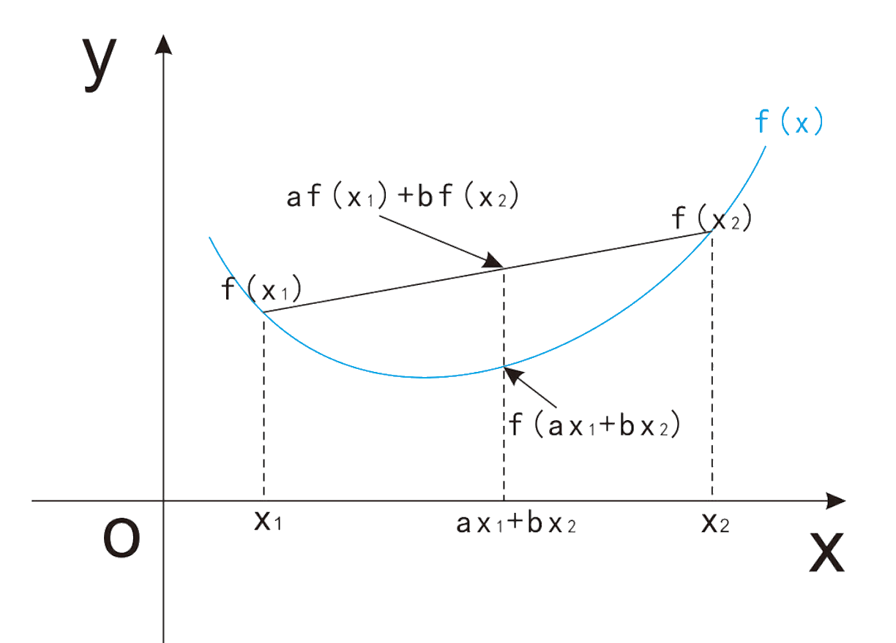

# 高数基础

## $\mathrm{Jensen}$ 不等式

- 向下凸起的函数称为凸函数，凸函数有最小值

- 对于凸函数上的任意两点，这两点的割线一定在这两点间函数图像的上方，即：

  $$
  a f \left( x_{1} \right) + b f \left( x_{2} \right) \geq f \left( a x_{1} + b x_{2} \right)
  $$

  - 其中 $0 \leq a, \ b \leq 1$ 且 $a + b = 1$

## 泰勒展开

- 如果定义在包含 $a$ 的区间上的函数 $f$，在 $x = a$ 处 $n + 1$ 阶可导，那么对区间内的任意 $x$ 都有：

  $$
  f \left( x \right) = \sum_{n = 0}^{\infty} \frac{f^{n} \left( a \right)}{n!} \left( x - a \right)^{n}
  $$

## 三次方因式分解

$$
a^{3} - b^{3} = \left( a - b \right) \cdot \left( a^{2} + b^{2} + ab \right)
$$

$$
a^{3} + b^{3} = \left( a + b \right) \cdot \left( a^{2} + b^{2} + ab \right)
$$

## 分步积分

$$
\int f \left( x \right) \cdot g' \left( x \right) \mathrm{d} x = f \left( x \right) \cdot g \left( x \right) - \int f' \left( x \right) \cdot g \left( x \right) \mathrm{d} x
$$

## 极值点 $\mathrm{VS}$ 驻点 $\mathrm{VS}$ 鞍点 $\mathrm{VS}$ 拐点

### 极值点

- 对于 $x_{0}$ 的去心邻域 $\left( x_{0} - \epsilon, \ x_{0} + \epsilon \right)$：

  - 如果 $f \left( x_{0} \right) > f \left( x \right)$ 恒成立，则 $\left( x_{0}, \ f \left( x_{0} \right) \right)$ 是极大值点

  - 如果 $f \left( x_{0} \right) < f \left( x \right)$ 恒成立，则 $\left( x_{0}, \ f \left( x_{0} \right) \right)$ 是极小值点

- 极值点处的导数可能不存在

### 驻点

- 一阶导数存在且为 $0$ 的点称为驻点

### 鞍点

- 在一维空间中，鞍点即驻点

- 在高维空间中，鞍点是指在一个方向是极小值，在另一个方向是极大值的点

### 拐点

- 二阶导数为 $0$ 且两侧二阶导数异号的点称为拐点

## 偏导数 $\mathrm{VS}$ 梯度 $\mathrm{VS}$ 方向导数

### 偏导数

- 多元函数在 $x$ 处关于某一个特定变量 $x_{i}$ 的导数称为偏导数

### 梯度

- 对于 $n$ 维函数，$x_{0}$ 不同方向上的变化率构成 $x_{0}$ 处的梯度

- 梯度 $\nabla_{x} f \left( x \right)$ 的第 $i$ 个元素是 $f$ 对 $x_{i}$ 的偏导数

- 沿着梯度方向，函数上升最快；沿着负梯度方向，函数下降最快

#### 沿负梯度方向，函数值下降最快

- 由泰勒展开：

  $$
  f \left( x_{0} + \alpha d \right) = f \left( x_{0} \right) + \alpha \cdot g^{T} d + \Omega
  $$

  - $d$ 是任意方向的单位向量，$\alpha$ 是步长（实数）

  - $\Omega$ 是高阶无穷小，可以忽略

  - $g$ 是 $x_{0}$ 处的梯度，最小化 $f \left( x_{0} + \alpha d \right)$ 等价于最小化 $g^{T} d$

    - 当 $d$ 与 $g$ 方向相反时，取得最小值

    - 因此沿负梯度方向，函数值下降最快

### 方向导数

- 函数 $f$ 在单位向量 $u$ 方向（任意方向）上的斜率

- 函数 $f \left( x + \beta u \right)$ 关于 $\beta$（$\beta \rightarrow 0$）的导数：

  $$
  \lim_{\beta \rightarrow 0} \frac{f \left( x + \beta u \right) - f \left( x \right)}{\beta}
  $$

  - 退化为一维时计算如下：

    $$
    \lim_{\Delta x \rightarrow 0} \frac{f \left( x + \Delta x \cdot 1 \right) - f \left( x \right)}{\Delta x}
    $$

## 常用函数求导

- 对数：

  $$
  \frac{\mathrm{d} \log_{a} x}{\mathrm{d} x} = \frac{1}{x \ln a}
  $$

## 链式法则

- 假设 $z = f \left( x, \ y \right)$，其中 $x = g \left( t \right), \ y = h \left( t \right)$，那么：

  $$
  \frac{\partial{z}}{\partial{t}} = \frac{\partial{z}}{\partial{x}} \cdot \frac{\partial{x}}{\partial{t}} + \frac{\partial{z}}{\partial{y}} \cdot \frac{\partial{y}}{\partial{t}}
  $$