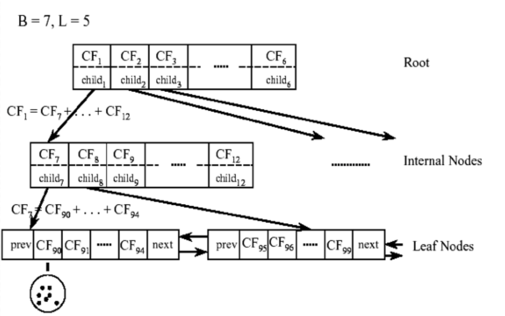

# 聚类算法

## 背景介绍

- 将无标签样本分成多个类或多个簇，使得同一簇内的样本具有高度相似性，不同簇间的样本具有较大差异性

- 属于无监督学习

- 常用聚类算法如下：

	- 基于划分：K-means(++)、K-medoids

	- 基于层次：Hierarchical K-means、BIRCH

	- 基于密度：DBSACN
	
	- 基于模型：GMM、SOM

## 划分聚类

### K-means

#### 基本思想

- K-means 的目标是将数据集中的 \\(n\\) 个样本分成 \\(k\\) 个簇，同时要满足：

	- 每个簇内至少一个样本

	- 每个样本必须属于一个簇，而且只能属于一个簇

- 聚类中心：

	- 当前簇中所有样本的均值向量

#### 算法流程

- 适当选择 \\(k\\) 个初始聚类中心

- 在每一次迭代中，计算每个样本到各个中心的距离，将其归到距离最近的类中

- 根据划分结果，将每个簇的中心更新为簇内所有样本的均值

- 重复上述两步，直到某次更新后所有簇的中心不再改变

#### 算法分析

- 当簇间区别明显，且每个簇大小相近时，聚类效果比较明显

- 需要事先指定 \\(k\\) 值，但很多情况并不知道应该划分为几个类最合适

- 需要人为确定初始聚类中心，不同的初始值可能会导致完全不同的聚类结果

- 对噪声和离群点比较敏感

### K-means ++

#### 基本思想

- 自动选择 \\(k\\) 个聚类中心，并使初始聚类中心间的距离尽可能远

- 根据选出的 \\(k\\) 个聚类中心，执行普通的 K-means 

#### 算法流程

- 随机选择一个样本作为第一个聚类中心

- 对数据集中每个样本，计算其到最近聚类中心的距离 \\(D(x)\\)

- 选择一个新样本作为新的聚类中心，原则是：

	- \\(D(x)\\) 越大的点，被选为聚类中心的概率越大

- 重复上述两步，直到选出 \\(k\\) 个聚类中心

- 根据选出的 \\(k\\) 个聚类中心，执行普通的 K-means 

#### 聚类中心选择

- 由于存在噪声，不能直接选择最大的 \\(D(x)\\) 对应的样本

- 为保证 \\(D(x)\\) 越大的点被选中概率越大，选择方式如下：

	- 计算所有 \\(D(x)\\) 的和 \\(S\\)

	- 随机生成一个 \\([0,S)\\) 范围内的数 \\(R\\)，将包含 \\(R\\) 的样本作为新的聚类中心

- 上述过程是把每个 \\(D(x)\\) 看成长度为 \\(D(x)\\) 的线段，拼接后随机选择一点，并选中该点所在线段；某条线段越长，其被选中的概率越大

#### 算法分析

- 解决了 K-means 手动选择初始聚类中心的问题，聚类效果比较稳定

- 依然没有解决需要手动设置聚类数目 \\(k\\) 的问题

### K-medoids

#### 基本思想

- K-medoids 的目标是将数据集中的 \\(n\\) 个样本分成 \\(k\\) 个簇，同时要满足：

	- 每个簇内至少一个样本

	- 每个样本必须属于一个簇，而且只能属于一个簇

- 聚类中心：

	- 当前簇中到其他样本距离之和最小的样本

#### 算法流程

- 随机选取 \\(k\\) 个样本作为初始聚类中心

- 在每一次迭代中，计算每个样本到各个中心的距离，将其划分到距离最近的类中

- 根据划分结果，将每个簇的中心更新为当前簇内到其他样本距离之和最近的点

- 重复上述两步，直到某次更新后所有簇的中心不再改变

#### 算法分析

- 相对于 K-means，对噪声和离群点不敏感

- 更新聚类中心时，要枚举每一个点到（同类）所有点的距离，计算量较大；比较适合小数据集

## 层次聚类

### 基本思想

- 类与类之间可能存在包含关系

- 将 \\(n\\) 个样本聚为 \\(c\\) 类

- 按照聚类的方向分为两种：

	- 分裂聚类：

		- 开始时所有样本属于同一类，逐渐分裂距离最远的类，直到产生 \\(c\\) 类

	- 凝聚聚类：

		- 开始时每个样本都是一类，逐渐合并距离最近的类，直到剩下 \\(c\\) 类

### 相似性度量

- 假设 \\(D\_{i}, \ D\_{j}\\) 是两个簇，\\(x\_{i}, \ x\_{j}\\) 分别是 \\(D\_{i}, \ D\_{j}\\) 中的样本：

	- 最近距离

		$$ d = \min\_{x\_{i}, \ x\_{j}} ||x\_{i} - x\_{j}|| $$

	- 最远距离

		$$ d = \max\_{x\_{i}, \ x\_{j}} ||x\_{i} - x\_{j}|| $$

	- 平均距离

		$$ d = \frac{1}{|D\_{i}| \cdot |D\_{j}|} \sum\_{x\_{i}} \sum\_{x\_{j}} ||x\_{i} - x\_{j}|| $$

	- 均值距离

		$$ d = ||\mu\_{i} - \mu\_{j}|| $$

### Hierarchical K-means

#### 算法流程

- 首先，把原始数据集聚到同一个簇 \\(C\\) 中，组成层次结构的最顶层

- 使用 K-means 将簇 \\(C\\) 划分成指定的 \\(k\\) 个子簇，形成一个新的层

- 对上一步的 \\(k\\) 个簇，递归使用 K-means，直到每个簇不能再划分，或达到终止条件

#### 算法分析

- 一旦两个点在最开始被划分到了不同的簇，即使这两个点距离很近，在以后的划分中也不会被聚类到一起

### BIRCH

#### 基本思想

- 使用聚类特征树（Clustering Feature Tree，即 CF 树）表示聚类的层次结构

- CF 树的内部结点是一个或多个聚类特征（CF），每个聚类特征代表一个簇，表示如下：

	$$ CF = (n, \ LS, \ SS) $$
	
	- 其中 \\(n\\) 是簇内样本数，\\(LS\\) 是 \\(n\\) 个样本的线性和，\\(SS\\) 是 \\(n\\) 个样本的平方和

	- 簇的质心是所有样本的均值向量，计算如下：

		$$ c = \frac{LS}{n} $$
	
	- 簇的半径是所有样本到质心的平均距离，计算如下：

		$$ r = \sqrt{\frac{\sum\_{x} \left( x - c \right)^{2}}{n}} $$
	
	- 由 CF 线性可加：

		- 簇合并时，只需将两个簇的 CF 信息相加

		- 簇分裂时，根据下一层 CF 信息重新计算当前结点的 CF 值

- 对数据集只扫描一次，在扫描过程中生成 CF 树

#### 算法流程

- CF 树类似于 B+ 树，有三个参数：

	- 内部结点平衡因子 \\(B\\)，即每个内部结点的最大子结点数

	- 叶结点平衡因子 \\(L\\)，即每个叶结点的最大样本数

	- 簇半径阈值 \\(T\\)，即每个簇的最大半径

		- 阈值 \\(T\\) 决定了 CF 树的规模，如果 \\(T\\) 太小，树的结点会非常多

- 从根结点开始，自上而下选择最近的子结点

- 到达叶结点后，检查距离当前样本最近的 CF 结点能否吸收此样本：

	- 判断标准是当前叶结点满足平衡因子 \\(L\\) 和簇半径 \\(T\\) 约束

	- 如果能吸收，更新当前结点的 CF 信息

	- 否则，从当前叶结点中选择最远的一对结点进行分裂，并将其他结点重新分配

- 依次更新每个内部结点的 CF 信息，直到所有结点都满足 CF 树的约束

#### 算法分析

- CF 树只存储簇的聚类特征，而不存储原始数据，因此内存占用较小

- 只需对扫描数据集进行一次扫描，即可生成 CF 树

## 密度聚类

### 基本思想

- 同一类别的样本紧密相连，即当前类别的任意样本周围一定有同类别样本存在

### DBSCAN

#### 基本思想

- 簇定义为密度相连的点的最大集合

- 从某个核心点出发，不断向密度可达区域扩张，得到包含核心点和边界点的最大区域

- DBSCAN 需要设置两个参数：

	- 邻域半径 \\(\epsilon\\)

	- 邻域内点的最小数量 \\(n\\)

- 核心点：

	- 如果样本 \\(x\\) 的 \\(\epsilon\\) 邻域内样本数量超过 \\(n\\)，则称 \\(x\\) 为核心点

- 直接密度可达：

	- 如果 \\(p\\) 是核心点，\\(q\\) 在 \\(p\\) 的 \\(\epsilon\\) 邻域内，则从 \\(p\\) 出发到 \\(q\\) 是直接密度可达的

- 密度可达：

	- 存在一条对象链：\\(p, \ p\_{1}, \ p\_{2}, \ \cdots, \ p\_{n}, \ q\\)，而 \\(p\_{i}\\) 到 \\(p\_{i+1}\\) 直接密度可达，则从 \\(p\\) 出发到 \\(q\\) 密度可达

#### 算法流程

- 从数据集中随机选取一个未处理的点：

	- 如果该点是核心点，找出所有密度可达的点，构成一个簇

	- 否则继续寻找下一个核心点，直到所有点都被处理

#### 算法分析

- 基于密度进行聚类，相对而言抗噪能力较强

- 能处理任意形状、大小的簇，而不用事先指定聚类个数 \\(k\\)

- 由于使用了统一的邻域半径和最小点数量，当密度分布不均时：

	- 如果 \\(\epsilon\\) 较小，密度较小的簇会被分成多个相似的簇

	- 如果 \\(\epsilon\\) 较大，密度较大且距离较近的簇会被合并

## 模型聚类

- 基于概率模型或神经网络模型进行聚类

### 高斯混合模型

- 基于概率模型，可以计算样本属于每一类的概率

- 关于高斯混合模型，参考 [GaussianModels.md](GaussianModels.md)

### SOM

- Self Organizin Map，即自组织映射

- 输入层对应一个输入向量，输出层由一系列组织 1 维或 2 维节点构成；输入节点与输出节点通过权重向量连接

- 学习过程中，找到与输入向量距离最短的输出层单元，对其更新，使其更靠近输入向量；同时将邻近区域的权值更新，使输出节点保持输入向量的拓扑特征