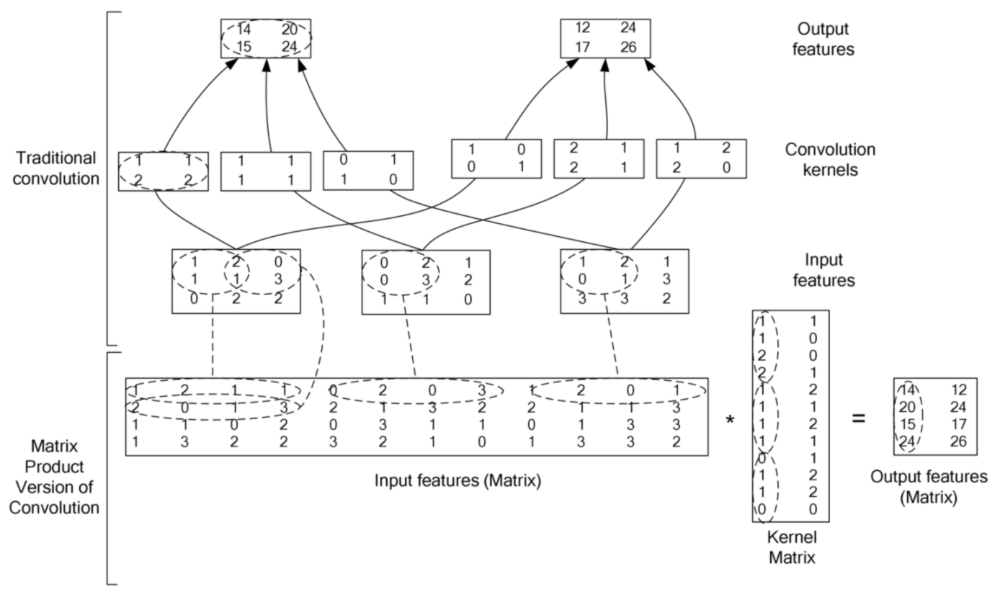

<script type="text/javascript" src="http://cdn.mathjax.org/mathjax/latest/MathJax.js?config=default"></script>

# 卷积

### CNN 的卷积操作，实际上是相关操作

&nbsp;

## 相关

- 直接进行对位乘法，记作 \\( I \otimes K \\)

	$$ I \otimes K = \\left[ \\begin{matrix} 1 & 2 & 3 \\\\ 4 & 5 & 6 \\\\ 7 & 8 & 9 \\end{matrix} \\right] \otimes \\left[ \\begin{matrix} 1 & 2 & 3 \\\\ 4 & 5 & 6 \\\\ 7 & 8 & 9 \\end{matrix} \\right] = \\left[ \\begin{matrix} 1 & 4 & 9 \\\\ 16 & 25 & 36 \\\\ 49 & 64 & 81 \\end{matrix} \\right] $$

## 卷积

- 先反转卷积核，再进行对位乘法，记作 \\( I * K \\)

	$$ I * K = \\left[ \\begin{matrix} 1 & 2 & 3 \\\\ 4 & 5 & 6 \\\\ 7 & 8 & 9 \\end{matrix} \\right] * \\left[ \\begin{matrix} 1 & 2 & 3 \\\\ 4 & 5 & 6 \\\\ 7 & 8 & 9 \\end{matrix} \\right] = \\left[ \\begin{matrix} 1 & 2 & 3 \\\\ 4 & 5 & 6 \\\\ 7 & 8 & 9 \\end{matrix} \\right] \otimes \\left[ \\begin{matrix} 9 & 8 & 7 \\\\ 6 & 5 & 4 \\\\ 3 & 2 & 1 \\end{matrix} \\right] = \\left[ \\begin{matrix} 9 & 16 & 21 \\\\ 24 & 25 & 24 \\\\ 21 & 16 & 9 \\end{matrix} \\right] $$

## 卷积加速

- 卷积定理

	- 参考 [FourierTransform.md] (FourierTransform.md)

	- 只有当卷积核较大时，加速效果才明显

- 矩阵展开

	- 已知输入图像维度为 \\(H * W * C\\)，共有 \\(T\\) 个 \\(K * K * C\\) 卷积核，步长为 \\(S\\)：

		- 输入图像可展开为一个 \\( N * (K * K * C) \\) 的矩阵 \\(A\\)，\\(A\\) 的每 \\(K * K\\) 列表示一个通道，即 \\( A = \\left[ \\begin{matrix} A\_{1} & A\_{2} & ... & A\_{C} \\end{matrix} \\right] \\)，\\(A\_{i}\\) 的每一行表示与卷积核计算的元素展开

		- 所有卷积核可合并为一个 \\((K * K * C) * T\\) 的矩阵 \\(B\\)，\\(B\\) 的每 \\(C\\) 行表示一个通道，即 \\( B = \\left[ \\begin{matrix} B\_{1} \\\\ B\_{2} \\\\ ... \\\\ B\_{C} \\end{matrix} \\right] \\)，\\(B\_{i}\\) 的每一列表示当前通道卷积核的元素展开

		- 通过 GPU 可以对矩阵乘法进行加速，计算 \\(D = A \cdot B\\)。

		- \\(D\\) 为 \\(N * T\\) 矩阵，\\(D\\) 的每一列表示一个卷积核的计算结果，即 \\(D = \\left[ \\begin{matrix} D\_{1} & D\_{2} & ... & D\_{T} \\end{matrix} \\right]\\)，将 \\(D\_{i}\\) 转化成 \\(\left( \frac{H - K}{S} + 1 \right) * \left( \frac{W - K}{S} + 1 \right) \\) 矩阵，以得到所有卷积结果
	
	

&nbsp;

## Python 实现

- OpenCV 的 filter2D 函数根据卷积核大小，自动选择上述方案

	```
	response = cv2.filter2D(frame, cv2.CV_32F, kernel)
	```