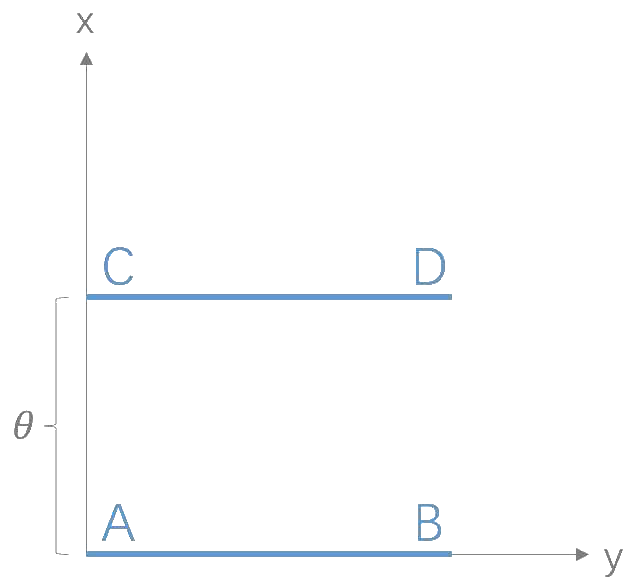

# 距离度量

&nbsp;

## \\(KL\\)散度

- Kullback-Leibler 散度

- 参考 [Entropy.md] (Entropy.md)

## \\(JS\\)散度

- Jenssen-Shannon 散度

- \\(JS(p,q) = \frac{1}{2} KL(p||\frac{p+q}{2}) + \frac{1}{2} KL(q||\frac{p+q}{2})\\)，其中 \\(p\\) 是样本的真实分布，\\(q\\) 是样本的假设分布

- 与 \\(KL\\) 相比，\\(JS\\) 散度具有对称性：\\(JS(p,q) = JS(q,p)\\)

- 当真实分布为 \\(p\\) 与假设分布 \\(q\\) 不重叠时，\\(JS\\) 散度为常数 \\(log2\\)：

$$
\begin{align\*}
prior \quad &p(i)=0 \quad when \quad q(i) \geq 0, \qquad q(i)=0 \quad when \quad p(i) \geq 0 \newline \newline
\qquad JS(p,q) &= \frac{1}{2} \sum\_{i} p(i)log\frac{p(i)}{\frac{p(i)+q(i)}{2}} + \frac{1}{2} \sum\_{i} q(i)log\frac{q(i)}{\frac{p(i)+q(i)}{2}} \newline
&= \frac{1}{2} log2\ \sum\_{i} p(i) + \frac{1}{2} \sum\_{i} p(i)log\frac{p(i)}{p(i)+q(i)} + \frac{1}{2} log2\ \sum\_{i} q(i) + \frac{1}{2} \sum\_{i} q(i)log\frac{q(i)}{p(i)+q(i)} \newline
&= log2 + \frac{1}{2} \sum\_{i} p(i)log\frac{p(i)}{p(i)+q(i)} + \frac{1}{2} \sum\_{i} q(i)log\frac{q(i)}{p(i)+q(i)} \qquad (1) \newline
&= log2 + \frac{1}{2} \sum\_{p(i) \neq 0} p(i)log\frac{p(i)}{p(i)} + \frac{1}{2} \sum\_{q(i) \neq 0} q(i)log\frac{q(i)}{q(i)} \qquad (2)\newline
&= log2
\end{align\*}
$$

- 由 \\((1)\\) 到 \\((2)\\) 的推导，由洛必达法则可知：

$$
\\left\\{ \begin{matrix} p(i)log\frac{p(i)}{p(i)+q(i)} = 0 & if \ p(i) = 0, q(i) \neq 0 \\\\ q(i)log\frac{q(i)}{p(i)+q(i)} = 0 & if \ q(i) = 0, p(i) \neq 0 \end{matrix} \\right\.
$$

## Wasserstein距离

- 又称 EM 距离，即 Earth-Mover 距离

- \\(W(p,q) = \inf \limits\_{\gamma \sim \Pi(p,q)} \mathbb{E}\_{(x,y) \sim \gamma}{\left[||x-y||\right]}\\)，其中 \\(\Pi(p,q)\\) 是 \\(p\\) 和 \\(q\\) 所有可能的联合分布的集合，\\((x,y)\\) 是从联合分布 \\(\gamma\\) 中采样的样本，\\(inf\\) 表示最大下界

- \\(\mathbb{E}\_{(x,y) \sim \gamma}{\left[||x-y||\right]}\\) 可以理解为在 \\(\gamma\\) 这个“路径规划”下，把 \\(q\\) 这堆“土”挪到 \\(p\\) “位置”所需的“消耗”，而 \\(W(p,q)\\) 就是在“最优路径规划”下的的“最小消耗”。

- 与 \\(KL\\) 散度、\\(JS\\) 散度相比，即使两个分布没有重叠，Wasserstein 距离也能够反映他们的远近：

	- 考虑二维平面内两个均匀分布 \\(P\_{1}, P\_{2}\\):

		
		
		- \\(KL(P\_{1}||P\_{2}) = KL(P\_{2}||P\_{1}) = \\left\\{ \begin{matrix} +\infty & if \ \theta \neq 0 \\\\ 0 & if \ \theta = 0 \end{matrix} \\right\.\\)

		- \\(JS(P\_{1}||P\_{2}) = \\left\\{ \begin{matrix} log2 & if \ \theta \neq 0 \\\\ 0 & if \ \theta = 0 \end{matrix} \\right\.\\)

		- \\(W(P\_{1}, P\_{2}) = |\theta|\\)