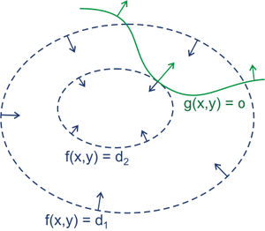

# 拉格朗日乘子法

## 背景介绍

- 求解无约束问题时，可以先求出所有的极值点，再从中选出最值点

- 求解有约束问题时，由于解空间受到限制，最值点不一定在极值点处取得

- 拉格朗日乘子法可以将 \\(n\\) 个变量、\\(k\\) 个条件的约束问题，转换为 \\(n+k\\) 个变量的无约束问题

- 典型的有约束模型如下：

	- 在特定的约束下，求解目标函数的最小值

	- 蓝色虚线是目标函数 \\(f(x,y)\\) 的等高线，等高线中心为目标函数的全局最小值

	- 绿色实线是约束条件 \\(g(x,y)\\) 的边界：

		- 如果约束条件是等式约束，可行的解空间在绿色实线上

		- 如果约束条件是不等式约束，可行的解空间在绿色实线的一侧

	

## 等式约束

- 当 \\(g(x,y) = 0\\) 时，称为等式约束

- 从等高线中心向外搜索，第一次与约束条件边界相切的点，即为约束条件下的最小值

	- 切点满足以下条件：

		- 目标函数 \\(f(x,y)\\) 与约束条件 \\(g(x,y)\\) 梯度共线：

			$$ \nabla f(x,y) = \beta \cdot \nabla g(x,y) $$

	- 因此可以构造以下拉格朗日函数：

		$$ L(x,y,\beta) = f(x,y) + \beta \cdot g(x,y) $$

		- 此时，\\(2\\) 变量、\\(1\\) 条件的约束问题转换为 \\(3\\) 变量的无约束问题

	- 对 \\(3\\) 变量求偏导并令导数为 \\(0\\)：

		$$ \nabla f(x,y) = -\beta \cdot \nabla g(x,y) $$

		$$ g(x,y) = 0 $$

	- 求解上述结果，即可得到原约束问题的最优解：

		- 此时 \\(g(x,y) = 0\\)，\\(L(x,y,\beta)\\) 的最小值等于 \\(f(x,y)\\) 的最小值

## 不等式约束

- 当 \\(g(x,y) \geq 0\\) 或 \\(g(x,y) \leq 0\\) 时，称为不等式约束

- 由于两种情况均可转换为 \\(G(x,y) \leq 0\\)，以 \\(g(x,y) \leq 0\\) 为例推导如下

- 在等高线图中，假设 \\(g(x,y) \leq 0\\) 的对应区域是绿色实线下方，此时约束条件不起作用：目标函数 \\(f(x,y)\\) 的最优解等于无约束问题中的最优解

- p

	- 该切点满足以下条件：

		- 由于等高线中心为最小值，因此目标函数在切点处的梯度方向为右上方

			- 沿着梯度方向，函数值上升最快

		- 由于 \\(g(x,y) \leq 0\\) 的对应区域是右上方，因此约束条件的梯度方向为左下方

			- 越靠近左下方区域，\\(g(x,y)\\) 越大

		- 综上，目标函数 \\(f(x,y)\\) 与约束条件 \\(g(x,y)\\) 的梯度共线且反向：

			$$ \nabla f(x,y) = - \alpha \cdot \nabla g(x,y) \qquad \alpha \geq 0 $$

	- 因此可以构造如下拉格朗日函数：

		$$ L(x,y,\alpha) = f(x,y) + \alpha \cdot g(x,y) \qquad \alpha \geq 0 $$
		
		- 当 \\(\alpha > 0\\) 时：

			- 如果 \\(g(x,y) < 0\\)，那么 \\(\alpha \cdot g(x,y)\\) 可以无限小于 \\(0\\)，此时 \\(L(x,y,\alpha)\\) 不存在最小值

			- 因此 \\(g(x,y) = 0\\) 必须成立，即 \\(\alpha \cdot g(x,y) = 0\\) 成立
		
		- 当 \\(\alpha = 0\\) 时：

			- 目标函数梯度 \\(\nabla f(x,y) = 0\\)，因此 \\(f(x,y)\\) 可以取到极值点处的值

			- 对于单极值问题，\\(\alpha = 0\\) 表明无约束问题的最优解包含在约束条件的解空间中；因此约束条件无效

			- 同时 \\(\alpha \cdot g(x,y) = 0\\) 也成立

		- 此时，\\(2\\) 变量、\\(1\\) 条件的约束问题转换为 \\(3\\) 变量的无约束问题

	- 对原始变量求偏导并令导数为 \\(0\\)：

		$$ \nabla f(x,y) + \alpha \cdot g(x,y) = 0 $$

		- 此时会得到关于 \\(\alpha\\) 的等式

	- 将上述结果代入 \\(L(x,y,\alpha)\\) 并求解对偶问题：

		$$ \max\_{\alpha} L(x,y,\alpha) $$

## 拉格朗日乘子法

- 假设要计算目标函数 \\(f(X)\\) 的最小值，有 \\(p\\) 个等式约束、\\(q\\) 个不等式约束：

	$$ \min\_{X} \ f(X) $$

	$$ h\_{i}(X) = 0 \qquad i = 1,2,\cdots,p $$

	$$ g\_{j}(X) = 0 \qquad j = 1,2,\cdots,q $$

- 构造拉格朗日函数如下：

	$$ L(X, \lambda, \mu) = f(X) + \sum\_{i=1}^{p} \lambda\_{i} h\_{i}(X) + \sum\_{j=1}^{q} \mu\_{j} g\_{j}(X) $$

- 该约束问题取到最优解的条件称为 KKT 条件：

	- 原变量约束：

		$$ \frac{\partial L}{\partial X} = 0 $$

	- 等式约束：

		$$ h\_{i}(X) = 0 \qquad i = 1,2,\cdots,p $$

	- 不等式约束：

		$$ \mu\_{j} g\_{j}(X) = 0 \qquad j = 1,2,\cdots,q $$

		$$ \mu\_{j} \geq 0 \qquad j = 1,2,\cdots,q $$

		$$ g\_{j}(X) \leq 0 \qquad j = 1,2,\cdots,q $$