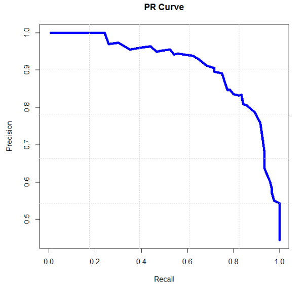
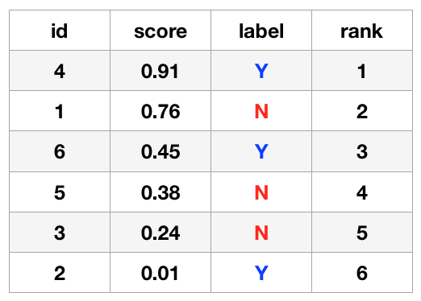
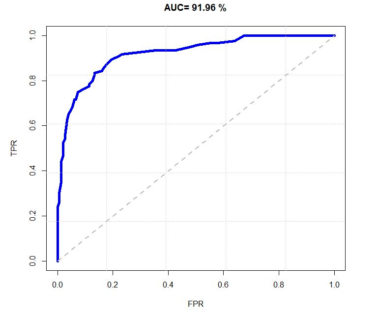

# 模型评价

## 评估方法

### 留出法

- 直接将数据集划分为两个互斥的训练集、验证集

	- 训练集、验证集的划分要尽可能保持数据一致性

	- 训练集、验证集比例介于 \\(2:1 - 4:1\\)

- 在训练集上训练出模型后，计算验证集上的泛化误差

	- 一般要进行多次随机划分，将平均值作为最终的泛化误差

### 交叉验证

- 将数据集分为 \\(k\\) 个大小相似的互斥子集

	- 每个子集尽可能保持分布的一致性

- 每次选择 \\(1\\) 个子集作为验证集，其他 \\(k-1\\) 个子集作为训练集，计算泛化误差

	- 计算 \\(k\\) 个验证集上误差的平均值，作为最终的泛化误差

- 当 \\(k\\) 等于样本数时，称为“留一法”，训练时计算开销较大

- 因此，\\(k\\) 一般取 \\(10\\)

### BootStrap

- 留出法和交叉验证在训练时，只使用了数据集的一个子集

- 对于有 \\(m\\) 个样本的数据集，随机有放回采样 \\(m\\) 次，得到训练集

- 某个样本在 \\(m\\) 次采样中均未被选中的概率为

	$$
	\lim\_{m \rightarrow \infty} \left( 1 - \frac{1}{m} \right) ^{m} = \frac{1}{e} = 0.368
	$$
	
	- 约有 \\(1 \ / \ 3\\) 的数据未被选中，将这些数据作为验证集

- BootStrap 能从原始数据集产生多个不同的训练集

## 偏差—方差分解

- 以回归任务为例，假设样本为 \\(x\\)，真实标记为 \\(y\\)，在训练集中的标记为 \\(y\_{D}\\)，训练集 \\(D\\) 上学得模型的预测输出为 \\(f(x;D)\\)

- 学习算法的期望输预测：

	$$
	\bar{f}(x) = E\_{D} [f(x;D)]
	$$

- 使用不同训练集产生的方差：

	$$
	var(x) = E\_{D} \left[ (f(x;D) - \bar{f}(x))^{2} \right]
	$$
	
	- 方差衡量了数据集变动导致的学习性能的变化

- 由于标记问题产生的噪声：

	$$
	\epsilon^{2} = E\_{D} \left[ (y\_{D} - y)^{2} \right]
	$$
	
	- 噪声衡量了当前任务上任何模型所能达到的泛化误差下界

- 期望输出与真实标记的偏差：

	$$
	bias^{2}(x) = \left( \bar{f}(x) - y \right) ^{2}
	$$
	
	- 偏差衡量了模型本身的拟合能力

- 平均泛化误差：

	$$
	E(f;D) = E\_{D} \left[ (f(x;D) - y\_{D})^{2} \right]
	$$

- 误差的偏差—方差分解

	$$
	E(f;D) = var(x) + bias^{2}(x) + \epsilon^{2}
	$$
	
	- 在训练不足时，模型拟合能力不强，训练集变动不足以使模型拟合的能力发生显著变化，此时偏差主导了泛化误差

	- 在训练充足后，模型拟合能力较强，训练集的轻微变动都会导致模型发生显著变化，此时方差主导了泛化误差

## 正确率

- Accuracy

- 正确分类的样本数占样本总数的比例

## 查准率

- Precision，又称精确率

- 预测出的正样本中，实际正样本所占比例

## 查全率

- Recall，又称召回率

- 预测出的正样本中，实际的正样本在所有正样本中的比例

## \\(F\\) 值

- \\(\frac{1}{F} = \alpha \frac{1}{P} + (1-\alpha) \frac{1}{R}\\)，即 \\(F = \frac{(\beta^{2} + 1) PR}{\beta^{2} P + R}\\)，而 \\(\beta^{2} = \frac{1-\alpha}{\alpha}\\)

- 其中 \\(\alpha\\) 或 \\(\beta\\) 决定查准率 \\(P\\) 和查全率 \\(R\\) 的权重：\\(\alpha > 0.5\\) 或 \\(\beta < 1\\) 时强调查准率 \\(P\\)；\\(\alpha < 0.5\\) 或 \\(\beta > 1\\) 时强调查全率 \\(R\\)

- \\(\beta=1\\) 或 \\(\alpha=0.5\\) 时，查准率 \\(P\\) 和查全率 \\(R\\) 的权重相同，此时的的 \\(F\\) 值称为 \\(F1\\) 值

- \\(F1\\) 值综合了查准率 \\(P\\) 和查全率 \\(R\\)，当 \\(F1\\) 值较高时，说明结果比较理想

## 真正例率

- \\(TPR\\)，即 True Positive Rate

- 预测出的正样本中，实际的正样本在所有正样本中的比例；也就是查全率

- 表示实际正样本中被正确预测的概率

## 假正例率

- \\(FPR\\)，即 False Positive Rate

- 预测出的正样本中，实际的负样本在所有负样本中的比例

- 表示实际负样本中被错误预测为正样本的概率

## \\(P-R\\) 曲线

- Precision-Recall，即 查准率-查全率 曲线

- 通过调整不同的阈值区分正负样本，得到一组 \\((R, P)\\) 值，将这些 \\((R, P)\\) 坐标绘制成 \\(P-R\\) 曲线

- 曲线越靠近右上角，整体效果越好

- \\(P-R\\) 曲线不单调，因此可以用来参数调优

- 正负样本分布变化时，\\(P-R\\) 曲线会发生较大变化

- 如果分类器 A 的 \\(P-R\\) 曲线包含分类器 B 的 \\(P-R\\) 曲线，那么分类器 A 的性能更好

## AP & mAP

- \\(P-R\\) 曲线下的面积称为 AP，即 Average Precision。AP 越大，检索性能越好

- 对多个类别的 AP 值进行平均得到 mAP，即 mean Average Precision

### 计算方式

- 设目标检索结果是 \\(\\{D\_{1}, \ D\_{2}, \ \cdots, \ D\_{n} \\}\\)，\\(R\_{i}\\) 是检索到 \\(D\_{i}\\) 时的排名，则：

	$$AP = \frac{1}{n} \sum\_{i=1}^{n} \frac{i}{R\_{i}}$$

- 对于以下检索结果，AP 值为：

	$$ AP = \frac{1}{3} \cdot (\frac{1}{1} + \frac{2}{3} + \frac{3}{6}) = 0.722 $$

	

## ROC 曲线

- 通过调整不同的阈值区分正负样本，得到一组 \\((FPR, TPR)\\) 值，将这些 \\((FPR, TPR)\\) 坐标绘制成 ROC 曲线

- ROC 曲线的纵坐标为 \\(P-R\\) 曲线的横坐标

- 曲线越靠近左上角，整体效果越好

- ROC 曲线单调递增，衡量的是分类器的相对性能

- 单调性不完全证明：

	- \\(TPR = \frac{TP}{TP + FN} = \frac{1} {1 + \frac{FN}{TP}}\\)，\\(FPR = \frac{FP}{FP + TN} = \frac{1} {1 + \frac{TN}{FP}}\\)

	- 当样本集固定时，TP + FN、FP + TN 均为定值

	- 当阈值减小时，TP、FP 都增大，导致 FN、TN 都减小，TPR、FPR 都增大

	- 当阈值为 1 时，所有样本都被预测为负样本，此时 TPR = FPR = 0，即（0，0）点

	- 当阈值为 0 时，所有样本都被预测为证样本，此时 TPR = FPR = 1，即（1，1）点

	- 直观上，从左下角过渡到右上角，阈值越来越低；因此，ROC 曲线单调递增

- 正负样本分布变化时，ROC 曲线保持不变。证明：

	- 由 TPR、FPR 意义可知：无论正负样本如何分布，相同阈值下的 TPR、FPR 不变

- 如果分类器 A 的 ROC 曲线包含分类器 B 的 ROC 曲线，那么分类器 A 的性能更好

## AUC

- ROC 曲线下的面积称为 AUC，即 Area Under Curve。AUC 越大，分类器性能越好

	- AUC = 1，完美分类器

		- 所有正样本都被被预测为正样本，没有负样本被预测为正样本，此时 AUC = 1.0，即 TPR = 1.0，FPR = 0.0 恒成立

	- 0.5 < AUC < 1，强于随机猜测

	- AUC = 0.5，与随机猜测效果一样

		- 从所有样本中各选择一半正负样本，将其预测为正样本，此时 AUC = 0.5

### 计算方式

- 假设有 \\(M\\) 个正样本，\\(N\\) 个负样本，共有 \\(T=M + N\\) 个样本

- 按得分对样本进行排序，对于所有 \\(M * N\\) 个正、负样本对，统计正样本得分高于负样本的样本对数量 \\(S\\)，则：

	$$AUC = \frac{S}{M \cdot N}$$

- 为加速计算，可令得分最高的样本 rank 为 \\(T\\)，第二高的样本为 \\(T-1\\)，以此类推：

	- 假设得分最高的正样本 rank 为 \\(R\_{1}\\)，那么共有 \\((R\_{1}-1)-(M-1) = R\_{1} - M\\) 个负样本的得分比该正样本低

	- 假设得分第二高的正样本 rank 为 \\(R\_{2}\\)，那么共有 \\((R\_{2}-1)-(M-2) = R\_{2} - (M - 1)\\) 个负样本的得分比该正样本低

	- 假设得分最低的正样本 rank 为 \\(R\_{M}\\)，那么共有 \\((R\_{M}-1)-(M-M) = R\_{M} - 1\\) 个负样本的得分比该正样本低

	- 因此：

	$$ S = \sum\_{i=1}^{M}R\_{i} - \sum\_{j=1}^{M}j= \sum\_{i=1}^{M}R\_{i} - \frac{M(M+1)}{2} $$

## \\(IoU\\)

- Intersection over Union

- 目标检测中常用的衡量指标，计算 Region Proposal 与 Bounding Box 的重叠率

- 假设 Region Proposal 区域为 \\(P\\)，Bounding Box 区域为 \\(B\\)，计算如下：

	$$ IoU = \frac{P \cap B}{P \cup B} $$

- \\(IoU\\) 越大，检测结果越准确；当 \\(IoU=1\\) 时，Region Proposal 和 Bounding Box 完全重合