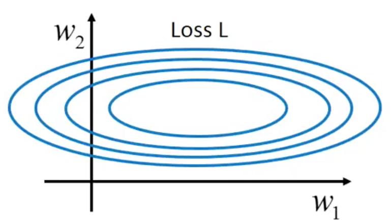

# 优化方法

## 背景介绍

- 建立模型后，需要最小化损失函数

- 一般采用基于梯度的方法及其变种，对参数进行持续迭代更新，直到模型趋于稳定

## 常用优化方法

### $\mathrm{Gradient \ Descent \ Optimizer}$

- 通常所说的梯度下降，是指 $\mathrm{Mini-batch \ Gradient \ Descent}$

- 更新公式均为 $\theta \leftarrow \theta - \eta \nabla_{\theta} J \left( \theta \right)$，但计算梯度时使用的样本数量不同

#### $\mathrm{Batch \ Gradient \ Descent}$

- 更新参数时，使用所有的样本计算梯度

- 优点：

  - 能得到全局最优解，迭代次数少

- 缺点：

  - 当样本集太大时，训练过程缓慢

#### $\mathrm{Stochastic \ Gradient \ Descent}$

- 更新参数时，使用单个样本计算梯度

- 优点：

  - 训练速度快

- 缺点：

  - 训练过程不稳定，得不到全局最优解

#### $\mathrm{Mini-batch \ Gradient \ Descent}$

- 更新参数时，使用 $N$ 个样本计算梯度；$N$ 一般为 $50 - 256$

- 优点：

  - 训练速度较快，接近全局最优解

#### 总结

- 鞍点附近梯度较小，如果鞍点较多，会导致训练过程接近停滞

- 选择合适的学习率 $\eta$ 非常依赖于经验

- 对每个参数的学习率都相同，这种做法不合理：

  - 当一个方向上的梯度变化比另一个方向陡峭，训练过程会发生明显振荡

    - 在 $\mathrm{loss}$ 的等高线图中，$w_{1}$ 方向梯度较小，$w_{2}$ 方向梯度较大

    - 合理的选择是为 $w_{1}$ 设置较大的学习率，为 $w_{2}$ 设置较小的学习率

### 牛顿法

#### 牛顿法

- $f \left( x \right)$ 在 $x_{k}$ 处的二阶泰勒展开为：

  $$
  f \left( x_{k} \right) + f' \left( x_{k} \right) \cdot \left( x - x_{k} \right) + \frac{1}{2} f'' \left( x_{k} \right) \cdot \left( x - x_{k} \right)^{2}
  $$

- 对 $x$ 求导：

  $$
  f' \left( x_{k} \right) + f'' \left( x_{k} \right) \cdot \left( x - x_{k} \right)
  $$

- 令导数为 $0$ ：

  $$
  x = x_{k} - \frac{f' \left( x_{k} \right)}{f'' \left( x_{k} \right)}
  $$

- 因此牛顿法迭代公式为：

  $$
  x_{k+1} = x_{k} - \frac{f' \left( x_{k} \right)}{f^{''} \left( x_{k} \right)}
  $$

- 对于多元函数，要用到 $\mathrm{Hessian}$ 矩阵

- 牛顿法用二次曲面拟合当前位置的局部曲面，而梯度下降法用平面拟合当前位置的局部曲面

  - 通常情况下，二次曲面比平面拟合情况要好，因此牛顿法迭代次数更少

### $\mathrm{Momentum \ Optimizer}$

- 借用物理中动量的概念，模拟物体运动时的惯性，在一定程度上保留之前的更新方向，同时根据当前 $\mathrm{Batch}$ 的梯度微调最终的更新方向

- 参数更新过程如下：

  $$
  v_{t} \leftarrow \gamma v_{t - 1} + \eta \nabla_{\theta} J \left( \theta \right)
  $$

  $$
  \theta \leftarrow \theta - v_{t}
  $$

  - 超参数 $\gamma$ 通常设置为 $0.9$

- 优点：

  - 由于保留了之前的更新方向，在一定程度上能够减少振荡，从而加速收敛

### $\mathrm{RMSProp \ Optimizer}$

- 递归地计算梯度平方的历史均值：

  $$
  \mathbb{E} \left[ g^{2} \right]_{t} \leftarrow \gamma \mathbb{E} \left[ g^{2} \right]_{t - 1} + \left( 1 - \gamma \right) g_{t}^{2}
  $$

  - 超参数 $\gamma$ 通常设置为 $0.9$

- 参数更新如下：

  $$
  \theta_{t + 1} \leftarrow \theta_{t} - \frac{\eta}{\sqrt{\mathbb{E} \left[ g^{2} \right]_{t} + \epsilon}} \ g_{t}
  $$

  - 超参数 $\eta$ 通常设置为 $0.001$

- 无需设置默认学习率，训练初期加速效果不错

### $\mathrm{Adam \ Optimizer}$

- 本质上是带偏差校正和动量项的 $\mathrm{RMSProp}$

- 像 $\mathrm{RMSProp}$ 一样，保存梯度平方的历史均值 $v_{t}$；除此之外，还保存梯度的历史均值 $m_{t}$，类似于动量：

  $$
  \left\{ \begin{matrix} m_{t} \leftarrow \beta_{1} \ m_{t - 1} + \left( 1 - \beta_{1} \right) \ g_{t} \\ v_{t} \leftarrow \beta_{2} \ v_{t - 1} + \left( 1 - \beta_{2} \right) \ g_{t}^{2} \end{matrix} \right.
  $$

  - $m_{t}, \ v_{t}$ 分别是对梯度的一阶矩（均值）、二阶矩（方差）的估计

  - 超参数 $\beta_{1}, \ \beta_{2}$ 通常设置为 $0.9, \ 0.999$

- $m_{t}, \ v_{t}$容易偏向于 $0$，需要进行偏置校正：

  $$
  \left\{ \begin{matrix} \tilde{m_{t}} = \frac{m_{t}}{1 - \beta_{1}^{t}} \\ \tilde{v_{t}} = \frac{v_{t}}{1 - \beta_{2}^{t}} \end{matrix} \right.
  $$

- 最终参数更新如下：

  $$
  \theta_{t + 1} \leftarrow \theta_{t} - \frac{\eta}{\sqrt{\tilde{v_{t}}} + \epsilon} \ \tilde{m_{t}}
  $$

  - 超参数 $\eta$ 通常设置为 $0.001$

- 由于优化后期梯度越来越稀疏，偏差校正使得 $\mathrm{Adam}$ 在实际中表现更好