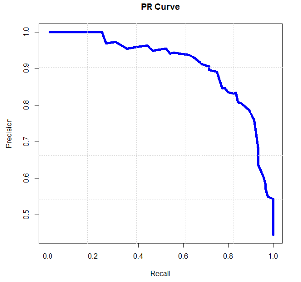
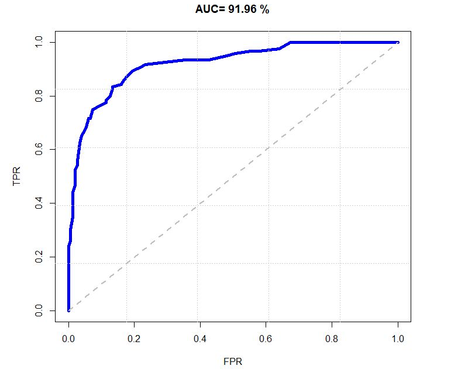

# 结果评价

## 正确率

- accuracy

- 正确分类的样本数占样本总数的比例

## 查准率

- Precision，又称精确率

- 预测出的正样本中，实际正样本所占比例

## 查全率

- Recall，又称召回率

- 预测出的正样本中，实际的正样本在所有正样本中的比例

## \\(F\\) 值

- \\(\frac{1}{F} = \alpha \frac{1}{P} + (1-\alpha) \frac{1}{R}\\)，即 \\(F = \frac{(\beta^{2} + 1) PR}{\beta^{2} P + R}\\)，而 \\(\beta^{2} = \frac{1-\alpha}{\alpha}\\)

- 其中 \\(\alpha\\) 或 \\(\beta\\) 决定查准率 \\(P\\) 和查全率 \\(R\\) 的权重：\\(\alpha > 0.5\\) 或 \\(\beta < 1\\) 时强调查准率 \\(P\\)；\\(\alpha < 0.5\\) 或 \\(\beta > 1\\) 时强调查全率 \\(R\\)

- \\(\beta=1\\) 或 \\(\alpha=0.5\\) 时，查准率 \\(P\\) 和查全率 \\(R\\) 的权重相同，此时的的 \\(F\\) 值称为 \\(F1\\) 值

- \\(F1\\) 值综合了查准率 \\(P\\) 和查全率 \\(R\\)，当 \\(F1\\) 值较高时，说明结果比较理想

## 真正例率

- \\(TPR\\)，即 True Positive Rate

- 预测出的正样本中，实际的正样本在所有正样本中的比例；也就是查全率

- 表示实际正样本中被正确预测的概率

## 假正例率

- \\(FPR\\)，即 False Positive Rate

- 预测出的正样本中，实际的负样本在所有负样本中的比例

- 表示实际负样本中被错误预测为正样本的概率

## \\(P-R\\) 曲线

- Precision-Recall，即 查准率-查全率 曲线

- 通过调整不同的阈值区分正负样本，得到一组 \\((R, P)\\) 值，将这些 \\((R, P)\\) 坐标绘制成 \\(P-R\\) 曲线

- 曲线越靠近右上角，整体效果越好

- \\(P-R\\) 曲线不单调，因此可以用来参数调优

- 正负样本分布变化时，\\(P-R\\) 曲线会发生较大变化

- 如果分类器 A 的 \\(P-R\\) 曲线包含分类器 B 的 \\(P-R\\) 曲线，那么分类器 A 的性能更好

## ROC 曲线

- 通过调整不同的阈值区分正负样本，得到一组 \\((FPR, TPR)\\) 值，将这些 \\((FPR, TPR)\\) 坐标绘制成 ROC 曲线

- ROC 曲线的纵坐标为 \\(P-R\\) 曲线的横坐标

- 曲线越靠近左上角，整体效果越好

- ROC 曲线单调递增。单调性不完全证明：

	- \\(TPR = \frac{TP}{TP + FN} = \frac{1} {1 + \frac{FN}{TP}}\\)，\\(FPR = \frac{FP}{FP + TN} = \frac{1} {1 + \frac{TN}{FP}}\\)

	- 当样本集固定时，TP + FN、FP + TN 均为定值

	- 当阈值减小时，TP、FP 都增大，导致 FN、TN 都减小，TPR、FPR 都增大

	- 当阈值为 1 时，所有样本都被预测为负样本，此时 TPR = FPR = 0，即（0，0）点

	- 当阈值为 0 时，所有样本都被预测为证样本，此时 TPR = FPR = 1，即（1，1）点

	- 直观上，从左下角过渡到右上角，阈值越来越低；因此，ROC 曲线单调递增

- 正负样本分布变化时，ROC 曲线保持不变。证明：

	- 由 TPR、FPR 意义可知：无论正负样本如何分布，相同阈值下的 TPR、FPR 不变

- 如果分类器 A 的 ROC 曲线包含分类器 B 的 ROC 曲线，那么分类器 A 的性能更好

- ROC 曲线下的面积称为 AUC，即 Area Under Curve。AUC 越大，分类器性能越好

	- AUC = 1，完美分类器

		- 所有正样本都被被预测为正样本，没有负样本被预测为正样本，此时 AUC = 1.0，即 TPR = 1.0，FPR = 0.0 恒成立

	- 0.5 < AUC < 1，强于随机猜测

	- AUC = 0.5，与随机猜测效果一样

		- 从所有样本中各选择一半正负样本，将其预测为正样本，此时 AUC = 0.5

