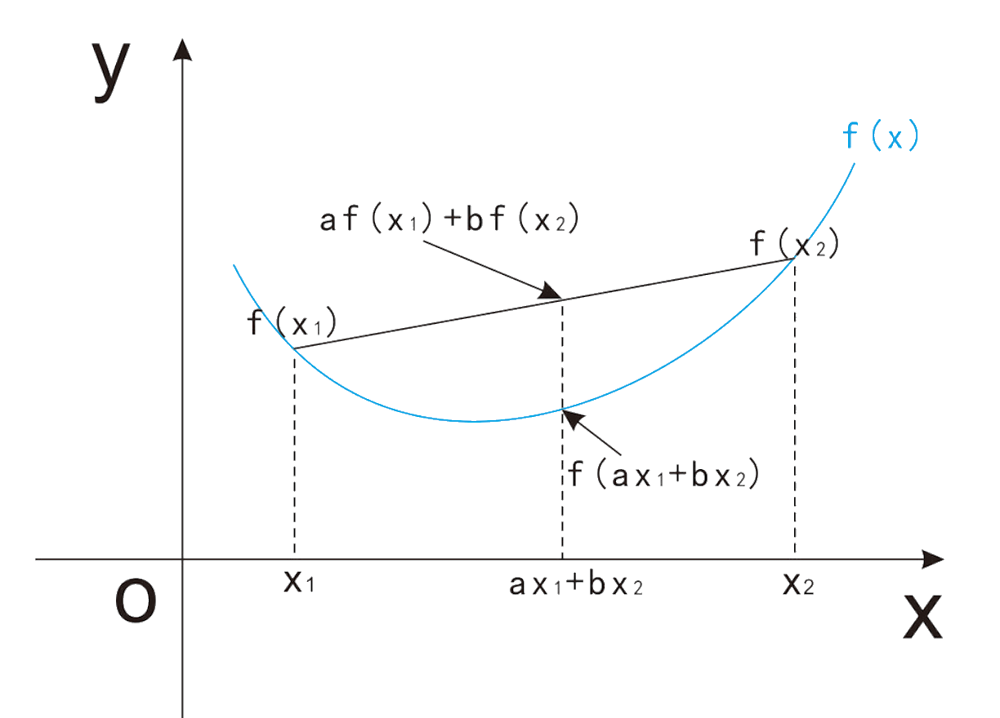

# 数学定理

## Jensen 不等式

- 向下凸起的函数称为凸函数，凸函数有最小值

- 对于凸函数上的任意两点，这两点的割线一定在这两点间函数图像的上方，即：

	$$ a f(x\_{1}) + b f(x\_{2}) \geq f(a x\_{1} + b x\_{2}) $$
	
	- 其中 \\(0 \leq a,b \leq 1\\) 且 \\(a + b = 1\\)

	

## 大数定律

- 对于 \\(n\\) 个独立同分布的样本，当 \\(n \rightarrow \infty\\) 时，样本均值收敛到期望值：

	$$ \lim\_{n \rightarrow \infty}{\frac{1}{n} \sum\_{i=1}^{n} x\_{i}} = \mu $$

## 中心极限定理

- 对于 \\(n\\) 个独立同分布的样本，当 \\(n \rightarrow \infty\\) 时，样本均值近似服从正态分布：

	$$ \lim\_{n \rightarrow \infty} \frac{1}{n} \sum\_{i=1}^{n} x\_{i} \ \sim \ N(\mu, \frac{\sigma^{2}}{n}) $$

## 泰勒展开

- 函数 \\(f(x)\\) 的在 \\(x=a\\) 处的泰勒展开如下：

	$$ f(x) = \sum\_{n=0}^{\infty} \frac{f^{n}(a)}{n!} (x-a)^{n} $$

## 期望运算

- 线性运算的期望等于期望的线性运算：

	$$ E \left( \sum\_{i=1}^{n} a\_{i} x\_{i} + c \right) = \sum\_{i=1}^{n} a\_{i} E(x\_{i}) + c $$

- 如果两个变量相互独立，乘积的期望等于期望的乘积：

	$$ E(xy) = E(x) \cdot E(y) $$

## 方差运算

- 线性运算的方差，等于所有协方差的线性运算：

	$$ Var \left( \sum\_{i=1}^{n} a\_{i} x\_{i} \right) = \sum\_{i=1}^{n} \sum\_{j=1}^{n} a\_{i} a\_{j} Cov(x\_{i}, x\_{j}) $$

- 如果两个变量相互独立，线性运算的方差计算如下：

	$$ Var(ax+by) = a^{2} Var(x) + b^{2} Var(y) $$

- 如果两个变量相互独立，且均值为 \\(0\\)，乘积的方差计算如下：

	$$ Var(xy) = Var(x) \cdot Var(y) $$