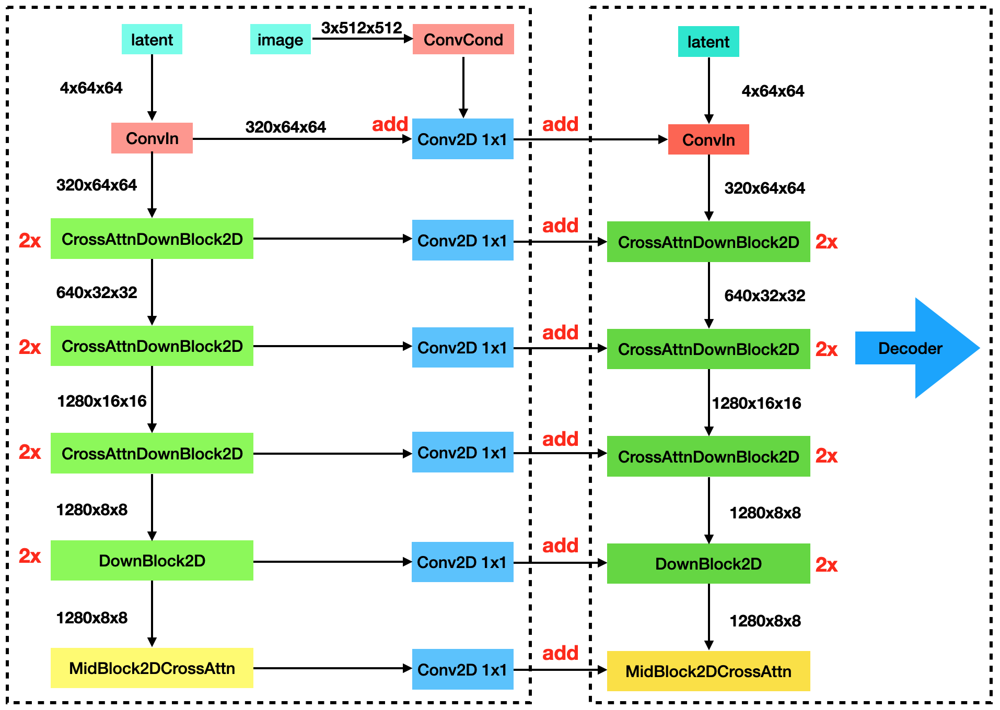

# $\mathrm{ControlNet}$

## 基本思想

- 通过额外的输入模块，控制 $\mathrm{Stable \ Diffusion}$ 的输出结果，与输入尽量匹配

- 额外的输入可以是图像的边缘信息、语义分割信息、深度信息等

## 网络结构

- 复制一份 $\mathrm{Stable \ Diffusion}$ 的 $\mathrm{Encoder}$ 部分参数（左），通过一个外部向量进行训练（$\mathrm{image}$）

  - 原始 $\mathrm{U-Net}$ 部分的权重，在训练过程和推理过程中始终被冻结，保持不变

  - 对原始权重进行复制而不是直接训练原始权重，主要是为了避免小数据集训练导致的过拟合，保持大模型性能

- 在 $\mathrm{Encoder}$ 模块的前后各添加一个 $\mathrm{Conv2D \ 1\times 1}$ 卷积层，训练开始时，该部分权重置为 $0$

- $\mathrm{ConvCond}$ 负责将输入的 $3$ 通道控制图像转换为 $320 \times 64 \times 64$，以适应 $\mathrm{U-Net}$ 输入维度

- $\mathrm{ControlNet}$ 输出与 $\mathrm{U-Net}$ 的 $\mathrm{Encoder}$ 结果叠加后，送入 $\mathrm{U-Net}$ 的 $\mathrm{Decoder}$ 模块，按原流程进行处理（右）

## 训练过程

- 对于 $\mathrm{Encoder}$ 模块前后的 $\mathrm{Conv2D \ 1\times 1}$ 卷积层

  - 训练开始时，$\mathrm{ControlNet}$ 输出与原始 $\mathrm{U-Net}$ 的输出一致

  - 训练过程中，权重逐渐调整，并适应特定任务

- 在训练过程中，以 $50\%$ 概率随机将文本 $\mathrm{prompt}$ 置为空，从而促使模型更关注控制图像中的信息

## $\mathrm{Control \ Mode}$

### 均衡模式

- 对应 $\mathrm{WebUI}$ 的 $\mathrm{Balanced}$ 或 $\mathrm{diffusers}$ 的 $\mathrm{guess\_mode = False}$

- 直接将 $\mathrm{ControlNet}$ 结果加到 $\mathrm{U-Net}$ 的 $\mathrm{Encoder}$ 上

### 无提示词的猜测模式

- 对应 $\mathrm{WebUI}$ 的 $\mathrm{ControlNet \ is \ more \ important}$ 或 $\mathrm{diffusers}$ 的 $\mathrm{guess\_mode = True}$

- 具体实现时，将 $\mathrm{ControlNet-Encoder}$ 的 $13$ 个输出先加权，再加到 $\mathrm{U-Net}$ 的 $\mathrm{Encoder}$ 上

  - 包括 $8$ 个 $\mathrm{CrossAttn}$ 层、$3$ 个下采样层、$1$ 个 $\mathrm{ConvIn}$ 层、$1$ 个 $\mathrm{MidBlock}$

  - 权重数值按等比数列设置，范围是 $\left[ 0.1, \cdots , \ 1.0 \right]$；所在层数越深，权重越大

## $\mathrm{Reference \ Only}$

- 除正常的模式（复制 $\mathrm{Encoder}$ 并训练）外，还支持不使用模型的 $\mathrm{Reference \ Only}$ 模式

  - 将参考图信息编码在 $\mathrm{U-Net}$ 的 $\mathrm{Self-Attenion}$ 模块中

- 通过 $\mathrm{Reference \ Only}$ 模式，（一定程度上）可以生成与参考图接近的图片（可能是姿态、色彩等）

### 具体实现

- 通过 $\mathrm{StableDiffusion-AutoEncoder}$（$\mathrm{VAE}$）的 $\mathrm{Encoder}$ 部分得到参考图的隐空间输入 $\mathrm{ref\_latent}$

- 基于与 $\mathrm{latent}$ 相同的 $\mathrm{seed}$，向参考图的 $\mathrm{ref\_latent}$ 添加高斯噪声

- 以 $\mathrm{ref\_latent}$ 为输入，第一次运行 $\mathrm{U-Net}$，记录每个 $\mathrm{Attenion}$ 模块的中间状态

- 以 $\mathrm{latent}$ 为输入，第二次运行 $\mathrm{U-Net}$，对于 $\mathrm{Attenion}$ 模块的 $\mathrm{Self-Attention}$ 部分：

  - 首先计算“当前输入”与“当前输入 + 对应 $\mathrm{ref}$ 输入”（$\mathrm{concat}$）的 $\mathrm{Self-Attention}$

  - 然后计算“当前输入”与“当前输入”的 $\mathrm{Self-Attention}$

  - 该部分涉及 $\mathrm{Classifier-Free-Guidance}$，但不涉及 $\mathrm{prompt}$，$\mathrm{condition}$ 是指参考图 $\mathrm{ref\_latent}$

  - 通过风格忠实度参数 $\mathrm{style\_fidelity}$ 控制参考图的影响程度

    - $0$ 表示更接近大模型风格，此时参考图影响较弱

    - $1$ 表示更接近参考图风格，但效果不稳定

    - 通常使用平衡值 $0.5$