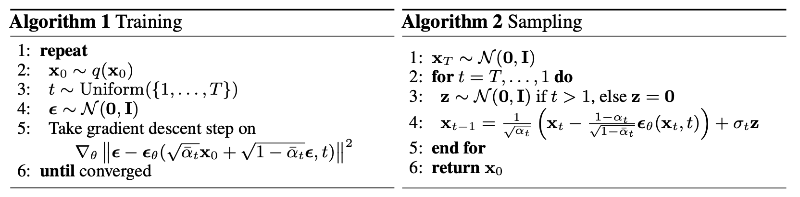

# $\mathrm{DDPM}$

## 基本原理

- 扩散模型包括两个过程：前向过程和反向过程

  - 前向过程又叫扩散过程，用于加噪声

  - 反向过程又叫去噪过程，用于生成数据

## 扩散过程（前向）

- 前向过程又叫扩散过程，指的是对原始数据逐渐添加高斯噪声，直至数据变成随机噪声的过程

- 对于原始数据 $x_{0} \sim q \left( x_{0} \right)$，扩散过程总共 $T$ 步，其中每一步 $t$ 都一步得到的数据 $x_{t-1}$ 按如下方式添加高斯噪声

  $$
  q \left( x_{t} \mid x_{t-1} \right) = N \left( x_{t}; \ \sqrt{1 - \beta_{t}} \ x_{t - 1}, \ \ \beta_{t} \ I \right)
  $$

  - $\left\{ \beta_{t} \right\}_{t=1}^{T}$ 为每一步的方差，介于 $0 \sim 1$ 之间

    - 不同 $\mathrm{step}$ 的方差设定称为 $\mathrm{variance \ schedule}$ 或 $\mathrm{noise \ schedule}$，以下简称 $\mathrm{schedule}$

    - 通常，越靠后的 $\mathrm{step}$，使用的方差也越大，即 $\beta_{1} < \beta_{2} < \cdots < \beta_{T} $

  - 扩散过程每一步都生成一个带噪声的 $x_{t}$；如果 $T$ 足够大，最终得到的 $x_{T}$ 就会完全丢失原始数据，变成随机噪声

- 扩散过程满足马尔可夫性质，即当前时刻状态 $x_{t}$ 只与前一时刻状态 $x_{t - 1}$ 有关；因此可直接对原始数据 $x_{0}$ 进行任意 $t$ 步采样得到 $x_{t}$

  $$
  \begin{aligned}
  x_{t} \sim q \left( x_{0} \right) &= \sqrt{\bar{\alpha}_{t}} \ x_{0} + \sqrt{1 - \bar{\alpha}_{t}} \ \epsilon \newline
  &\sim N \left( x_{t}; \ \sqrt{\bar{\alpha}_{t}} \ x_{0}, \ \left( 1 - \bar{\alpha}_{t} \right) \ I \right)
  \end{aligned}
  $$

  - 其中 $\alpha_{t} = 1 - \beta_{t}, \ \bar{\alpha}_{t} = \prod_{i = 1}^{t} \alpha_{i}$，而 $\epsilon$ 是高斯噪声；推理过程用到了高斯函数叠加性和重参数化技巧

    - 高斯函数叠加性：

    $$
    N \left( 0, \ \sigma_{1}^{2} \ I \right) + N \left( 0, \ \sigma_{2}^{2} \ I \right) = N \left( 0, \ \left( \sigma_{1}^{2} + \sigma_{2}^{2} \right) \ I \right)
    $$

    - 重参数化技巧：

      - 从 $q \left( z \right) \sim N \left( z; \ \mu, \ \sigma^{2} I \right)$ 采样等效于从 $z = \mu + \sigma \odot \epsilon$ 采样，其中 $\epsilon \sim N \left( 0, \ I \right) $

  - 基于上述推导，$x_{t}$ 可以看成是原始数据 $x_{0}$ 与随机噪声 $\epsilon$ 的线性加权

    - $\sqrt{\bar{\alpha}_{t}}$ 称为 $\mathrm{signal\_rate}$，$\sqrt{1 - \bar{\alpha}_{t}}$ 称为 $\mathrm{noise\_rate}$

- 更进一步，可以基于 $\bar{\alpha}_{t}$ 而不是 $\beta_{t}$ 来定义 $\mathrm{schedule}$

  - 由于 $x_{t} = \sqrt{\bar{\alpha}_{t}} \ x_{0} + \sqrt{1 - \bar{\alpha}_{t}} \ \epsilon$，直接将 $\bar{\alpha}_{T}$ 设置为接近 $0$ 的值，即可得到近似随机噪声 $x_{T}$

- 需要说明的是，扩散过程往往是固定的，即采用一个预先定义好的 $\mathrm{schedule}$

## 去噪过程（反向）

- 反向过程又叫去噪过程，指的是从随机噪声 $x_{T} \sim N \left( 0, \ I \right) $开始，逐渐去噪，最终生成数据的过程

- 去噪过程每一步的真实分布 $q \left( x_{t - 1} \mid x_{t} \right)$ 不可知，但加上条件 $x_{0}$ 的后验分布 $q \left( x_{t - 1} \mid x_{t}, \ x_{0} \right)$ 可以处理：

  - 基于贝叶斯公式、高斯函数性质，$q \left( x_{t - 1} \mid x_{t}, \ x_{0} \right)$ 的方差、均值分别为（过程略）：

  $$
  \tilde{\beta}_{t} = \frac{1 - \bar{\alpha}_{t - 1}}{1 - \bar{\alpha}_{t}} \cdot \beta_{t} \newline
  \tilde{\mu}_{t} \left( x_{t}, \ x_{0} \right) = \frac{\sqrt{\alpha_{t}} \ \left( 1 - \bar{\alpha}_{t - 1} \right)}{1 - \bar{\alpha}_{t}} \ x_{t} + \frac{\sqrt{\bar{\alpha}_{t - 1}} \ \beta_{t}}{1 - \bar{\alpha}_{t}} \ x_{0}
  $$

    - 因此，方差 $\tilde{\beta}_{t}$ 是一个定值，均值 $\tilde{\mu}_{t} \left( x_{t}, \ x_{0} \right)$ 是依赖 $x_{t}, \ x_{0}$ 的函数

- 基于变分推断、$\mathrm{Jesen}$ 不等式，得到的优化目标如下（过程略）：

  $$
  L_{t - 1} = \mathbb{E}_{q \left( x_{t} \mid x_{0} \right)} \left[ \frac{1}{2\sigma_{t}^{2}} \left\| \tilde{\mu}_{t} \left( x_{t}, \ x_{0} \right) - \mu_{\theta} \left( x_{t}, \ t \right) \right\|^{2} \right]
  $$

  - 即，希望网络学习到的均值 $\mu_{\theta} \left( x_{t}, \ t \right)$ 与后验分布的均值 $\tilde{\mu}_{t} \left( x_{t}, \ x_{0} \right)$ 一致

- 根据扩散过程特性，将 $x_{t} = \sqrt{\bar{\alpha}_{t}} \ x_{0} + \sqrt{1 - \bar{\alpha}_{t}} \ \epsilon$ 中的 $x_{0}$ 代入上式，结合重参数化可得（过程略）：

  $$
  L_{t - 1}^{\mathrm{simple}} = \mathbb{E}_{x_{0}, \ \epsilon \sim N \left(0, \ I \right)} \left[ \left\| \epsilon - \epsilon_{0} \left( \sqrt{\bar{\alpha}_{t}} \ x_{0} + \sqrt{1 - \bar{\alpha}_{t}} \ \epsilon, \ t \right) \right\|^{2} \right]
  $$

  - 上述过程，将预测均值转换为预测噪声

  - 实验结果表明，预测噪声比预测均值效果更好

## 扩散与去噪

- 对于前向扩散过程

  - 损失函数与预测噪声的梯度有关

- 对于反向去噪过程

  - 先由 $x_{t} = \sqrt{\bar{\alpha}_{t}} \ x_{0} + \sqrt{1 - \bar{\alpha}_{t}} \ \epsilon$ 解出 $x_{0}$ 

  - 再基于 $x_{0}$ 求解 $\tilde{\mu}_{t} \left( x_{t}, \ x_{0} \right)$

  - 最后基于重采样 $z = \mu + \sigma \odot \epsilon$，代入可得

## 模型设计

- 扩散模型的在于训练噪声预测模型

- 由于噪声与原始数据同维度，可以采用 $\mathrm{AutoEncoder}$ 作为噪声预测模型

- 理论上，扩散模型实际需要 $T$ 个噪声预测模型

- 实际处理时，可以训练一个共享的 $\mathrm{AutoEncoder}$

  - 在 $\mathrm{DDPM}$ 的每个残差块中加入 $\mathrm{time \ embedding}$，类似 $\mathrm{Transformer}$ 的 $\mathrm{position \ embedding}$