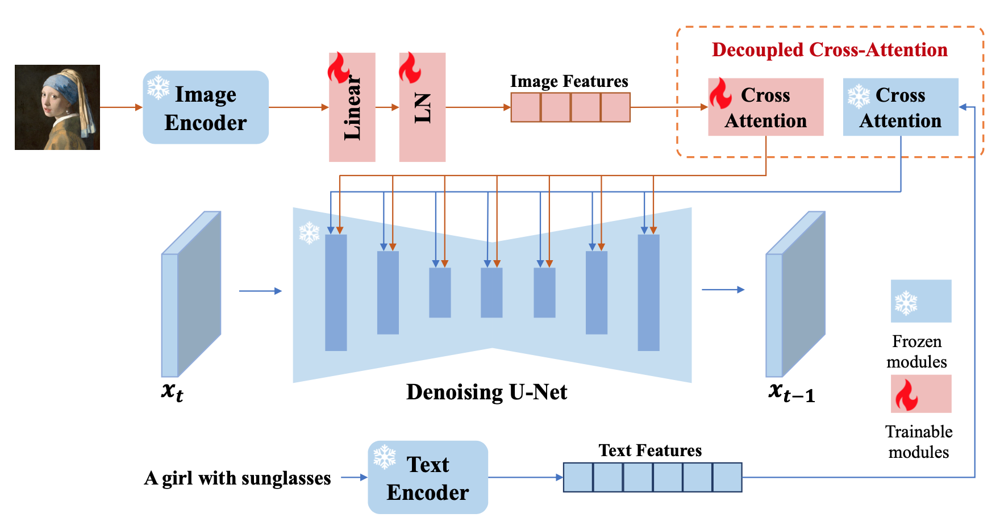

# $\mathrm{IP-Adapter}$

## 基本思想

- 再复杂的文本 $\mathrm{prompt}$，信息量也不如一张图像 $\mathrm{prompt}$

- 将图像信息转换为 $\mathrm{Stable \ Diffusion}$ 的 $\mathrm{prompt}$，可以与文本 $\mathrm{prompt}$ 配合使用

### $\mathrm{Cross-Attention}$ 解耦

- 由于原始 $\mathrm{Corss-Attention}$ 主要用于学习文本结构特征，直接加入图像特征，可能导致某些图像结构特征难以学习

- 可以用 $\mathrm{CLIP}$ 提取图像 $\mathrm{Embedding}$，通过额外 $\mathrm{Cross-Attention}$ 处理后，与原始 $\mathrm{Cross-Attention}$ 特征相加

- 具体使用的模型是 $\mathrm{CLIP-ViT-H/14}$，输入图像分辨率 $224 \times 224$

  - 对应 $\mathrm{Patch \ Embedding}$ 的长度为 $\left( 224 / 14 \right) ^ {2} + 1 = 257$

- 对于 $\mathrm{query}$ 部分，直接使用原始 $\mathrm{Cross-Attention}$ 的输出；因此只需要训练 $\mathrm{key, \ value}$ 相关的权重矩阵

## 网络结构

### $\mathrm{IP-Adapter}$

- 基于 $\mathrm{CLIP}$ 的 $\mathrm{Global \ Embedding}$，特征维度 $1 \times 1024$

  - $\mathrm{Patch \ Embedding}$ 特征经过了 $\mathrm{Pooling}$ 处理

- 通过 $\mathrm{Reshape + Linear}$ 得到 $1 \times 4 \times 768$ 向量

### $\mathrm{IP-Adapter-Plus}$

- 基于 $\mathrm{CLIP}$ 的 $\mathrm{Patch \ Embedding}$，特征维度 $1 \times 257 \times 1280$

- 首先通过 $\mathrm{Linear}$ 得到 $1 \times 257 \times 768$ 向量

- 通过四次采样 + $\mathrm{Self-Attention}$ 模块得到 $1 \times 16 \times 768$ 向量

### $\mathrm{IP-Adapter-Full}$

- 基于 $\mathrm{CLIP}$ 的 $\mathrm{Patch \ Embedding}$，特征维度 $1 \times 257 \times 1280$

- 直接通过两个 $\mathrm{Linear}$ 得到 $1 \times 257 \times 768$ 向量

### $\mathrm{IP-Adapter-FaceID}$

- 类似 $\mathrm{IP-Adapter}$

- 基于人脸识别模型的输出层 $\mathrm{Embedding}$，特征维度 $1 \times 512$

- 通过 $\mathrm{Reshape + Linear}$ 得到 $1 \times 4 \times 768$ 向量

- 对于 $\mathrm{Attention}$ 部分，通过训练 $\mathrm{LoRA}$ 可以提高 $\mathrm{ID}$ 一致性（原理未知）

### $\mathrm{IP-Adapter-FaceID-Plus}$

- $\mathrm{IP-Adapter-FaceID}$ 对人脸姿态、人脸结构等信息保持较差

- 基于人脸识别模型的输出层 $\mathrm{Embedding}$ 和 $\mathrm{CLIP}$ 的 $\mathrm{Patch \ Embedding}$

  - 前者用于保持人脸的身份，特征维度 $1 \times 512$

    - 通过 $\mathrm{Reshape + Linear}$ 得到 $1 \times 4 \times 768$ 向量

  - 后者用于保持人脸的结构，特征维度 $1 \times 257 \times 1280$

    - 通过四次采样 + $\mathrm{Self-Attention}$ 模块得到 $1 \times 4 \times 768$ 向量

- 上述两部分特征向量相加，作为 $\mathrm{Cross-Attention}$ 的输入图像特征

- 对于 $\mathrm{Attention}$ 部分，通过训练 $\mathrm{LoRA}$ 可以提高 $\mathrm{ID}$ 一致性（原理未知）

### $\mathrm{IP-Adapter-FaceID-PlusV2}$

- 类似 $\mathrm{IP-Adapter-FaceID-Plus}$

- 区别在于，可以调整 $\mathrm{CLIP}$ 特征向量的权重

## 训练过程

- 训练过程中，原始 $\mathrm{U-Net}$ 参数保持不变，只训练 $\mathrm{IP-Adapter}$ 新增的 $\mathrm{Cross-Attention}$ 模块

- 为了加速训练收敛，图像 $\mathrm{Cross-Attention}$ 的权重初始化为文本 $\mathrm{Cross-Attention}$ 权重