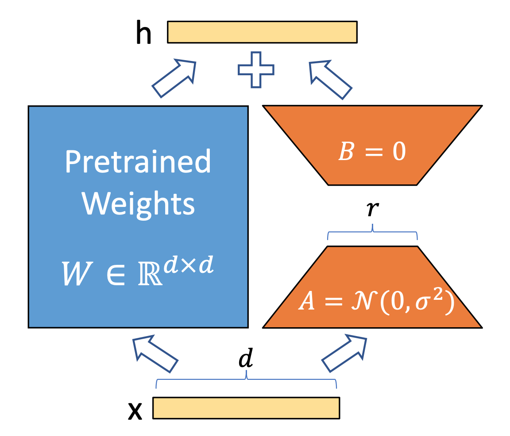
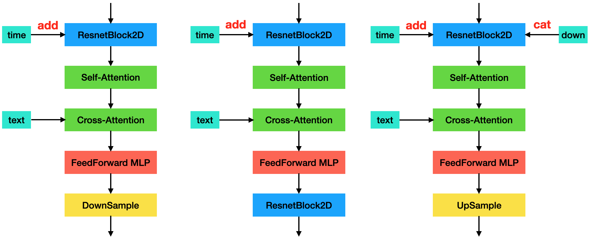

# $\mathrm{LoRA}$

## $\mathrm{LoRA}$

### 提出背景

- 前人研究表明，大模型都是过参数化的。用于特定任务时，其中只有一小部分参数起主要作用

- 因此，预训练模型的本征维度（有效维度）很小

  - 也就是说，存在一个维度较低的参数集合，微调它与微调整个模型，能起到相同的效果

- 换句话说，尽管权重矩阵维度很高，但可以用低维矩阵分解近似

  - 类似于矩阵特征向量，主成分分析的思想

- 只作用于 $\mathrm{Self-Attention}$ 模块的几个矩阵 $W_{q}, \ W_{k}, \ W_{v}, \ W_{o}$

  - $W_{o}$ 指 $\mathrm{Multi-Head \ Attention}$ 模块 $\mathrm{Concat}$ 后的输出时的 $\mathrm{Linear}$ 层权重

- 在 $\mathrm{Stable \ Diffusion}$ 中，则是作用于 $\mathrm{Cross-Attention, \ Self-Attention}$（包括 $\mathrm{U-Net, \ TextEncoder}$）层的相关参数

### 基本思想

- 对于网络层 $L$ 的权重 $W$，正常全局微调时，相当于将 $L$ 的权重调整为 $W + \Delta W$

  - 其中 $\Delta W$ 表示微调结束时权重 $W$ 的变化量，二者维度相同

- 基于“预训练模型有效维度很小”这个前提，在 $W$ 旁增加一条分支，包含降维结构 $A$ 和升维结构 $B$

  - $A$ 的输出维度与 $B$ 的输入维度相同，称为秩（$\mathrm{rank}$，记为 $r$）

  - $r$ 远小于 $W$ 的输入输出维度

- 初始化时，结构 $A$ 的参数设置为高斯分布，结构 $B$ 的参数全部设置为 $0$

  - 因此训练开始时，$L$ 的输出与预训练模型一致

- 训练过程中，固定参数 $W$，只训练 $A$ 和 $B$ 的参数

  - 网络层 $L$ 的输出是两个分支相加：$Wx + BAx$

- 训练结束时，合并 $A$ 和 $B$ 的参数：$W + \Delta W = W + BA$

#### 缩放因子

- 由于 $\mathrm{LoRA}$ 的特殊结构，神经网络的权重通常很小，保存 $\mathrm{LoRA}$ 权重时甚至会近似为 $0$，存在精度问题

- 可以通过 $\alpha$ 参数对权重进行削弱，削弱率 $\mathrm{ratio}$ 表示为 $\frac{\alpha}{r} \in \left( 0, \ 1 \right]$

  - 通常将 $\alpha$ 设置为 $r$ 的一半，即 $\mathrm{ratio} = 0.5$

  - 理论上 $\alpha$ 可以设置为任意正数，但 $\alpha$ 太大时，不保证 $\mathrm{LoRA}$ 效果

- 实际计算时，将 $L$ 层输出乘以 $\mathrm{ratio}$；因此保存的权重参数相对较大，可以减少精度问题

### 实际效果

- 由于参数 $W$ 固定，而参数 $A, \ B$ 维度很低，因此训练显存占用明显减少，模型文件的磁盘占用明显减少

  - 参数 $W$ 不涉及梯度反传，显存中无需保存相关梯度信息

  - 参数 $W$ 全程不变，磁盘上仅保存 $A, \ B$ 相关权重即可

- 由于减少了梯度反传，训练过程更快

- 实际效果跟全局微调接近，甚至比全局微调更好

- 可以方便地在不同任务上进行切换，从 $W$ 中先减去旧 $BA$ 再合并新 $BA$ 即可

  - 减少的是完整模型文件从 $\mathrm{CPU}$ 读取，以及从 $\mathrm{CPU}$ 加载到 $\mathrm{GPU}$ 的时间

### 其他结论

- 微调参数总量固定时，$W_{q}, \ W_{k}, \ W_{v}, \ W_{o}$ 同时调整时的效果最好

- 即使是很小的 $r$ 值（比如 $2$ 甚至是 $1$），$\mathrm{LoRA}$ 都有不错的效果

- $\mathrm{LoRA}$ 的更新矩阵 $\Delta W = BA$，仅仅放大了对特定任务有用的特征

  - 这些特征早已在预训练模型中学得，但在预训练模型中权重偏低

## $\mathrm{LoCon}$

### 基本思想

- 除了 $\mathrm{Attention}$ 层，也对卷积层参数进行低维分解

- $\mathrm{Stable \ Diffusion}$ 的基本单元如下：

  - 在 $\mathrm{LoRA}$ 中，仅对 $\mathrm{Self/Cross-Attention}$ 层的 $W_{q}, \ W_{k}, \ W_{v}, \ W_{o}$ 参数，以及 $\mathrm{FeedFordward}$ 中参数进行低维分解

    - 实际上，除了 $\mathrm{Attention, \ FeedFordward}$ 的 $\mathrm{Linear}$ 层，还包括整个 $\mathrm{Block}$ 前后用于通道变换的 $\mathrm{1 \times 1 \ Conv2D}$

    - $\mathrm{U-Net, \ TextEncoder}$ 中的 $\mathrm{Transformer}$ 模块都有所涉及

  - 在 $\mathrm{LoCon}$ 中，还对 $\mathrm{ResnetBlock2D, \ DownSample/UpSample}$ 中的卷积核进行了低维分解

    - 通道降维部分的卷积核大小与原始卷积核相同（通常为 $3$），通道升维部分的卷积核大小设置为 $1 \times 1$

    - 训练结束后，与 $\mathrm{LoRA}$ 一样，直接合并两个卷积核即可

### 实际效果

- 训练过程可能略慢，推理过程速度不变

- 相比 $\mathrm{LoRA}$，（可能）可以保留更多的细节