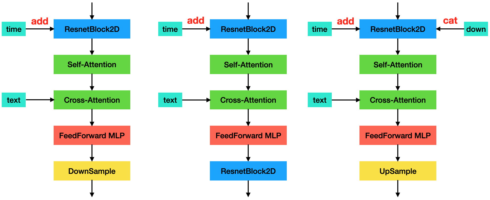

# $\mathrm{Stable \ Diffusion}$

## $\mathrm{Stable \ Diffusion}$

### 提出背景

- 传统的 $\mathrm{diffusion}$ 模型在像素空间进行操作；当图像分辨率过高时，前向扩散过程和反向去噪过程都很慢

- 基于 $\mathrm{AutoEncoder}$，在隐空间上进行“加噪-去噪”，提升速度

- 由于是在隐空间进行操作，可以把不同模态的输入映射到隐空间，进而可以应用于多模态任务

  - 接受的输入形式包括但不限于：文本、图像、语义图等

### 隐空间（$\mathrm{Latent \ Space}$）

- 简单来说，隐空间是对数据的压缩降维；通过降维，可以滤掉一些无关紧要的信息

- 在 $\mathrm{Stable \ Diffusion}$ 中，首先训练一个 $\mathrm{AutoEncoder}$，学习图像数据的低维表示

  - 通过编码器 $E$，将全尺寸图像压缩到隐空间中

  - 通过解码器 $D$，将隐空间数据恢复到全尺寸图像

- 实验发现，下采样 $4$ 倍或 $8$ 倍时，是效果和性能的折衷点

### 扩散、去噪

- 固定训练完成的 $\mathrm{AutoEncoder}$，在隐空间中进行前向扩散和反向去噪

- 由于是在隐空间进行操作，可以将其他模态的信息映射到隐空间，进而应用于多模态任务

#### $\mathrm{Cross-Attention}$

- 以文本生成图像为例，首先通过 $\mathrm{BERT, \ CLIP}$ 等语言模型将文本转换为 $\mathrm{Embedding}$ 向量

- 通过 $\mathrm{Cross-Attention}$ 机制映射到 $\mathrm{U-Net}$ 相关层，$\mathrm{Cross-Attention}$ 类似 $\mathrm{Self-Attention}$，计算如下：

  $$
  \mathrm{Attention} \left( Q, \ K, \ V \right) = \mathrm{softmax} \left( \frac{Q K^{T}}{\sqrt{d}} \right) \cdot V \newline
  Q = W_{Q} \cdot \varphi \left( z \right), \quad K = W_{K} \cdot \tau \left( y \right), \quad V = W_{V} \cdot \tau \left( y \right)
  $$

  - $z$ 是 $\mathrm{U-Net}$ 上一层输出，$y$ 是文本的 $\mathrm{Embedding}$ 向量

  - $\tau$ 是一个域专用解码器，用于将文本向量映射为中间表示，方便后续信息融合

- $\mathrm{U-Net}$ 中，$\mathrm{Encoder-Decoder}$ 的每一层都使用 $\mathrm{Cross-Attention}$

### 条件控制模型 $\mathrm{Classifier-Free-Guidance}$

- 想要输入特定类别的图片，最简单的方案是直接复用预训练的无条件大模型，训练一个自定义的分类模型，通过分类模型进行采样，生成目标类别的数据

  - 由于推理过程需要用到两个模型，采样效率有所下降

  - 实验结果和部分理论分析表明，$\mathrm{Classifier-Guidance}$ 方式会导致样本质量下降

- 除此之外，也可以训练一个隐式的分类模型来代替显式的分类模型，并通过以下方式进行采样（过程略）：

  $$
  \begin{aligned}
  \epsilon_{out} &= \epsilon_{uc} + \beta \cdot \left( \epsilon_{c} - \epsilon_{uc} \right) \newline
  &= \beta \cdot \epsilon_{c} + \left( 1 - \beta \right) \cdot \epsilon_{uc}
  \end{aligned}
  $$

  - $\epsilon_{out}$ 为最终输出，$\epsilon_{uc}$ 为无条件生成模型输出，$\epsilon_{c}$ 为条件生成模型输出

  - $\beta$ 为调节因子，用于控制类别信息（也可是任意条件信息）对扩散过程的影响程度

    - 相当于对无条件生成模型输出 $\epsilon_{uc}$ 和 条件生成模型输出 $\epsilon_{c}$ 的线性插值

    - 对应 $\mathrm{WebUI}$ 的 $\mathrm{CFG \ Scale}$ 或 $\mathrm{diffusers}$ 的 $\mathrm{guidance\_scale}$

    - $\beta$ 越大，结果与 $\mathrm{prompt}$ 越匹配，（通常）会增加图片饱和度，颜色更平滑；$\beta$ 过大时，结果会崩

- 理论上，需要训练两个模型：无条件模型、有条件模型

- 实际上，可以用同一个模型表示。训练时只需以一定概率将条件置空即可

- 实验结果表明，$\mathrm{Classifier-Free-Guidance}$ 可以有效解决有条件控制时样本质量下降的问题

### $\mathrm{Negative \ Prompt}$

- 与 $\mathrm{Classifier-Free-Guidance}$ 类似，采用以下公式进行采样（过程略）：

  $$
  \begin{aligned}
  \epsilon_{out} &= \epsilon_{neg} + \beta \cdot \left( \epsilon_{pos} - \epsilon_{neg} \right) \newline
  &= \beta \cdot \epsilon_{pos} + \left( 1 - \beta \right) \cdot \epsilon_{neg}
  \end{aligned}
  $$

  - 其中 $\epsilon_{pos}$ 是 $\mathrm{prompt}$ 对应的模型输出，$\epsilon_{neg}$ 是 $\mathrm{negative \ prompt}$ 对应的模型输出

  - 当 $\mathrm{negative \ prompt}$ 为空时，$\epsilon_{neg}$ 对应 $\mathrm{Classifier-Free-Guidance}$ 的无条件输出 $\epsilon_{uc}$

### 网络结构

#### $\mathrm{U-Net}$

- 包含 $\mathrm{CrossAttnDownBlock2D, \ MidBlock2DCrossAttn, \ CrossAttnUpBlock2D}$ 共 $3$ 种基本单元

  - 分别代表下采样、中间处理、上采样 $3$ 个阶段

  - 下采样部分，$\mathrm{CrossAttnDownBlock2D}$ 重复 $2$ 次

  - 上采样部分，$\mathrm{CrossAttnUpBlock2D}$ 重复 $3$ 次

- $\mathrm{U-Net}$ 的输入输出均为 $4 \times 64 \times 64$，相对于 $\mathrm{Stable \ Diffusion}$ 输入输出，下采样 $8$ 倍

- 在 $\mathrm{U-Net}$ 运算过程中，又进行了 $8$ 倍下采样；因此相对于 $\mathrm{Stable \ Diffusion}$ 输入输出，共下采样 $64$ 倍

#### $\mathrm{U-Net}$ 基本单元

- 下采样 $\mathrm{CrossAttnDownBlock2D}$、中间处理 $\mathrm{MidBlock2DCrossAttn}$、上采样 $\mathrm{CrossAttnUpBlock2D}$ 分别如下

- $\mathrm{DownBlock2D, \ UpBlock2D}$ 为简单的 $\mathrm{ResnetBlock2D}$ 单元

- 时间信息 $\mathrm{TimeEmbedding}$ 在 $\mathrm{ResnetBlock2D}$ 中通过 $\mathrm{add}$ 方式进行处理

- 文本信息 $\mathrm{TextEmbedding}$ 在 $\mathrm{Cross-Attention}$ 中通过 $W_{k}, \ W_{v}$ 作为输入

- 下采样单元的输出通过 $\mathrm{concat}$ 方式引入上采样单元作为输入，并进一步处理；共有 $12$ 次 $\mathrm{concat}$：

  - $1$ 个 $\mathrm{ConvIn}$ 输出 $\mathrm{concat}$ 到 $\mathrm{ConvOut}$ 作为输入

  - $6$ 个 $\mathrm{CrossAttnDownBlock2D}$ 的常规输出 $\mathrm{concat}$ 到对应的 $6$ 个 $\mathrm{CrossAttnUpBlock2D}$ 作为输入

  - 其中进行下采样的 $3$ 个 $\mathrm{CrossAttnDownBlock2D}$，输出还包括$\mathrm{DownSample}$ 部分，同样需要 $\mathrm{concat}$

  - $2$ 个 $\mathrm{DownBlock2D}$ 的输出 $\mathrm{concat}$ 到对应的 $2$ 个 $\mathrm{UpBlock2D}$ 作为输入

### $\mathrm{Stable \ Diffusion \ v1.0-v1.5}$

- 基于不同数据集、训练步长得到的不同 $\mathrm{checkpoint}$

  - 网络结构相同，预训练分辨率均为 $512 \times 512$

### $\mathrm{Stable \ Diffusion \ v2.0-v2.1}$

- 将 $\mathrm{Text-Encoder}$ 从 $\mathrm{CLIP-L/14}$ 升级为 $\mathrm{OpenCLIP-H/14}$，模型更大，能够更准确地提取文本特征

- $\mathrm{U-Net}$ 的 $\mathrm{Cross-Attention}$ 模块的维度由 $768$ 调整为 $1024$（适配 $\mathrm{CLIP}$ 结构变更）

- 除了支持 $512 \times 512$ 之外，也提供预训练的 $768 \times 768$ 分辨率版本

## $\mathrm{Stable \ Diffusion \ XL}$

- $\mathrm{Stable \ Diffusion}$ 进阶版，针对 $1024 \times 1024$ 分辨率优化

### 网络结构

#### $\mathrm{VAE}$

- 采用与 $\mathrm{Stable \ Diffusion}$ 相同的 $\mathrm{VAE}$ 结构

- 但在训练时做了以下改进，以提高模型鲁棒性：

  - 将 $\mathrm{batch\_size}$ 从 $9$ 提到 $256$

  - 通过 $\mathrm{EMA}$（指数滑动平均）对模型参数进行平均

#### $\mathrm{U-Net}$

- 相比 $\mathrm{Stable \ Diffusion}$ 版的 $\mathrm{U-Net}$，改进如下（参数量变为 $3$ 倍）：

  - 通道数保持不变，但 $\mathrm{stage}$ 数量从 $4$ 变为 $3$，因此整体下采样 $4$ 倍

  - $\mathrm{stage2, \ stage3}$ 的 $\mathrm{TransformerBlock}$ 数量有所增加：

    - $\mathrm{stage2}$ 的 $\mathrm{TransformerBlock}$ 数量从 $1$ 变为 $2$，$\mathrm{stage3}$ 的 $\mathrm{TransformerBlock}$ 数量从 $1$ 变为 $10$

    - 一个 $\mathrm{TransformerBlock}$ 是指 $\mathrm{SelfAttention-CrossAttention-FeedForward}$

#### $\mathrm{Text-Encoder}$

- 使用两个 $\mathrm{Text-Encoder}$ 的特征级联作为文本的 $\mathrm{Embedding}$（$2048$ 维）

  - 第一个 $\mathrm{Text-Encoder}$ 与原始 $\mathrm{Stable \ Diffusion}$ 相同，输出维度 $768$

  - 第二个 $\mathrm{Text-Encoder}$ 为更大的 $\mathrm{OpenCLIP \ ViT-bigG}$，输出维度 $1280$

- 此外，$\mathrm{OpenCLIP \ ViT-bigG}$ 的 $\mathrm{Pooled \ Text-Embedding}$ 与 $\mathrm{Time-Embedding}$ 相加作为辅助

#### $\mathrm{Refiner}$ 模型（可选项）

- 上述 $\mathrm{Stable \ Diffusion \ XL}$ 模型有时细节较差

- 为了提高生成质量，在同一个 $\mathrm{VAE}$ 空间中训练了一个单独的 $\mathrm{LDM}$ 模型

  - 上述标准 $\mathrm{Stable \ Diffusion \ XL}$ 称为 $\mathrm{base}$ 模型，该模型称为 $\mathrm{refiner}$ 模型

- $\mathrm{refiner}$ 模型与 $\mathrm{base}$ 模型训练逻辑一致，但只在前 $200$ 个 $\mathrm{timestep}$ 进行训练（共 $1000$ 步）

- $\mathrm{refiner}$ 模型与 $\mathrm{base}$ 模型的 $\mathrm{U-Net}$ 有所不同：

  - 共 $4$ 个 $\mathrm{stage}$，每个 $\mathrm{stage}$ 的通道数比 $\mathrm{base}$ 模型更多（$320 \rightarrow 384$）

  - 每个 $\mathrm{stage}$ 内的 $\mathrm{TransformerBlock}$ 均为 $4$

- 推理时，首先从 $\mathrm{base}$ 模型生成 $\mathrm{latent}$，进行简单加噪后，通过 $\mathrm{refiner}$ 模型生成最终 $\mathrm{latent}$

### 训练优化

- 傅立叶特征编码后的维度为 $256$，最终 $\mathrm{Time-Embedding}$ 维度为 $2048 + 256 \times 3 = 2816$

  - 傅立叶特征编码：对信息进行正余弦编码

#### 图像尺寸条件化

- 为了不丢弃小尺寸图片，通常做法是对原图进行放大

  - 但图像简单放大或超分可能会影响图像质量，进而影响训练效果

- 将图片的尺寸（$\mathrm{width, \ height}$）通过傅立叶特征进行编码，然后 $\mathrm{concat}$ 到 $\mathrm{Time-Embedding}$

  - 训练时，让模型自动学习图像的原始分辨率信息

  - 推理时，通过调整嵌入的 $\mathrm{width, \ height}$ 即可得到不同质量的图片

    - 数值越大，图像越清晰；数值越小，图像越模糊

#### 图像裁剪参数条件化

- 为了保持训练时同一个 $\mathrm{batch}$ 内图像尺寸相同，需要对原图进行裁剪

  - 对于人像生成，可能会裁掉头部、脚部区域，进而影响模型对相关概念的学习

- 将裁减位置坐标（$\mathrm{x, \ y}$）通过傅立叶特征进行编码，然后 $\mathrm{concat}$ 到 $\mathrm{Time-Embedding}$

  - 与原始图片尺寸（$\mathrm{width, \ height}$）一起 $\mathrm{concat}$，让模型自动学习图像的裁剪信息

  - 推理时，设置（$\mathrm{x, \ y}$）为（$0, \ 0$）即可得到主体居中且无特征缺失的图像

#### 多长宽比图像训练

- 基于长宽比 $\mathrm{ratio}$，对图像进行聚类，每个类别总像素接近 $1024 \times 1024$

- 训练时，随机选择一个长宽比，并将 $\mathrm{ratio}$ 嵌入到 $\mathrm{Time-Embedding}$，学习长宽比信息

## 图生图 $\mathrm{img2img}$

- 在文生图 $\mathrm{txt2img}$ 模式下，$\mathrm{U-Net}$ 的输入是随机噪声

- 在图生图 $\mathrm{img2img}$ 模式下，$\mathrm{U-Net}$ 的输入是加噪后的图像特征（由 $\mathrm{AutoEncoder}$ 提取）

  - $\mathrm{denoising}$ 控制实际的“加噪-去噪”步数 $N$

  - $\mathrm{denoising = 0.5}$ 表示只进行 $0.5 \cdot N$ 步“加噪-去噪”，因此速度比 $\mathrm{txt2img}$ 更快

- 重绘 $\mathrm{inpaint}$ 模式是一种特殊的 $\mathrm{img2img}$ 模式，需要额外的 $\mathrm{mask}$ 输入来标记需要重绘的区域

  - 与 $\mathrm{img2img}$ 流程类似

  - 但对于 $\mathrm{mask}$ 以外的区域，用输入图对应步数的特征（来源于加噪过程）进行替换