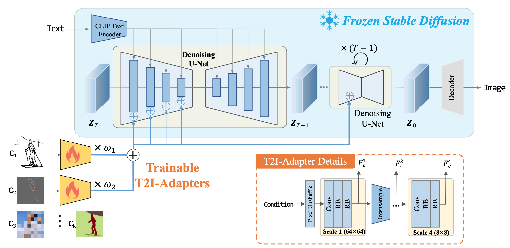

# $\mathrm{T2I-Adapter}$

## 基本思想

- 通过额外的输入模块，控制 $\mathrm{Stable \ Diffusion}$ 的输出结果，与输入尽量匹配

- 额外的输入可以是图像的边缘信息、语义分割信息、深度信息等

- 与 $\mathrm{ControlNet}$ 原理类似，不同的点在于网络结构

  - $\mathrm{ControlNet}$ 对 $\mathrm{U-Net}$ 的 $\mathrm{Encoder}$ 进行了复制，结合 $\mathrm{zero-convolution}$ 将控制信息注入原始 $\mathrm{Encoder}$

  - $\mathrm{T2I-Adapter}$ 通过重新设计的网络结构，将学习到的控制信息，直接注入原始 $\mathrm{Encoder}$

## 网络结构

- 通过 $\mathrm{PixelUnshuffle + Conv2D}$ 将 $3 \times 512 \times 512$ 输入变成 $192 \times 64 \times 64 \rightarrow 320 \times 64 \times 64$

- 通过 $4$ 组 $\mathrm{AdapterBlock}$（共 $8$ 个）一步步将特征降维提取为 $64 \times 64, \ 32 \times 32, \ 16 \times 16, \ 8 \times 8$ 尺度

- 上述 $4$ 个尺度的特征，分别与 $\mathrm{U-Net}$ 的对应层 $\mathrm{Encoder}$ 输出相加后，送入 $\mathrm{U-Net}$ 的对应 $\mathrm{Decoder}$

