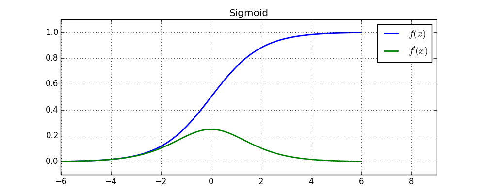
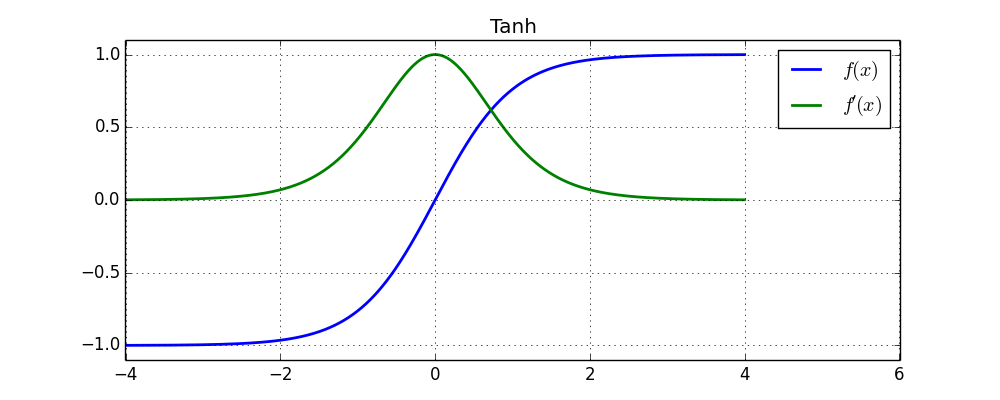
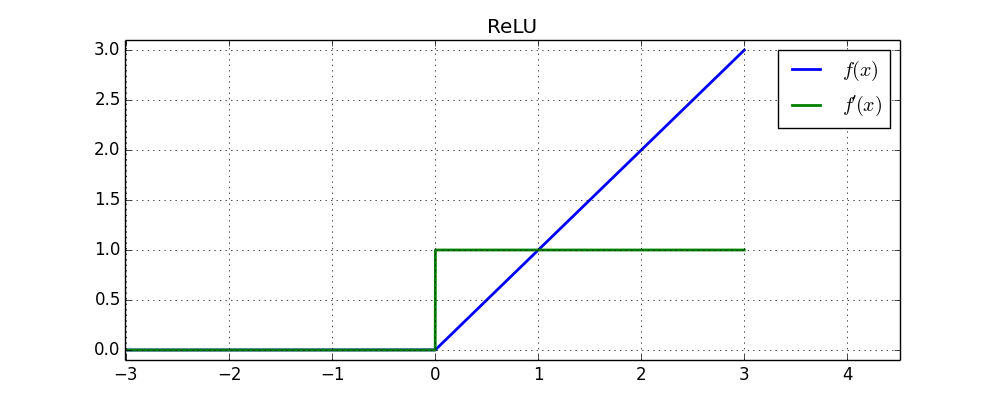
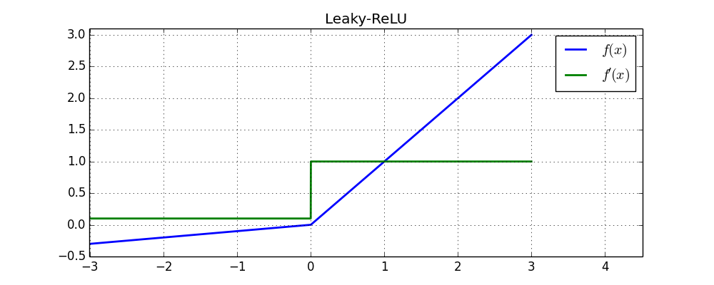
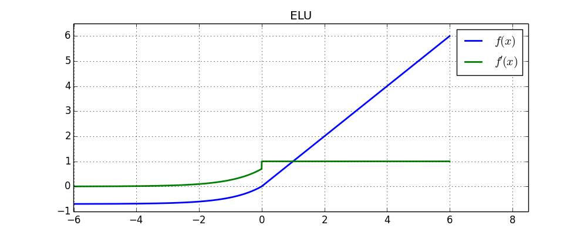
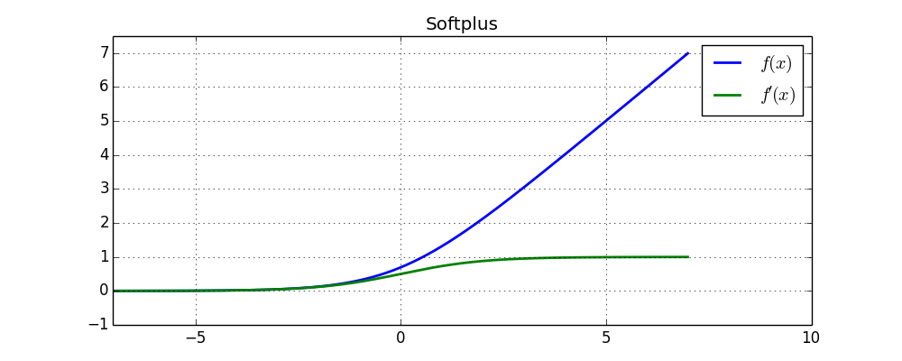

# 激活函数

## 背景介绍

- 在神经网络中，当不使用激活函数或使用线性激活函数时，每一层输出都是上一层输入的线性函数；无论神经网络有多少层，输出都是输入的线性组合，难以拟合复杂的函数

### 激活函数特性

#### 非线性

- 对于线性激活函数，输出仅仅是输入的线性组合

#### 可微性

- 当优化方法基于梯度时，该性质必须满足

#### 单调性

- 保证单层网络是凸函数，可以优化求解

#### 有界性

- 方便数值计算

## 常用激活函数

### $\mathrm{Softmax}$

- 用于多分类神经网络输出，计算如下：

  $$
  f \left( x_{i} \right) = \frac{\mathrm{e}^{x_{i}}}{\sum_{j} \mathrm{e}^{x_{j}}}
  $$

#### $\mathrm{softmax}$ 溢出

- 在计算 $\mathrm{softmax}$ 时存在以下问题：

  - 某个 $x_{i}$ 太大，计算 $\mathrm{e}^{x_{i}}$ 容易上溢

  - 所有 $x_{j}$ 都太小，计算 $\sum_{j} \mathrm{e}^{x_{j}}$ 容易下溢，分母为 $0$

- 通常先减去 $x$ 中的最大值 $M$，再进行计算：

  $$
  \frac{\mathrm{e}^{x_{i}}}{\sum_{j} \mathrm{e}^{x_{j}}} = \frac{\mathrm{e}^{-M} \cdot \mathrm{e}^{x_{i}}}{\mathrm{e}^{-M} \cdot \sum_{j} \mathrm{e}^{x_{j}}} = \frac{\mathrm{e}^{x_{i} - M}}{\sum_{j} \mathrm{e}^{x_{j} - M}}
  $$

  - 都减去最大值 $M$，保证了不会上溢

  - 分母中至少有一项为 $1$，虽无法避免分子下溢，却能保证分母有意义

#### $\mathrm{log \ softmax}$ 溢出

- 由于上述方法无法避免下溢，当需要计算 $\mathrm{log \ softmax}$ 时存在以下问题：

  - 某个 $x_{i}$ 太小，其 $\mathrm{softmax}$ 值为 $0$，而 $\log \left( 0 \right) = -\infty$

- 通常不计算 $\mathrm{softmax}$，而是直接 $\mathrm{log \ softmax}$ 值：

  $$
  \log \left( \frac{\mathrm{e}^{x_{i}}}{\sum_{j} \mathrm{e}^{x_{j}}} \right) = \log \left( \frac{ \mathrm{e}^{x_{i} - M}}{\sum_{j} \mathrm{e}^{x_{j} - M}} \right) = \left( x_{i} - M \right) - \log \left( \sum_{j} \mathrm{e}^{x_{j} - M} \right)
  $$

  - 都减去最大值 $M$，保证了不会上溢

  - $\mathrm{log}$ 中至少有一项为 $1$，虽无法避免下溢，却能保证 $\mathrm{log}$ 有意义

### $\mathrm{Sigmoid}$

- 原函数、导数分别如下：

  $$
  f \left( x \right) = \frac{1}{1 + \mathrm{e}^{-x}} \qquad f' \left( x \right) = f \left( x \right) \cdot \left( 1 - f \left( x \right) \right)
  $$

  

  
  

#### 优点

- 单调连续，将输出映射在 $\left( 0,  \ 1 \right)$ 区间，输出值可作为概率，可用于输出层

#### 缺点

- 在神经网络反向传播过程中，需要用到 $\mathrm{sigmoid}$ 导数，但 $\mathrm{sigmoid}$ 导数容易饱和，导致向底层传递的梯度消失，网络参数难以有效训练

- 激活值始终为正，无法输出负数

### $\mathrm{Tanh}$

- 原函数、导数分别如下：

  $$
  f \left( x \right) = \frac{\mathrm{e}^{x} - \mathrm{e}^{-x}}{\mathrm{e}^{x} + \mathrm{e}^{-x}} \qquad f' \left( x \right) = 1 - f \left( x \right)^{2}
  $$

  

  
  

#### 优点  

- 解决了 $\mathrm{sigmoid}$ 函数不能输出负数的问题

- 导数比 $\mathrm{sigmoid}$ 大，收敛速度比 $\mathrm{sigmoid}$ 快

#### 缺点

- $\mathrm{tanh}$ 导数容易饱和，无法解决梯度消失问题，网络参数难以有效训练

### $\mathrm{ReLU}$

- $\mathrm{Rectified \ Linear \ Unit}$

- 原函数、导数分别如下：

  $$
  f \left( x \right) = \max \left( x, \ 0 \right) \qquad f' \left( x \right) = \left\{ \begin{matrix} 1, \quad x \geq 0 \\ 0, \quad x < 0 \end{matrix} \right.
  $$

  

  
  

#### 优点

- 在 $x > 0$ 时梯度不衰减，缓解梯度消失问题，可以有效训练深层神经网络

- 由于原函数、导数都不包含复杂的数学运算，可以加速计算

#### 缺点

- 当某个神经元被 $\mathrm{ReLU}$ 函数抑制时，梯度难以继续更新，神经元不可逆的死亡

- 当学习率过高时，很容易导致大部分神经元死亡

### $\mathrm{Leaky \ ReLU}$

- 原函数、导数分别如下：

  $$
  f \left( x \right) = \left\{ \begin{matrix} x, \quad x \geq 0 \\ \alpha x, \quad x < 0 \end{matrix} \right. \qquad f' \left( x \right) = \left\{ \begin{matrix} 1, \quad x \geq 0 \\ \alpha, \quad x < 0 \end{matrix} \right.
  $$

  

  
  

#### 优点

- 由于导数始终不为 $0$，可以解决 $\mathrm{ReLU}$ 神经元死亡的问题

#### 缺点

- $\alpha$ 值难以凭经验确定，需要多次实验选择才能比 $\mathrm{ReLU}$ 更好

### $\mathrm{PReLU}$

- $\mathrm{Parametric \ ReLU}$

- 函数定义与 $\mathrm{Leaky \ ReLU}$相同，但是将 $\alpha$ 也作为待学习的参数

- 根据原论文，建议将初始值设置为 $\mathrm{0.25}$，不采用正则项约束

### $\mathrm{RReLU}$

- $\mathrm{Randomized \ ReLU}$

- 函数定义与 $\mathrm{Leaky \ ReLU}$ 相同，但是 $\alpha$ 不再固定，而是某个区间内的随机值

- 由于 $\alpha$ 取值随机，在一定程度上可以起到正则项的效果

### $\mathrm{ELU}$

- $\mathrm{Exponential \ Linear \ Unit}$

- 原函数、导数分别如下：

  $$
  f \left( x \right) = \left\{ \begin{matrix} x, \qquad \qquad x \geq 0 \\ \alpha \left( \mathrm{e}^{x} - 1 \right), \quad x < 0 \end{matrix} \right. \qquad f' \left( x \right) = \left\{ \begin{matrix} 1, \qquad x \geq 0 \\ \alpha \mathrm{e}^{x}, \quad x < 0 \end{matrix} \right.
  $$

  

  
  

#### 优点

- 减少了两部分梯度间的差距，可以加速神经网络收敛

### $\mathrm{Softplus}$

- 原函数、导数分别如下：

  $$
  f \left( x \right) = \log \left( 1 + \mathrm{e}^{x} \right) \qquad f' \left( x \right) = \frac{1}{1 + \mathrm{e}^{-x}}
  $$

  

  
  

#### 优点

- $\mathrm{softplus}$ 导数处处连续、无处不在，可以防止神经元死亡

#### 缺点

- 由于导数为 $\mathrm{sigmoid}$ 函数，处处小于 $1$，无法避免梯度消失问题

### $\mathrm{Maxout}$

- 同时训练多组参数，将最大激活值作为最终的输出

- （二元）原函数、导数分别如下：

  $$
  f \left( x \right) = \max \left( w_{1}^{T} x + b_{1}, \ w_{2}^{T}x + b_{2} \right) \qquad f' \left( x \right) = \left\{ \begin{matrix} w_{1}, \quad w_{1}^{T} x + b_{1} \geq w_{2}^{T} x + b_{2} \\ w_{2} , \quad w_{1}^{T} x + b_{1} < w_{2}^{T} x + b_{2} \end{matrix} \right.
  $$

#### 优点

- 能够近似任意连续函数

- 可以像 $\mathrm{ReLU}$ 一样避免梯度消失，又不会像 $\mathrm{ReLU}$ 那样导致神经元死亡

#### 缺点

- 参数翻倍，甚至增加几倍，增加了计算量，导致网络效率降低