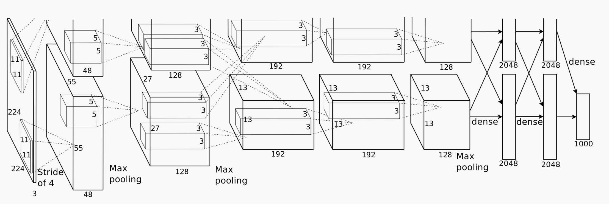

# AlexNet

## 网络结构

- \\(5\\) 个卷积层，\\(3\\) 个全连接层

	

- 原始 AlexNet 对特征图进行了 GPU 分组加速

	- 卷积层 Conv1 对输入图像进行卷积，Conv3 对 Conv2 的所有特征图进行卷积

	- 卷积层 Conv2、Conv4、Conv5 只对当前 GPU 的上一层特征图进行卷积

### 输入层 Input

- 输入为 \\(227 \times 227\\) 的 RGB 图像

- 或者将 \\(224 \times 224\\) 的 RGB 图像 padding 到 \\(227 \times 227\\)

### 卷积层 Conv1

- 对 Input 数据进行卷积，特征图维度为 \\(55 \times 55\\)

	- 卷积核大小为 \\(11\\)，步长为 \\(4\\)，不进行 padding

- 对特征图先 ReLU 再池化，特征图维度为 \\(27 \times 27\\)

	- 池化核大小为 \\(3\\)，步长为 \\(2\\)，使用 max polling

- 对特征图进行局部响应归一化，不改变特征图维度

### 卷积层 Conv2

- 对 Conv1 结果进行卷积，特征图维度为 \\(27 \times 27\\)

	- 卷积核大小为 \\(5\\)，步长为 \\(1\\)，padding 为 \\(2\\)

- 对特征图先 ReLU 再池化，特征图维度为 \\(13 \times 13\\)

	- 池化核大小为 \\(3\\)，步长为 \\(2\\)，使用 max pooling

- 对特征图进行局部响应归一化，不改变特征图维度

### 卷积层 Conv3

- 对 Conv2 结果进行卷积，特征图维度为 \\(13 \times 13\\)

	- 卷积核大小为 \\(3\\)，步长为 \\(1\\)，padding 为 \\(1\\)

- 对特征图进行 ReLU，不改变特征图维度

### 卷积层 Conv4

- 对 Conv3 结果进行卷积，特征图维度为 \\(13 \times 13\\)

	- 卷积核大小为 \\(3\\)，步长为 \\(1\\)，padding 为 \\(1\\)

- 对特征图进行 ReLU，不改变特征图维度

### 卷积层 Conv5

- 对 Conv4 结果进行卷积，特征图维度为 \\(13 \times 13\\)

	- 卷积核大小为 \\(3\\)，步长为 \\(1\\)，padding 为 \\(1\\)

- 对特征图先 ReLU 再池化，特征图维度为 \\(6 \times 6\\)

	- 池化核大小为 \\(3\\)，步长为 \\(2\\)，使用 max pooling

### 全连接层 FC6

- 与 Conv5 进行全连接，生成向量维度为 \\(4096\\)

- 对生成向量先 ReLU 再 dropout，不改变生成向量维度

### 全连接层 FC7

- 与 FC6 进行全连接，生成向量维度为 \\(4096\\)

- 对生成向量先 ReLU 再 dropout，不改变生成向量维度

### 全连接层 FC8

- 与 FC7 进行全连接，生成向量维度为 \\(1000\\)

### 输出层 Output

- 对 FC8 生成向量进行 softmax，计算每一类的概率