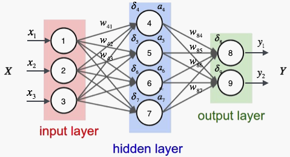

# $\mathrm{Back \ Propagation}$

## 背景介绍

- $\mathrm{BP}$ 网络由一个输入层、一个输出层、一个或多个隐含层组成；每一层的输出使用 $\mathrm{sigmoid}$ 函数

- 正向计算时，从输入层开始，逐层计算每一层节点的输出；当前层的输出作为下一层的输入

- 反向传播时，从输出层开始，逐层计算每一层节点的误差；当前层的输出作为上一层的输入

- 在训练时，先正向计算，再反向传播，直到神经网络的权值趋于稳定

  

  
  

## 数学推导

### 单样本

- 定义如下：

  - $t_{i} \quad$：样本 $s$ 的实际值的第 $i$ 个分量

  - $y_{i} \quad$：样本 $s$ 的预测值的第 $i$ 个分量

  - $w_{ji}^{l} \quad$：第 $l$ 层第 $j$ 个节点与第 $l - 1$ 层第 $i$ 个节点间的权值

  - $b_{j}^{l} \quad$：第 $l$ 层第 $j$ 个节点的偏置

  - $x_{j}^{l} \quad$：第 $l$ 层第 $j$ 个节点的加权输入

    $$
    x_{j}^{l} = \sum_{i} w_{ji}^{l} \cdot z_{i}^{l - 1} + b_{j}^{l}
    $$

  - $z_{j}^{l} \quad$：第 $l$ 层第 $j$ 个节点的预测输出

    $$
    z_{j}^{l} = f \left( x_{j}^{l} \right)
    $$

  - $E_{s} \quad$：输出层误差

    $$
    E_{s} = \frac{1}{2} \sum_{i = 1}^{N} \left( y_{i} - t_{i} \right)^{2}
    $$

- 由梯度下降可得：

  $$
  \left\{ \begin{matrix}
  w_{ji}^{l} \leftarrow w_{ji}^{l} - \eta \cdot \frac {\partial{E_{s}}}{\partial{w_{ji}^{l}}} \\
  b_{j}^{l} \leftarrow b_{j}^{l} - \eta \cdot \frac {\partial{E_{s}}}{\partial{b_{j}^{l}}}
  \end{matrix} \right.
  $$

- 对权重项应用链式法则：

  $$
  \frac{\partial{E_{s}}}{\partial{w_{ji}^{l}}} = \frac{\partial{E_{s}}}{\partial{x_{j}^{l}}} \cdot \frac{\partial{x_{j}^{l}}}{\partial{w_{ji}^{l}}} = \frac{\partial{E_{s}}}{\partial{x_{j}^{l}}} \cdot z_{i}^{l - 1}
  $$

  - 对于输出层，$x_{j}^{l}$ 通过影响 $y_{i}$ 直接作用于 $E_{s}$，因此：

    $$
    \begin{align*}
    \frac{\partial{E_{s}}}{\partial{x_{j}^{l}}} &= \frac{\partial{E_{s}}}{\partial{y_{j}}} \cdot \frac{\partial{y_{j}}}{\partial{x_{j}^{l}}} \newline
    &= \left( y_{j} - t_{j} \right) \cdot \left( y_{j} \right)' \newline
    \end{align*}
    $$

    - 令 $\delta_{j}^{l} = \frac{\partial{E_{s}}}{\partial{x_{j}^{l}}}$，即误差项为预测误差对该节点输入的偏导值，则：

      $$
      \delta_{j}^{l} = \left( y_{j} \right)' \left( y_{j} - t_{j} \right)
      $$

    - 于是 $w_{ji}^{l}$ 更新公式为：

      $$
      w_{ji}^{l} \leftarrow w_{ji}^{l} - \eta \ \delta_{j}^{l} z_{i}^{l-1}
      $$

  - 对于中间层，$x_{j}^{l}$ 依次影响 $z_{j}^{l}, \ x_{k}^{l + 1}, \ y_{k}$ 间接作用于 $E_{s}$，因此：

    $$
    \begin{aligned}
    \frac{\partial{E_{s}}}{\partial{x_{j}^{l}}} &= \sum_{k \in \mathrm{Next}} \frac{\partial{E_{s}}}{\partial{x_{k}^{l + 1}}} \cdot \frac{\partial{x_{k}^{l + 1}}}{\partial{z_{j}^{l}}} \cdot \frac{\partial{z_{j}^{l}}}{\partial{x_{j}^{l}}} \newline
    &= \sum_{k \in \mathrm{Next}} \delta_{k}^{l + 1} \cdot w_{kj}^{l + 1} \cdot \left( z_{j}^{l} \right)' \newline
    &= \left( z_{j}^{l} \right)' \sum_{k \in \mathrm{Next}} \delta_{k}^{l + 1} w_{kj}^{l + 1} \newline
    \end{aligned}
    $$

    - 将 $\delta_{j}^{l} = \frac{\partial{E_{s}}}{\partial{a_{j}^{l}}}$ 代入得：

      $$
      \delta_{j}^{l} = \left( z_{j}^{l} \right)' \sum_{k \in \mathrm{Next}} \delta_{k}^{l + 1} w_{kj}^{l + 1}
      $$

    - 于是 $w_{ji}^{l}$ 更新公式为：

      $$
      w_{ji}^{l} \leftarrow w_{ji}^{l} - \eta \ \delta_{j}^{l} z_{i}^{l - 1}
      $$

- 对偏置项应用链式法则：

  $$
  \frac{\partial{E_{s}}}{\partial{b_{j}^{l}}} = \frac{\partial{E_{s}}}{\partial{x_{j}^{l}}} \cdot \frac{\partial{x_{j}^{l}}}{\partial{b_{j}^{l}}} = \frac{\partial{E_{s}}}{\partial{x_{j}^{l}}}
  $$

  - 于是：

    $$
    b_{j}^{l} \leftarrow b_{j}^{l} - \eta \delta_{j}^{l}
    $$

### 样本集

- 定义如下：

  - $\lambda \quad$：$L_{2}$ 正则项系数

  - $J \quad$：样本集上的损失函数

    $$
    J = \frac{1}{m} \sum_{s = 1}^{m} E_{s} + \frac{\lambda}{2} \sum_{l} \sum_{j} \sum_{i} \left( w_{ji}^{l} \right)^{2}
    $$

- 对权重项应用链式法则：

  $$
  \frac{\partial{J}}{\partial{w_{ji}^{l}}} = \frac{1}{m} \sum_{s = 1}^{m} \frac{\partial{E_{s}}}{\partial{w_{ji}^{l}}} + \lambda w_{ji}^{l}
  $$

- 对偏置项应用链式法则：

  $$
  \frac{\partial{J}}{\partial{b_{j}^{l}}} = \frac{1}{m} \sum_{s = 1}^{m} \frac{\partial{E_{s}}}{\partial{b_{j}^{l}}}
  $$