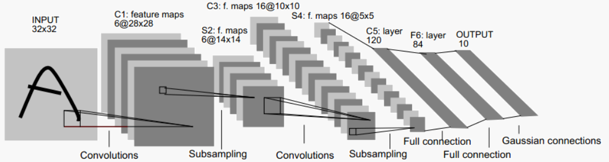
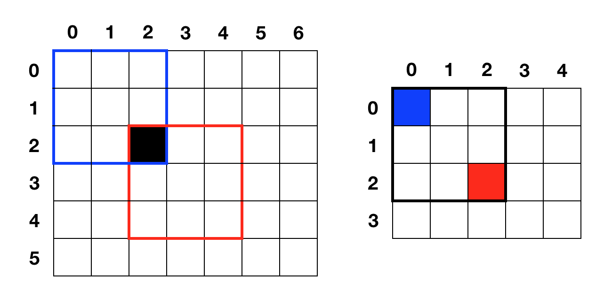

# Convolutional Neural Networks

## 背景介绍

- 与 BP 网络相比，CNN 的隐藏层细分为卷积层、池化层、全连接层

- 输入是二维图像而非一维向量，因此可以学到像素点的空间关系

- 卷积层、池化层的梯度计算方式与 BP 的全连接层不同，但训练过程相同

### 卷积层

- 与不同的卷积核做卷积，得到不同的特征图像

- 在训练时，需要进行卷积核、偏置项等参数的学习

### 池化层

- 降低特征图像的维度，分为 max-pooling 和 average-pooling

	- max-pooling

		- 取邻域最大值作为当前像素点的像素值
	
	- average-pooling

		- 取邻域平均值作为当前像素点的像素值

- 没有参数，在训练时无需学习

## 数学推导

### 单通道输入、单通道特征图

#### 卷积、互相关

- 参考 [Convolution.md] (../basic/Convolution.md)

#### 卷积层

- 定义如下：

	- \\(w\_{m, \ n}^{l} \ \ \\)：第 \\(l\\) 层的卷积核权值

	- \\(b^{l} \ \ \\)：第 \\(l\\) 层的偏置

	- \\(E \ \ \\)：输出层误差

	- \\(x\_{i, \ j}^{l} \ \ \\)：第 \\(l\\) 层 \\((i, \ j)\\) 像素点的加权输入
	
		$$ x\_{i, \ j}^{l} = \sum\_{m}\sum\_{n} w\_{m, \ n}^{l} \cdot z\_{i+m, \ j+n}^{l-1} + b^{l} $$

	- \\(z\_{i, \ j}^{l} \ \ \\)：第 \\(l\\) 层 \\((i, \ j)\\) 像素点的预测输出
	
		$$ z\_{i,\ j}^{l} = f(x\_{i, \ j}^{l}) $$
	
	- \\(\delta\_{i, \ j}^{l} \ \ \\)：第 \\(l\\) 层 \\((i, \ j)\\) 像素点的预测输出
	
		$$ \delta\_{i, \ j}^{l} = \frac{\partial{E}}{\partial{x\_{i, \ j}^{l}}} $$

- 由梯度下降可得：

	$$
	\\left\\{ \begin{matrix}
	w\_{m, \ n}^{l} \leftarrow w\_{m, \ n}^{l} - \eta \cdot \frac {\partial{E}}{\partial{w\_{m, \ n}^{l}}} \\\\
	b^{l} \leftarrow b^{l} - \eta \cdot \frac {\partial{E}}{\partial{b^{l}}}
	\end{matrix} \\right\.
	$$

- 对权重项应用链式法则：

	$$
	\begin{align\*}
	\frac{\partial{E}}{\partial{w\_{m, \ n}^{l}}} &= \sum\_{i=0}^{H-k\_{1}} \sum\_{j=0}^{W-k\_{2}}\frac{\partial{E}}{\partial{x\_{i, \ j}^{l}}} \cdot \frac{\partial{x\_{i, j}^{l}}}{\partial{w\_{m, \ n}^{l}}} \newline
	&= \sum\_{i=0}^{H-k\_{1}} \sum\_{j=0}^{W-k\_{2}} \delta\_{i, \ j}^{l} \cdot z\_{i+m, \ j+n}^{l-1} \newline
	\end{align\*}
	$$

	- 于是 \\(w\_{ji}\\) 更新公式为：

		$$ w\_{m, \ n}^{l} \leftarrow w\_{m, \ n}^{l} - \eta \cdot \sum\_{i=0}^{H-k\_{1}} \sum\_{j=0}^{W-k\_{2}} \delta\_{i, \ j}^{l} \cdot z\_{i+m, \ j+n}^{l-1} $$

- 对偏置项应用链式法则：

	$$
	\begin{align\*}
	\frac{\partial{E}}{\partial{b^{l}}} &= \sum\_{i=0}^{H-k\_{1}} \sum\_{j=0}^{W-k\_{2}}\frac{\partial{E}}{\partial{x\_{i, \ j}^{l}}} \cdot \frac{\partial{x\_{i, j}^{l}}}{\partial{b^{l}}} \newline
	&= \sum\_{i=0}^{H-k\_{1}} \sum\_{j=0}^{W-k\_{2}} \delta\_{i, \ j}^{l} \newline
	\end{align\*}
	$$
	
	- 于是：

		$$ b^{l} \leftarrow b^{l} - \eta \cdot \sum\_{i=0}^{H-k\_{1}} \sum\_{j=0}^{W-k\_{2}} \delta\_{i, \ j}^{l} $$

	
- 而误差项 \\( \delta\_{i, \ j}^{l} = \frac{\partial{E}}{\partial{x\_{i, \ j}^{l}}} \\) 计算如下：

	- 由于输入 \\(x\_{i, \ j}^{l}\\) 只影响 \\((i - k\_{1} + 1, \ j - k\_{2} + 1)\\) 到 \\((i, \ j)\\) 区域内的输出（见上图），记该区域为 \\(Q\\)，则：

	$$
	\begin{align\*}
	\frac{\partial{E}}{\partial{x\_{i, \ j}^{l}}} &= \sum \frac{\partial{E}}{\partial{x\_{Q}^{l+1}}} \cdot \frac{\partial{x\_{Q}^{l+1}}}{\partial{x\_{i, \ j}^{l}}} \newline
	&= \sum \delta\_{Q}^{l+1} \cdot \frac{\partial{x\_{Q}^{l+1}}}{\partial{x\_{i, \ j}^{l}}} \newline
	&= \sum\_{m=0}^{k\_{1}-1}\sum\_{n=0}^{k\_{2}-1}  \delta\_{i-m, \ j-n}^{l+1} \cdot \frac{\partial{x\_{i-m, \ j-n}^{l+1}}}{\partial{x\_{i, \ j}^{l}}} \newline
	&= \sum\_{m=0}^{k\_{1}-1}\sum\_{n=0}^{k\_{2}-1}  \delta\_{i-m, \ j-n}^{l+1} \cdot \frac{\partial}{\partial{x\_{i, \ j}^{l}}} \left( \sum\_{p}\sum\_{q} w\_{p, \ q}^{l+1} \cdot z\_{i-m+p, \ j-n+q}^{l} + b^{l+1} \right) \newline
	&= \sum\_{m=0}^{k\_{1}-1}\sum\_{n=0}^{k\_{2}-1}  \delta\_{i-m, \ j-n}^{l+1} \cdot \frac{\partial}{\partial{x\_{i, \ j}^{l}}} \sum\_{p}\sum\_{q} w\_{p, \ q}^{l+1} \cdot f(x\_{i-m+p, \ j-n+q}^{l}) \newline
	\end{align\*}
	$$
	
	- 由于:

		$$ \\left\\{ \begin{matrix} i-m+p=i \\\\ j-n+q=j \end{matrix} \\right\. \ \rightarrow  \ \\left\\{ \begin{matrix} \frac{\partial{f(x\_{i-m+p, \ j-n+q}^{l})}}{\partial{x\_{i, \ j}^{l}}} \neq 0 \\\\ m = p, \ n = q \end{matrix} \\right\. $$
		
	- 因此：
	
		$$
		\begin{align\*}
		\frac{\partial{E}}{\partial{x\_{i, \ j}^{l}}} &= \sum\_{m=0}^{k\_{1}-1}\sum\_{n=0}^{k\_{2}-1}  \delta\_{i-m, \ j-n}^{l+1} \cdot \frac{\partial}{\partial{x\_{i, \ j}^{l}}} \sum\_{p}\sum\_{q} w\_{p, \ q}^{l+1} \cdot f(x\_{i-m+p, \ j-n+q}^{l}) \newline
		&= \sum\_{m=0}^{k\_{1}-1}\sum\_{n=0}^{k\_{2}-1}  \delta\_{i-m, \ j-n}^{l+1} \cdot \frac{\partial}{\partial{x\_{i, \ j}^{l}}} w\_{m, \ n}^{l+1} \cdot f(x\_{i, \ j}^{l}) \newline
		&= f'(x\_{i, \ j}^{l}) \cdot \sum\_{m=0}^{k\_{1}-1}\sum\_{n=0}^{k\_{2}-1}  \delta\_{i-m, \ j-n}^{l+1} \cdot w\_{m, \ n}^{l+1} \newline
		\end{align\*}
		$$
	
	- 而由卷积 \\(\otimes\\) 与互相关 \\(*\\) 定义可知：

		$$
		\begin{align\*}
		\delta\_{i, \ j}^{l} &= f'(x\_{i, \ j}^{l}) \cdot \sum\_{m=0}^{k\_{1}-1}\sum\_{n=0}^{k\_{2}-1}  \delta\_{i-m, \ j-n}^{l+1} \cdot w\_{m, \ n}^{l+1} \newline
		&= f'(x\_{i, \ j}^{l}) \cdot (\delta^{l+1} \otimes w^{l+1})\_{i, \ j} \newline
		&= f'(x\_{i, \ j}^{l}) \cdot \left(\delta^{l+1} * filp\left(w^{l+1}\right)\right)\_{i, \ j} \newline
		\end{align\*}
		$$

	- CNN 中的卷积是指互相关，因此上式相当于先翻转卷积核再进行卷积

#### 池化层

##### max-pooling

- 根据前向计算时记录的最大值位置，将后一层误差原封不动地传到前一层邻域最大值处

	- 其他像素点由于被抑制，不会对最终的前向计算结果有影响

##### average-pooling

- 将后一层误差均匀地传到前一层邻域内的所有像素点