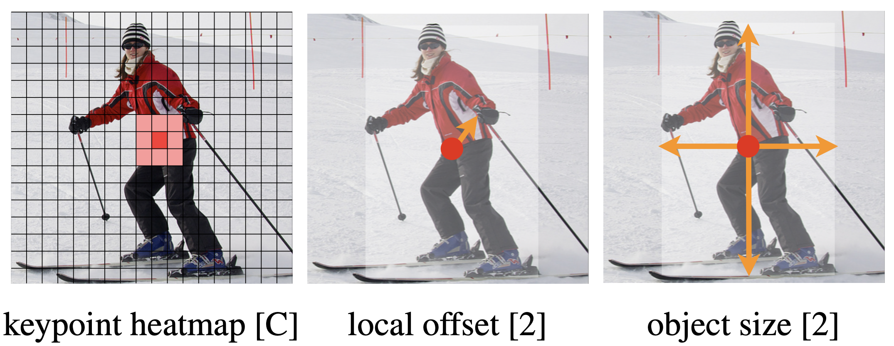

# $\mathrm{CenterNet}$

##  提出背景

- 基于 $\mathrm{Anchor}$ 的目标检测模型具有以下缺点：

  - $\mathrm{Anchor}$ 相关的超参数较多：包括 $\mathrm{Anchor}$ 的数量、尺寸、长宽比等

  - $\mathrm{Anchor}$ 通用性问题：不同数据集上的 $\mathrm{Anchor}$ 通常不同，需要重新设计

  - $\mathrm{Anchor}$ 导致正负样本不平衡：大部分是负样本，但可以通过 $\mathrm{Focal-Loss}$ 缓解

  - $\mathrm{NMS}$ 后处理耗时：预测的置信度阈值较低时，$\mathrm{NMS}$ 处理耗时

- 而 $\mathrm{CenterNet}$ 基于 $\mathrm{Anchor-Free}$ 思想，类似通过热力图预测关键点，直接预测目标的中心位置，同时预测目标尺寸和偏移量

## 训练阶段

- 整体 $\mathrm{loss}$ 为中心点热力图 $\mathrm{loss}$、偏移量 $\mathrm{loss}$、尺寸 $\mathrm{loss}$ 的三项加权

### 生成 $\mathrm{GroundTruth}$ 热力图

- 首先将 $\mathrm{GroundTruth}$ 由 $\mathrm{Box}$ 转换为离散热力图

  - 通常下采样 $4$ 倍，目标位置位 $1$，其余位置为 $0$

- 对热力图进行高斯模糊，高斯核半径 $r$ 计算如下：

  - 首先给定最小 $\mathrm{IOU}$ 阈值（通常是 $0.3$）

    - 大于阈值的点，都可在一定程度上代表 $\mathrm{GroundTruth}$ 位置；但离原中心点越近，热力图取值越大（越可靠）

  - $\mathrm{GroundTruth}$ 四周均向外扩 $r$，根据此时的 $\mathrm{IOU}$ 计算方式，建立关于 $r$ 的一元二次方程，并保证 $\mathrm{r > 0}$

  - $\mathrm{GroundTruth}$ 四周均向内缩 $r$，根据此时的 $\mathrm{IOU}$ 计算方式，建立关于 $r$ 的一元二次方程，并保证 $\mathrm{r > 0}$

  - $\mathrm{GroundTruth}$ 整体偏移 $r$ 但面积不变，根据此时的 $\mathrm{IOU}$ 计算方式，建立关于 $r$ 的一元二次方程，并保证 $\mathrm{r > 0}$

  - 上述 $3$ 种情况的最小 $r$ 即为最终的高斯核半径

- 不同类别使用不同的热力图；如果同一类别下有多个目标，则分别计算热力图，然后取每个位置的最大值

### 热力图 $\mathrm{loss}$ 计算

- 采用 $\mathrm{Focal-Loss}$  的变形，计算预测热力图与真实热力图的 $\mathrm{loss}$，定义如下：

  $$
  L_{k} = - \frac{1}{N} \sum_{xyc} \left\{ \begin{matrix}
  \left( 1 - P_{xyc} \right)^{\alpha} \log \left( P_{xyc} \right) \qquad \qquad \qquad \ \ Y_{xyc} = 1 \\
  \left( 1 - Y_{xyc} \right)^{\beta} \left( P_{xyc} \right)^{\alpha} \log \left( 1 - P_{xyc} \right) \qquad Y_{xyc} \neq 1
  \end{matrix} \right.
  $$

  - 其中，$N$ 热力图的关键点个数，超参数通常设置为 $\alpha = 2, \ \beta = 4$

### 偏移量 $\mathrm{loss}$ 计算

- $\mathrm{backbone}$ 输出的特征图是输入的 $1/4$，因此预测时存在误差；通过学习额外的偏移量解决：

  $$
  L_{off} = \frac{1}{N} \sum_{p} \left| \hat{O}_{p} - \left( \frac{p}{R} - \tilde{p} \right) \right|
  $$

  - 其中，$\hat{O}_{p}$ 是预测的偏移量数值，$p$ 是目标在原图的中心点坐标，$R$ 是下采样比例（通常为 $4$），$\tilde{p}$ 是下采样后的中心点整数坐标

### 尺寸 $\mathrm{loss}$ 计算

- 直接根据目标尺寸计算 $\mathrm{loss}$，不进行尺寸的归一化：

  $$
  L_{size} = \frac{1}{N} \sum_{k=1}^{N} \left| \hat{S}_{p_{k}} - s_{k} \right|
  $$

  - 其中，$\hat{S}_{p_{k}}$ 是预测的尺寸，$s_{k}$ 是目标的真实尺寸

## 测试阶段

- 基于八邻域比较，分别在每个类别的热力图上寻找极值点，最多保留 $100$ 个位置

- 以选中位置为中心，根据偏移量、尺寸，得到一系列 $\mathrm{BBox}$；中心点的热力图数值作为置信度

## 性能与扩展

- 无需手动设计 $\mathrm{Anchor}$ 及各种超参数，无需复杂的后处理阶段（比如 $\mathrm{NMS}$）

  - 在推理时通过 $\mathrm{3 \times 3}$ 的 $\mathrm{MaxPool}$ 即可实现极值点选取，$\mathrm{GPU}$ 并行度高

- 可以相对容易地扩展到人体关键点检测、$\mathrm{3D}$ 目标检测等任务上，框架通用性较好

- 相比 $\mathrm{YOLO \ v3}$，同样精度下速度更快，同样速度下精度更高