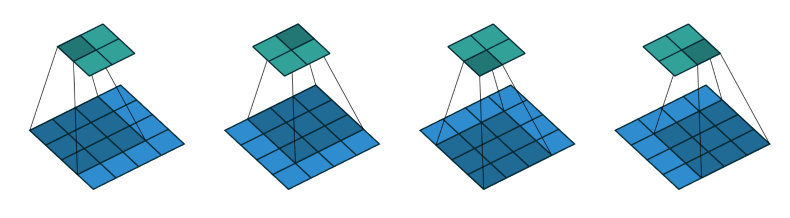
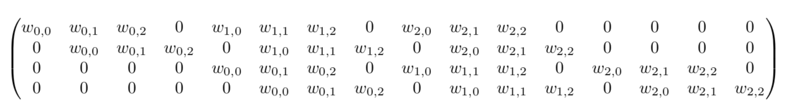
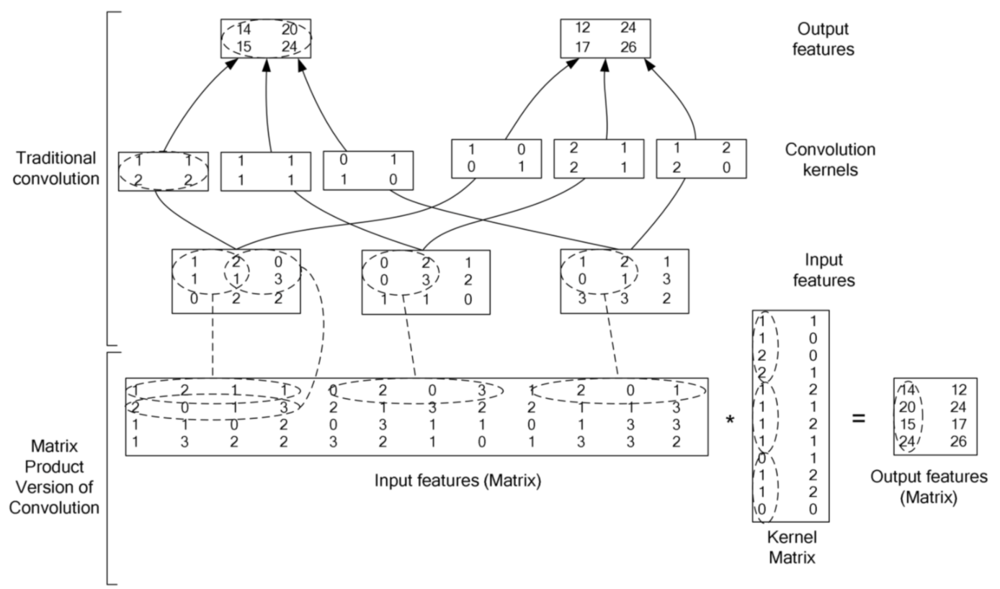

<script type="text/javascript" src="http://cdn.mathjax.org/mathjax/latest/MathJax.js?config=default"></script>

# 卷积

#### CNN 中的卷积，实际是指互相关

## 互相关

- 直接进行对位乘法，记作 \\( I \otimes K \\)

	$$ I \otimes K = \\left[ \\begin{matrix} 1 & 2 & 3 \\\\ 4 & 5 & 6 \\\\ 7 & 8 & 9 \\end{matrix} \\right] \otimes \\left[ \\begin{matrix} 1 & 2 & 3 \\\\ 4 & 5 & 6 \\\\ 7 & 8 & 9 \\end{matrix} \\right] = \\left[ \\begin{matrix} 1 & 4 & 9 \\\\ 16 & 25 & 36 \\\\ 49 & 64 & 81 \\end{matrix} \\right] $$

- 即：

	$$ (I \otimes K)\_{ij} = \sum\_{m=0}^{k\_{1}-1} \sum\_{n=0}^{k\_{2}-1} I(i+m, j+n) \cdot K(m, n) $$

## 卷积

- 先反转卷积核，再进行对位乘法，记作 \\( I * K \\)

	$$ I * K = \\left[ \\begin{matrix} 1 & 2 & 3 \\\\ 4 & 5 & 6 \\\\ 7 & 8 & 9 \\end{matrix} \\right] * \\left[ \\begin{matrix} 1 & 2 & 3 \\\\ 4 & 5 & 6 \\\\ 7 & 8 & 9 \\end{matrix} \\right] = \\left[ \\begin{matrix} 1 & 2 & 3 \\\\ 4 & 5 & 6 \\\\ 7 & 8 & 9 \\end{matrix} \\right] \otimes \\left[ \\begin{matrix} 9 & 8 & 7 \\\\ 6 & 5 & 4 \\\\ 3 & 2 & 1 \\end{matrix} \\right] = \\left[ \\begin{matrix} 9 & 16 & 21 \\\\ 24 & 25 & 24 \\\\ 21 & 16 & 9 \\end{matrix} \\right] $$

- 即：

	$$
	\begin{align\*}
	(I * K)\_{ij} &= \sum\_{m=0}^{k\_{1}-1} \sum\_{n=0}^{k\_{2}-1} I(i-m, j-n) \cdot K(m, n) \newline
	& = \sum\_{m=0}^{k\_{1}-1} \sum\_{n=0}^{k\_{2}-1} I(i, j) \cdot K(-m, -n) 
	\end{align\*}
	$$

## 转置卷积



- 上图中，卷积核大小为 \\(3\\)，如果把输入 \\(X\\) 拉成 \\(16\\) 维列向量，把输出 \\(Y\\) 拉成 \\(4\\) 维列向量，把卷积核 \\(W\\) 展成以下形式，那么卷积可由矩阵乘法完成：\\(Y=WX\\)

	

- 转置卷积的目标是通过 \\(W\\) 把输出 \\(Y\\) 变换到输入 \\(X\\) 的维度： \\(X=W^{T}Y\\)

- 转置卷积相当于先把卷积核翻转，再对输出矩阵进行卷积，以得到输入的近似矩阵

- 把卷积核按上述方式展开会得到稀疏矩阵，效率较低，通常采用以下矩阵展开方式

## 卷积加速

### 卷积定理

- 参考 [FourierTransform.md] (../basic/FourierTransform.md)

- 只有当卷积核较大时，加速效果才明显

### 矩阵展开

- 已知输入图像维度为 \\(H \times W \times C\\)，共有 \\(T\\) 个 \\(K \times K \times C\\) 卷积核，步长为 \\(S\\)：

	- 输入图像可展开为一个 \\( N \times (K \times K \times C) \\) 的矩阵 \\(A\\)，\\(A\\) 的每 \\(K \times K\\) 列表示一个通道，即 \\( A = \\left[ \\begin{matrix} A\_{1} & A\_{2} & \cdots & A\_{C} \\end{matrix} \\right] \\)，\\(A\_{i}\\) 的每一行表示与卷积核计算的元素展开

	- 所有卷积核可合并为一个 \\((K \times K \times C) \times T\\) 的矩阵 \\(B\\)，\\(B\\) 的每 \\(C\\) 行表示一个通道，即 \\( B = \\left[ \\begin{matrix} B\_{1} \\\\ B\_{2} \\\\ \vdots \\\\ B\_{C} \\end{matrix} \\right] \\)，\\(B\_{i}\\) 的每一列表示当前通道卷积核的元素展开

	- 通过 GPU 可以对矩阵乘法进行加速，计算 \\(D = AB\\)

	- \\(D\\) 为 \\(N \times T\\) 矩阵，\\(D\\) 的每一列表示一个卷积核的计算结果，即 \\(D = \\left[ \\begin{matrix} D\_{1} & D\_{2} & \cdots & D\_{T} \\end{matrix} \\right]\\)，将 \\(D\_{i}\\) 转化成 \\(\left( \frac{H - K}{S} + 1 \right) \times \left( \frac{W - K}{S} + 1 \right) \\) 矩阵，以得到所有卷积结果
	


## Python 实现

- OpenCV 的 filter2D 函数根据卷积核大小，自动选择上述方案

	```
	response = cv2.filter2D(frame, cv2.CV_32F, kernel)
	```