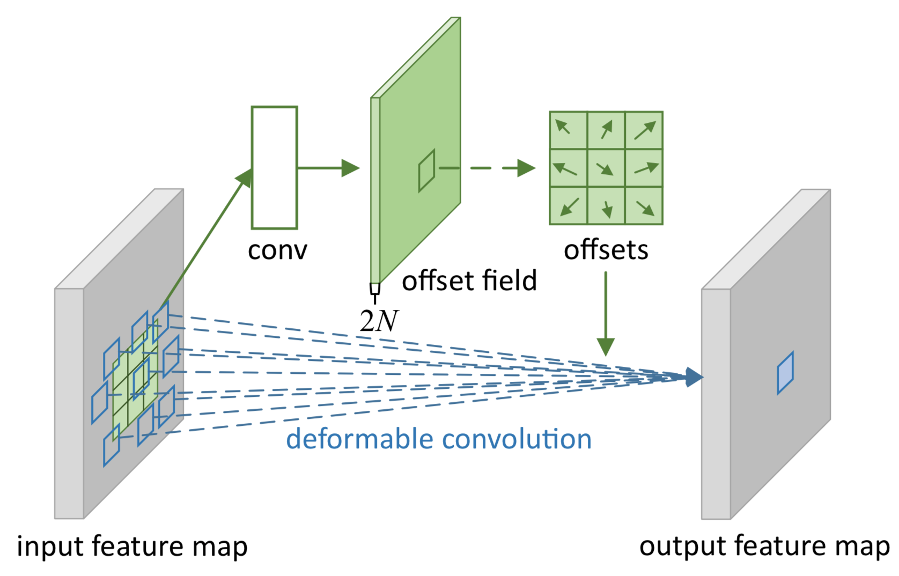
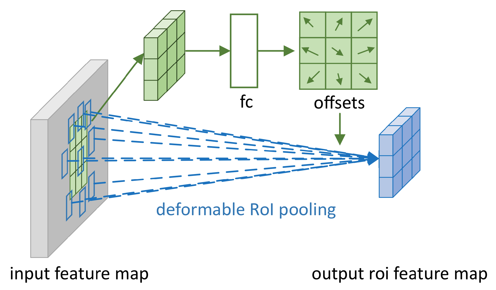
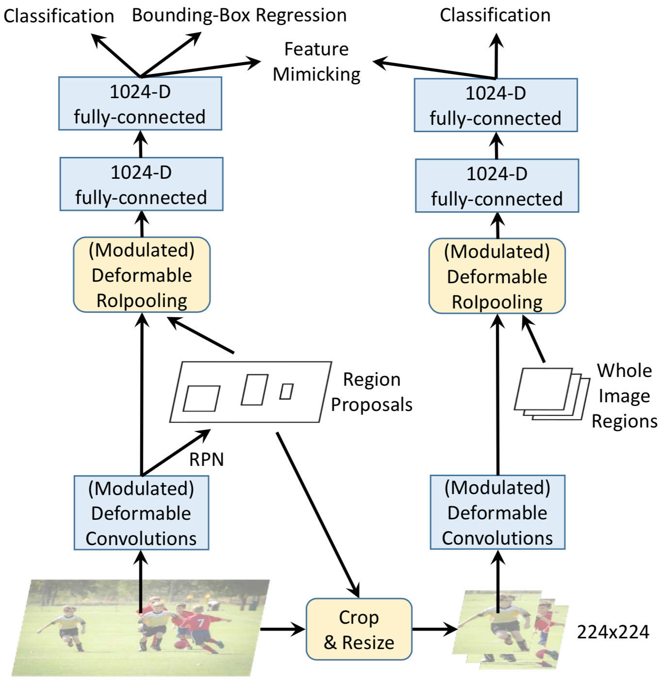

# $\mathrm{DCN}$

## $\mathrm{DCN \ v1}$

### 思想

- 由卷积层、池化层构成的网络模型，具有固定的几何结构，缺失处理几何形变的内部机制，$\mathrm{CNN}$ 对几何形变建模的能力，主要来自于广泛的数据增强；导致训练时间剧增，通常也会提高模型的复杂性

- 尽管像 $\mathrm{SIFT}$ 之类的方法，可以处理尺度变换等问题；但这些人工设计的特征在计算量、灵活性方面不够理想

- 提出可形变卷积层、可形变池化层，以适应检测对象尺寸变化、姿态变化，以及可能的几何形变

#### 可形变卷积层（$\mathrm{Deform \ Conv}$）

- 以单通道为例，假设 $R$ 为输入特征图 $x$ 采样区域，$y$ 为经过卷积核 $w$ 后的输出特征图

  - 对于普通卷积，$p_{0}$ 位置的卷积结果计算如下：

    $$
    y \left( p_{0} \right) = \sum_{p_{n} \in R} w \left( p_{n} \right) \cdot x \left( p_{0} + p_{n} \right)
    $$

  - 对于可形变卷积，$p_{0}$ 位置的卷积结果计算如下（$\Delta p_{n}$ 为 $p_{n}$ 位置对应的偏移量）：

    $$
    y \left( p_{0} \right) = \sum_{p_{n} \in R} w \left( p_{n} \right) \cdot x \left( p_{0} + p_{n} + \Delta p_{n} \right)
    $$

- 与普通卷积相比，卷积核形状不再固定，每个位置的偏移量由前一阶段的特征图学习得到

- 对于 $\mathrm{K \times K}$ 卷积核，每个位置上待学习的偏移量为 $\mathrm{2 \times K \times K}$，分别表示 $\mathrm{x}$ 和 $\mathrm{y}$ 两个方向上的偏移量

- 对应的偏移量特征图维度为 $\mathrm{2K^{2} \times H \times W}$，其中 $\mathrm{H \times W}$ 是原特征图维度（假设步长 $\mathrm{stride = 1}$）

  - 计算偏移量特征图时，使用普通的 $\mathrm{3 \times 3}$ 卷积即可

- 根据像素点位置及该位置上的偏移量，计算卷积核的实际采样位置，进而得到实际采样特征图，其维度为 $\mathrm{C_{in} \times HK \times WK}$，其中 $\mathrm{C_{in}}$ 为输入特征图通道数

  - 实际采样位置通常是浮点数，需要通过双线性插值实现近似计算

- 对实际采样特征图进行普通卷积，得到最终的特征图，其维度为 $\mathrm{C_{out} \times H \times K}$，其中 $\mathrm{C_{out}}$ 为输出特征图通道数，卷积核尺寸为 $\mathrm{HK \times WK}$，步长 $\mathrm{stride = K}$

  - 实际采样特征图的 $\mathrm{HK \times WK}$ 区域对应一个输出，而且这些区域互不重叠，因此 $\mathrm{stride = K}$

#### 可形变池化层（$\mathrm{Deform \ ROIPooling}$）

- 首先对目标区域进行普通的 $\mathrm{ROIPooling}$，得到 $\mathrm{K \times K}$ 的特征图

- 对上述特征图经过全连接层处理后，得到 $\mathrm{K \times K}$ 的偏移量特征图

  - 输出归一化后的偏移量 $[0, 1]$ 比直接回归偏移量，更好更稳定

  - 可能原因：归一化后，偏移量的学习不受 $\mathrm{ROI}$ 大小的影响

- 对原始目标区域重新进行 $\mathrm{ROIPooling}$，同时使用上一步得到的偏移量

  - 每个 $\mathrm{bin}$ 内部共享一组偏移量

  - 与可形变卷积类似，由于采样位置通常是浮点数，需要通过双线性插值实现近似计算

## $\mathrm{DCN-v2}$

### 提出背景

- 对 $\mathrm{DCN-v1}$ 的可视化结果表明，可形变卷积引入了过多上下文无关信息，影响了模型的特征提取能力

  - 在某些情况下，可形变卷积的采样位置远远超出目标 $\mathrm{ROI}$ 区域

### 更多的可形变卷积层

- 以 $\mathrm{ResNet-50}$ 为例，$\mathrm{conv3-conv5}$ 全部使用可形变卷积，以提高对几何形变的建模能力

  - $\mathrm{DCN-v1}$ 的实验在 $\mathrm{PASCAL \ VOC}$ 数据集上进行，模型容易饱和，因此只在 $\mathrm{conv5}$ 使用可形变卷积

### 幅值参数控制

- 以单通道为例，假设 $R$ 为输入特征图 $x$ 采样区域，$y$ 为经过卷积核 $w$ 后的输出特征图

  - 在 $\mathrm{DCN-v1}$ 中，$p_{0}$ 位置的卷积结果计算如下（$\Delta p_{n}$ 为 $p_{n}$ 位置对应的偏移量）：

    $$
    y \left( p_{0} \right) = \sum_{p_{n} \in R} w \left( p_{n} \right) \cdot x \left( p_{0} + p_{n} + \Delta p_{n} \right)
    $$

  - 在 $\mathrm{DCN-v2}$ 中，$p_{0}$ 位置的卷积结果计算如下（$\Delta m_{n}$ 为 $p_{n}$ 位置对应的幅值）：

    $$
    y \left( p_{0} \right) = \sum_{p_{n} \in R} w \left( p_{n} \right) \cdot x \left( p_{0} + p_{n} + \Delta p_{n} \right) \cdot \Delta m_{n}
    $$

- 在 $\mathrm{DCN-v1}$ 基础上增加幅值控制参数，以动态调整每个采样位置（偏移后）的权重

- 幅值特征图通过 $\mathrm{Sigmoid}$ 函数归一化到 $0-1$，维度与实际采样特征图维度相同，即 $\mathrm{C_{in} \times HK \times WK}$

  - $\mathrm{C_{in} \times H \times W}$ 为输入特征图的通道数、高、宽

  - $\mathrm{K \times K}$ 为对应的常规卷积核尺寸

### $\mathrm{R-CNN}$ 作为 $\mathrm{teacher \ network}$

- 理想状态下，将上下文无关位置的幅值动态降低，即可避免这些位置的干扰；但实验表明，简单增加幅值控制参数，性能提升有限，需要借助额外的指导才能更符合预期结果

- 由于 $\mathrm{R-CNN}$ 训练时使用裁剪过的图像，在很大程度上可以避免 $\mathrm{ROI}$ 以外区域的影响；因此把 $\mathrm{R-CNN}$ 当作 $\mathrm{teacher \ network}$，通过最大化 $\mathrm{Faster \ R-CNN}$ 与 $\mathrm{R-CNN}$ 最终提取特征之间的余弦相似度，实现 $\mathrm{Faster \ R-CNN}$ 对 $\mathrm{R-CNN}$ 的模仿

- 具体操作上，将 $\mathrm{Faster \ R-CNN}$ 的 $\mathrm{RPN}$ 结果经过裁剪缩放后，送入 $\mathrm{R-CNN}$，同时 $\mathrm{RPN}$ 结果继续经过 $\mathrm{Faster \ R-CNN}$ 进行特征提取；而 $\mathrm{R-CNN}$ 则从头对 $\mathrm{ROI}$ 进行特征提取

  - 由 $\mathrm{Faster \ R-CNN}$ 到 $\mathrm{RPN}$ 的过程中，所有的卷积层都在全图进行，可能会受到过多的上下文干扰

  - 而 $\mathrm{R-CNN}$ 从头对 $\mathrm{ROI}$ 进行特征提取，卷积只针对 $\mathrm{ROI}$ 区域，一定程度上可以减少上下文干扰

  - $\mathrm{Faster \ R-CNN}$ 与 $\mathrm{R-CNN}$ 共享网络权重（$\mathrm{R-CNN}$ 只有分类分支，没有回归分支）

- 在预测时，只使用 $\mathrm{Faster \ R-CNN}$ 部分；在训练时，除了 $\mathrm{Faster \ R-CNN}$ 本身的损失外，还计入模仿损失（上述余弦相似度），以及 $\mathrm{R-CNN}$ 部分的分类损失

