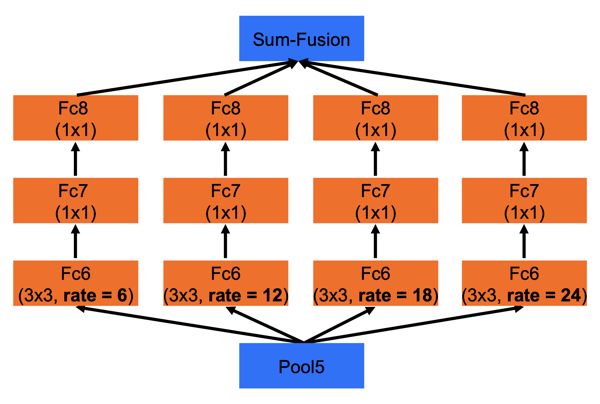
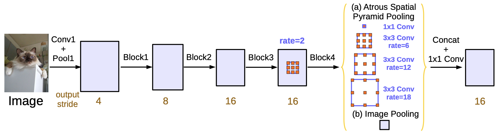
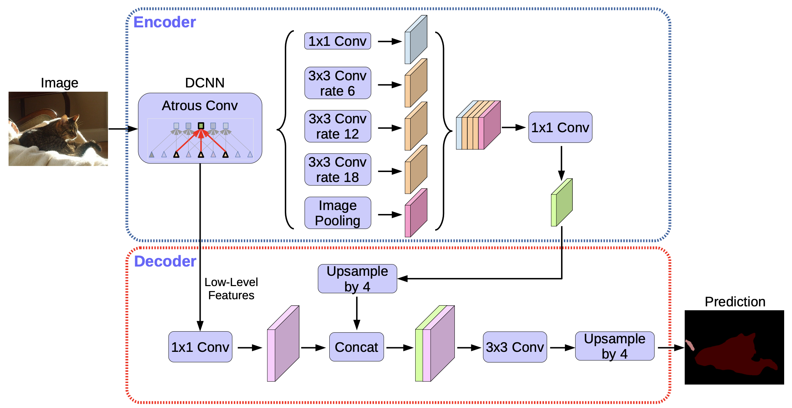

# $\mathrm{DeepLab}$

## $\mathrm{DeepLab \ v1}$

### 问题背景

- 不断下采样导致分辨率降低，信息丢失严重，不利于像素级分类

- 用于分类任务的神经网络具有平移不变性，会进一步影响分割精度

### 空洞卷积

- 去掉 $\mathrm{VGG16}$ 最后两个 $\mathrm{Pooling}$ 层，保持较高的分辨率（$8$ 倍下采样）

  - 训练时，直接使用 $8$ 倍下采样后的 $\mathrm{Ground \ Truth}$ 作为优化目标

  - 推理时，将预测结果进行 $8$ 倍上采样，作为最终的预测结果

- 为维持神经网络的感受野不变，后续卷积层替换为空洞卷积，进行特征提取

### 条件随机场 $\mathrm{CRF}$

- 基于神经网络的输出特征图，通过 $\mathrm{CRF}$ 进行后处理，优化边界预测结果

  - 解决神经网络平移不变性导致的分割精度下降

### 多尺度特征级联

- 在输入层、 $\mathrm{Pooling}$ 层后添加卷积层，依次进行特征提取、上采样、级联，作为最终预测结果

  - 充分利用不同尺度的特征，提高分割精度

## $\mathrm{DeepLab \ v2}$

### 空洞空间金字塔池化 $\mathrm{ASPP}$

- 基于空洞卷积（扩张卷积），使用不同的扩张率分支，同时进行特征图重采样

  - 优化多尺度问题，提高分割效果

### 其他改进

- 使用 $\mathrm{ResNet101}$ 替换 $\mathrm{VGG16}$，提高主干网络的特征提取能力

- 优化学习率衰减策略，使用 $\mathrm{poly}$ 模式替换 $\mathrm{step}$ 模式

## $\mathrm{DeepLab \ v3}$

### 增强 $\mathrm{ASPP}$ 结构

- 通过 $\mathrm{Batch \ Normalization}$ 加速收敛

- 将扩张率为 $24$ 的 $\mathrm{3 \times 3}$ 卷积分支替换为 $\mathrm{1 \times 1}$ 卷积

  - 扩张率过大时，$\mathrm{3 \times 3}$ 卷积等效于 $\mathrm{1 \times 1}$ 卷积

- 增加 $\mathrm{Global \ Average \ Pooling}$ 分支，获取图像级特征

- 实际使用时，只下采样 $8$ 倍，因此 $\mathrm{ASPP}$ 模块的扩张率需要加倍

### 其他改进

- 去掉 $\mathrm{CRF}$ 后处理过程，仅保留神经网络部分

- 训练时，不对 $\mathrm{Ground \ Truth}$ 下采样，而是将网络输出上采样后计算 $\mathrm{loss}$

  - 下采样 $\mathrm{Ground \ Truth}$ 容易在反向传播时丢失细节

## $\mathrm{DeepLab \ v3+}$

### $\mathrm{Encoder-Decoder}$ 结构

- 整体结构改为 $\mathrm{Encoder-Decoder}$ 模式，将 $\mathrm{DeepLab \ v3}$ 作为 $\mathrm{encoder}$，并添加 $\mathrm{decoder}$ 模块

  - 首先对 $\mathrm{DeepLab \ v3}$ 结果（下采样 $16$ 倍模式下）上采样 $4$ 倍

  - 与主干网络对应层进行特征级联、特征提取

  - 进一步上采样 $4$ 倍至输入尺寸，作为最终输出

- 充分利用特征，优化目标边界的精细程度

### 其他改进

- 使用 $\mathrm{Xception}$ 替换 $\mathrm{ResNet101}$，进一步提高主干网络的特征提取能力