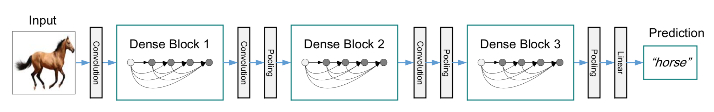

# DenseNet

## 基本思想

### 特征重用

- ResNet 的残差块中，只有一个 Skip Connection，无法充分利用提取到的特征

- 在 Dense 块中，任意的卷积层间都有连接

- 来自不同卷积层的特征图不再简单相加，而是按通道级联，作为当前卷积层输入

### Dense 块

- 整个网络由多个 Dense 块组成，而基本的 Dense 块结构如下：

	

	- Dense 块内每一层的输出特征图维度相同

	- 不考虑 bottleneck 结构时，每一层的特征图通道数也相同

	- 相比 ResNet 的残差块，Dense 块的特征图通道数较少，通常为12

	- 特征图通道数又被称为 Dense 块的 growth rate

- Dense 块采用 pre-activation，同一个特征图，作为不同层的输入时，经过的 Batch Normalization 层也不同，归一化后的输入分布也不同，可以充分利用提取到的特征

- 在 \\(L\\) 个卷积层的 Dense 块中，共有 \\(O(L^{2})\\) 个连接：

	$$ L + (L-1) + \cdots + 1 = \frac{L(L+1)}{2} = O(L^{2}) $$

## 网络结构

- 两个 Dense 块之间的层称为 transition 层：

	- 通常包含一个 Batch Normalization 层、一个 \\(1 \times 1\\) 卷积层、一个池化层

## 主要改进

- 进一步改善了前向计算时的信息流动，反向传播时的梯度流动

- 由于 Dense 块可以进行充分的特征重用，DenseNet 参数量比 ResNet 更少

## 显存优化

- \\(L\\) 层 Dense 块存在的问题：

	- 卷积层输出特征图的显存占用为 \\(O(L)\\)

	- 同一特征图作为不同层的输入时，经过的 Batch Normalization 层不同，得到的中间特征图也不同，这些特征图的显存为 \\(O(L^{2})\\)

	- 当输入在显存中连续时，CUDNN 的卷积运算较快；为加速运算，要把来自不同层的输入特征图复制到连续显存中，这些区域的显寸为 \\(O(L^{2})\\)

	- 反向传播时计算每一层（输出层、中间层）的梯度，梯度信息的显寸为 \\(O(L^{2})\\)

- 通过显存共享，减少显寸占用：

	- 申请 \\(O(L)\\) 的共享显存，存储当前层的所有输入特征图

	- 申请 \\(O(L)\\) 的共享显存，存储当前层所有输入特征图的 Batch Normalization 结果

	- 申请 \\(O(L)\\) 的共享显存，存储所有层的梯度信息

		- 反向传播时重新计算 Batch Normalization 的输出，用于计算梯度

- 由于反向传播时重新计算 Batch Normalization 输出，训练时间大约增加 \\(20\%\\)

- 但 DenseNet 显寸占用从 \\(O(L^{2})\\) 降为 \\(O(L)\\)，单 GPU 上训练更深的网络成为可能