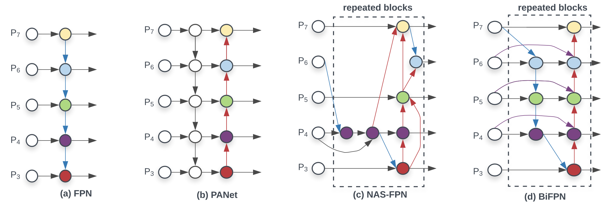

# $\mathrm{EfficientDet}$

### 改进双向特征金字塔 $\mathrm{BiFPN}$

- 在原始的特征金字塔 $\mathrm{FPN}$ 种，只有单向的信息流动

- $\mathrm{PANet}$ 在 $\mathrm{FPN}$ 基础上添加了另一个方向的特征融合，效果较好，但计算量更大

  - 减轻网络较深时，浅层特征传到深层时的信息丢失问题（传输路径过长）

#### 双向信息流动

- 基于经验，对 $\mathrm{PANet}$ 做了以下简化和优化，以提高性能：

  - 移除了只有一个输入的节点

    - 输入节点只有一个时，说明该节点对特征融合的贡献相对较小

  - 在同一层的输入节点和输出节点之间添加一条边，进行特征融合

  - 将 $\mathrm{BiFPN}$ 当做基本模块，在整个网络中多次堆叠

#### 特征加权

- 区别于 $\mathrm{FPN}$ 特征融合时的直接相加，$\mathrm{BiFPN}$ 对待融合特征进行了加权

- 各权重由可学习参数确定，通过线性 $\mathrm{Softmax}$ 归一化后进行特征加权，其中线性 $\mathrm{Softmax}$ 定义如下：

  $$
  W_{i} = \frac{w_{i}}{\epsilon + \sum_{j}{w_{i}}}
  $$

  - 既保证权重归一化到 $(0, 1)$ 有界区间，又避免直接进行 $\mathrm{Softmax}$ 指数运算造成的性能下降

#### 卷积轻量化

- 在特征融合时使用 $\mathrm{Depthwise}$ 卷积以提高效率

### 复合缩放

- 基于 $\mathrm{EfficientNet}$ 思想，同时对 $\mathrm{backbone}$、$\mathrm{BiFPN}$、预测网络、分辨率进行复合缩放，经验规则如下

#### $\mathrm{backbone}$

- 保持与 $\mathrm{EfficientNet}$ 系列相同，以复用预训练模型

#### $\mathrm{BiFPN}$

- 深度缩放规则：

  $$
  d_{\phi} = 3 + \phi
  $$

- 通道数缩放规则：

  $$
  w_{\phi} = 64 \cdot 1.35^{\phi}
  $$

#### 预测网络

- 深度缩放规则：

  $$
  d_{\phi} = 3 + \lfloor \frac{\phi}{3} \rfloor
  $$

- 通道数与 $\mathrm{BiFPN}$ 部分相同

#### 分辨率

- 由于通常会用 $\mathrm{P7}$ 特征，输入需要是 $2^{7} = 128$ 的整数倍，缩放规则：

  $$
  s_{\phi} = 512 + 128 \cdot \phi
  $$

### 网络结构

- 主结构与 $\mathrm{RetinaNet}$ 等基于 $\mathrm{anchor}$ 的 $\mathrm{One-Stage}$ 检测器类似

- 不同分辨率的特征，使用共享的预测网络（输出部分）