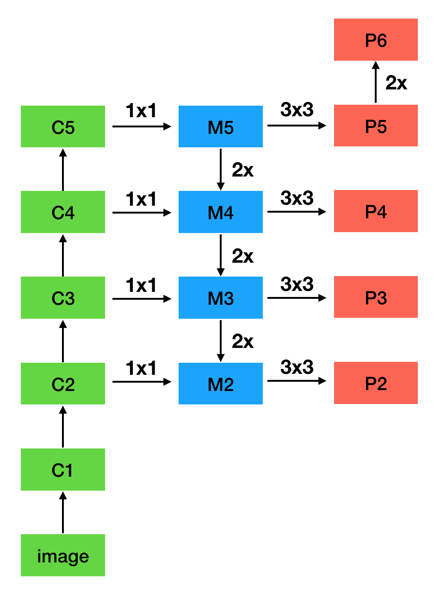

# $\mathrm{FPN}$

## 思想

- 直接使用图像金字塔进行预测，可以产生多尺度下的强语义特征，但存在以下问题：

  - 进行 $\mathrm{end-to-end}$ 训练时，内存开销巨大

  - 进行 $\mathrm{inference}$ 时，计算量较大，难以实时

- $\mathrm{CNN}$ 通过下采样构建的特征金字塔，也可以提取不同尺度的特征

  - 浅层特征分辨率较高，但语义特征较弱

  - 深层特征语义特征强，但定位不够准确

- $\mathrm{FPN}$ 同时利用浅层的高分辨率和深层的强语义，通过融合不同层的特征进行预测

  - 自下而上的主干网络用于特征提取

  - 自上而下的预测网络用于特征融合

## 网络结构

### 特征提取

- 进行特征提取的主干网络使用 $\mathrm{ResNet-50}$ 或 $\mathrm{ResNet-101}$

- $C_{i}$ 是 $\mathrm{ResNet}$ 第 $i$ 个 $\mathrm{stage}$ 的最后一个特征图

### 特征融合

- 首先对 $C_{5}$ 进行 $1 \times 1$ 卷积，得到 $M_{5}$

- 对于 $C_{2} - C_{4}$ ，将 $1 \times 1$ 卷积结果与上一层 $M_{i}$ 上采样结果直接相加得到 $M_{2} - M_{4}$

  - $1 \times 1$ 卷积进行通道降维，以匹配上一层的上采样特征

- 对于 $M_{2} - M_{5}$，通过 $3 \times 3$ 卷积得到 $P_{2} - P_{5}$，用于最终预测

  - $3 \times 3$ 卷积是为了消除上采样的混淆效应

- 为方便预测更大的 $\mathrm{ROI}$，对 $P_{5}$ 进行 $\mathrm{max-pooling}$ 得到 $P_{6}$

  - $P_{6}$ 只在 $\mathrm{RPN}$ 中使用，在 $\mathrm{Fast \ RCNN}$ 中被截断到 $P_{5}$

### $\mathrm{RPN}$

- 对 $P_{2} - P_{6}$ 分别进行 $\mathrm{RPN}$

  - $P_{2} - P_{6}$ 间共享 $\mathrm{BBox}$ 和 $\mathrm{Classifier}$ 参数，说明这些层的语义特征相似

  - 由于权重共享，$P_{2} - P_{6}$ 使用相同的通道数 $d = 256$

- 由于每一层代表了不同尺度的特征，每一层的 $\mathrm{Anchor}$ 只使用一个 $\mathrm{scale}$，$P_{2} - P_{6}$ 分别使用尺度为 $\left\{ 32, \ 64, \ 128, \ 256, \ 512 \right\}$ 的 $\mathrm{Anchor}$

- 每一层同时使用 $1:1, \ 1:2, \ 2:1$ 三种形状的 $\mathrm{Anchor}$

- 一共使用了 $5 \times 3 = 15$ 种 $\mathrm{Anchor}$

- 正、负样本的定义与 $\mathrm{Faster \ R-CNN}$ 相同

### $\mathrm{Fast \ R-CNN}$

- 进行 $\mathrm{ROI \ Pooling}$ 前，需要计算 $\mathrm{RoI}$ 对应的特征图

- 对于尺度为 $\left( w, \ h \right)$ 的 $\mathrm{RoI}$，其对应的特征图 $P_{k}$ 索引计算如下：

  $$
  k = k_{0} + \left \lfloor \log_{2} \frac{\sqrt{wh}}{224} \right \rfloor
  $$

  - 其中 $k_{0} = 4$，最终的 $k$ 值被截断到区间 $\left[ 2, \ 5 \right]$ 内

  - 当 $w, \ h$ 减半时，$k$ 值减 $1$，符合 $\mathrm{stride} = 2$ 的特征提取过程