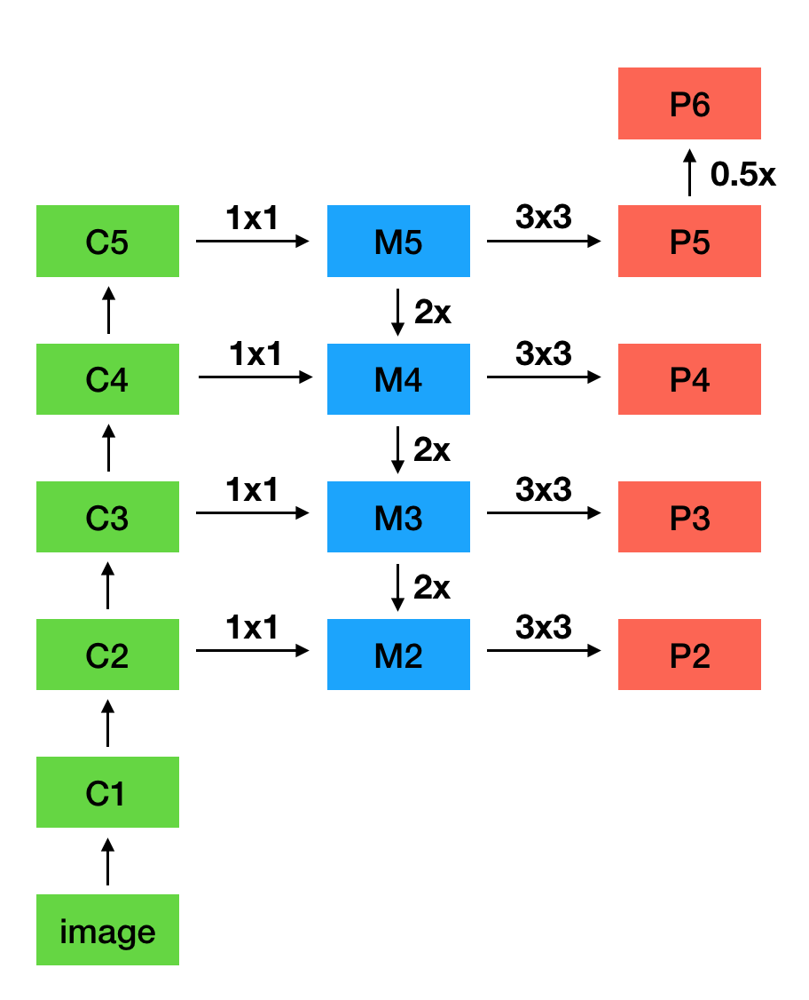

# FPN

## 思想

- 直接使用图像金字塔进行预测，可以产生多尺度下的强语义特征，但存在以下问题：

	- 进行 end-to-end 训练时，内存开销巨大

	- 进行 inference 时，计算量较大，难以实时

- CNN 通过下采样构建的特征金字塔，也可以提取不同尺度的特征

	- 浅层特征分辨率较高，但语义特征较弱

	- 深层特征语义特征强，但定位不够准确

- FPN 同时利用浅层的高分辨率和深层的强语义，通过融合不同层的特征进行预测

	- 自下而上的主干网络用于特征提取

	- 自上而下的预测网络用于特征融合

## 网络结构

### 特征提取

- 进行特征提取的主干网络使用 ResNet-50 或 ResNet-101

- \\(C\_{i}\\) 是 ResNet 第 \\(i\\) 个 stage 的最后一个特征图

### 特征融合

- 首先对 \\(C\_{5}\\) 进行 \\(1 \times 1\\) 卷积，得到 \\(M\_{5}\\)

- 对于 \\(C\_{2} - C\_{4}\\) ，将 \\(1 \times 1\\) 卷积结果与上一层 \\(M\_{i}\\) 上采样结果直接相加得到 \\(M\_{2} - M\_{4}\\)

	- \\(1 \times 1\\) 卷积进行通道降维，以匹配上一层的上采样特征

- 对于 \\(M\_{2}-M\_{5}\\)，通过 \\(3 \times 3\\) 卷积得到 \\(P\_{2} - P\_{5}\\)，用于最终预测

	- \\(3 \times 3\\) 卷积是为了消除上采样的混淆效应

- 为方便预测更大的 ROI，对 \\(P\_{5}\\) 进行 max-pooling 得到 \\(P\_{6}\\)

	- \\(P\_{6}\\) 只在 RPN 中使用，在 Fast RCNN 中被截断到 \\(P\_{5}\\)

### RPN

- 对 \\(P\_{2}-P\_{6}\\) 分别进行 RPN

	- \\(P\_{2} - P\_{6}\\) 间共享 BBox 和 Classifier 参数，说明这些层的语义特征相似

	- 由于权重共享，\\(P\_{2} - P\_{6}\\) 使用相同的通道数 \\(d = 256\\)

- 由于每一层代表了不同尺度的特征，每一层的 Anchor 只使用一个 scale，\\(P\_{2} - P\_{6}\\) 分别使用尺度为 \\(\\{32, \ 64, \ 128, \ 256, \ 512\\}\\) 的 Anchor

- 每一层同时使用 \\(1:1, \ 1:2, \ 2:1\\) 三种形状的 Anchor

- 一共使用了 \\(5 \times 3 = 15\\) 种 Anchor

- 正、负样本的定义与 Faster R-CNN 相同

### Fast R-CNN

- 进行 ROI Pooling 前，需要计算 RoI 对应的特征图

- 对于尺度为 \\((w, h)\\) 的 RoI，其对应的特征图 \\(P\_{k}\\) 索引计算如下：

	$$ k = k\_{0} + \left \lfloor \log\_{2} \frac{\sqrt{wh}}{224} \right \rfloor $$

	- 其中 \\(k\_{0} = 4\\)，最终的 \\(k\\) 值被截断到区间 \\([2, \ 5]\\) 内

	- 当 \\(w, h\\) 减半时，\\(k\\) 值减 \\(1\\)，符合 \\(stride = 2\\) 的特征提取过程