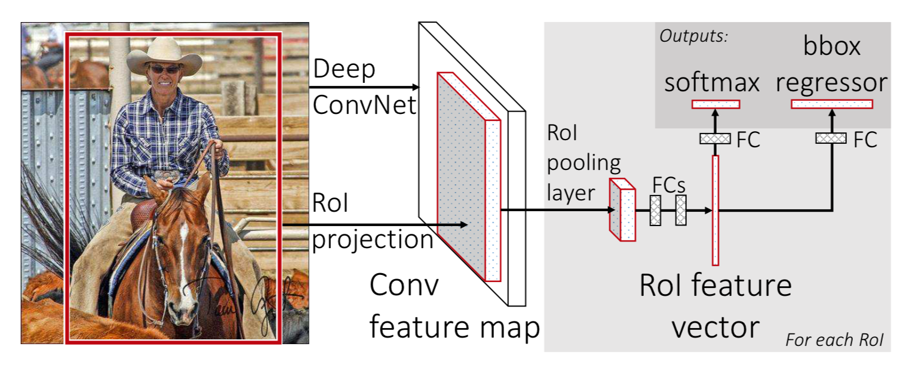

# Fast R-CNN

## 思想

- 将特征提取、分类以及 Bounding Box 回归统一到一个 CNN 中

- 算法流程：

	- 选出一部分可能是目标物体的区域（ROI）
	
	- 对 CNN 进行 fine tuning

	- 对 ROI 区域进行特征提取、分类以及 Bounding Box 回归

- 对整张图像做卷积，减少重复计算，加速计算：

	- 训练过程比 R-CNN 快 9 倍

	- 测试过程比 R-CNN 快 213 倍

- 特征提取、分类以及 Bounding Box 回归用同一个网络实现，不需要额外存储空间

- 检测范围：背景类、20 个前景类

- 由于使用了 Selective Search（2～3 秒），依然无法满足实时应用

## 候选区域选择

- 采用与 R-CNN 相同的 Selective Search，得到约 2000 个候选区域

## 网络结构

## CNN fine-tuning

### 模型结构修改

- 将最后的 max pooling 层替换为 ROI pooling 层

	- 对于最后 max pooling 层每个通道，将特征图划分为 \\(H \times W\\) 块，在每块上进行 max pooling，得到尺寸固定的输出 \\(C \times H \times W\\)

	- 后续全连接层的输入尺寸需要保持一致，而 Region Proposal 的大小可能不同，因此需要 ROI pooling 层

- 将最后的全连接层 FC8 替换为两个子网络：

	- K + 1 类的 Softmax 分类器（前景、背景）

		- 输出为 K + 1 维向量，表示属于每个类的概率

	- 类别相关的 Bounding Box 回归器

		- 输出为 4K 维向量，分别对应每一个前景类的 \\(t\_{x}, t\_{y}, t\_{w}, t\_{h}\\)

		- 关于 \\(t\_{x}, t\_{y}, t\_{w}, t\_{h}\\)，参考 [R-CNN.md](R-CNN.md)

- CNN 输入包含两部分：

	- 图像：待检测图像（受限于显存容量，短边缩放到为 600）
	
	- ROI：类别 \\(u\\)、Bounding Box 目标 \\(v = (v\_{x}, v\_{y}, v\_{w}, v\_{h})\\)

### fine-tuning

- 只对 VGG 的全连接层 fine-tuning 时效果较差，因此从 conv3_1 层开始进行 fine-tuning

- 损失函数包含两部分：

	- 分类网络的 Softmax 交叉熵

	- Bounding Box 网络的 Smooth L1 损失：

		$$ L\_{bb} = \sum\_{i \in \\{x, y, w, h\\}} [u \geq 1] \cdot Smooth\_{L\_{1}} (t\_{i}^{u} - v\_{i}) $$
		
		- 其中 \\(Smooth\_{L\_{1}}\\) 损失定义如下：

			$$ Smooth\_{L\_{1}} = \left\\{ \begin{matrix} 0.5 x^{2} \ \ \ \ \ \quad |x| \leq 1 \\\\ |x| - 0.5 \quad |x| > 1 \end{matrix} \right. $$

- 损失函数计算如下：

	$$ L = L\_{cls}(p, u) + \lambda \cdot L\_{bb} $$
	
	- 超参数 \\(\lambda = 1\\)

- 为了减少卷积层的计算量，训练时首先随机选取两张图片，之后从每张图片上选取 64 个 ROI 区域，共 128 个样本组成一个 batch

	- 每个 batch 包含 32 个正样本，96 个负样本

	- 将 \\(IoU \geq 0.5\\) 的 Region Proposal 视为 Ground Truth 对应的类

	- 将 \\(0.1 < IoU < 0.5\\) 的 Region Proposal 视为背景类

## 特征提取

### 坐标映射

- 将输入图像的 ROI 区域映射到 ROI pooling 层

	$$ in = out \cdot s + \left( \frac{k-1}{2} - p \right)$$
	
	- 关于 CNN 不同层间坐标映射，参考 [ReceptiveField.md](ReceptiveField.md)

- 为简化计算，在每一层都进行 \\(\frac{k}{2}\\) padding：

	- 当 k 为奇数时，上式化简为：

		$$ in = out \cdot s $$

	- 当 k 为偶数时，上式化简为：

		$$ in = out \cdot s - 0.5 $$

	- 由于坐标值 \\(in\\) 不可能是小数，上式可近似统一为：

		$$ in = out \cdot s $$

		- 即，感受野中心点坐标 \\(in\\) 只与后一层有关

		- 公式按层嵌套后，与 max pooling 响应点 \\(out\\) 对应的输入层中心点为：

			$$ in = out \cdot \prod\_{i} s\_{i} = out \cdot S $$

- 计算输入 ROI 在 ROI pooling 层上的对应区域：

	- 对于特征图上的 \\((x', y')\\)，在输入图像中的对应点为 \\((x, y) = (Sx', Sy')\\)

	- 计算 ROI 左上角坐标 \\((x, y)\\) 对应的 ROI pooling 坐标：

		$$ x' = \left \lfloor \frac{x}{S} \right \rfloor + 1 \qquad y' = \left \lfloor \frac{y}{S} \right \rfloor + 1 $$
	
	- 计算 ROI 右上角坐标 \\((x, y)\\) 对应的 ROI pooling 坐标：

		$$ x' = \left \lceil \frac{x}{S} \right \rceil - 1 \qquad y' = \left \lceil \frac{y}{S} \right \rceil - 1 $$

### CNN 训练

- 从 ROI pooling 层提取相应 ROI 的特征，训练 Softmax 分类器和 Bounding Box 回归器

	- 将 \\(IoU \geq 0.5\\) 的 Region Proposal 视为正样本

	- 将 \\(0.1 \leq IoU < 0.5\\) 的 Region Proposal 视为负样本

- 按 \\(0.5\\) 的概率对输入图像随机翻转，进行数据增强

### 全连接层提速

- 由于每个 ROI 都要通过全连接层进行分类和回归，全连接层占了计算时间的 \\(50\%\\)

- 全连接层的矩阵乘法计算如下：

	$$ y = Wx $$

	- 假设 \\(y, x\\) 分别为 \\(u, v\\) 向量，则 \\(W\\) 维度为 \\(u \times v\\)，矩阵乘法复杂度为 \\(uv\\)

- 对 \\(W\\) 进行 SVD，并用前 \\(t\\) 个奇异值近似：

	$$ W = U \Sigma V^{T} \approx U(:, 1:t) \cdot \Sigma(1:t, 1:t) \cdot V(:,1:t)^{T} $$

	- 关于 SVD，参考 [MatrixDecomposition.md](../basic/MatrixDecomposition.md)

	- 此时全连接层计算如下：

		$$ y = U \Sigma V^{T} x = U(\Sigma V^{T} x) = Uz $$

		- 相当于把一个全连接层拆分为两个，中间以一个低维（ \\(t\\) 维）数据相连

	- 由于 \\(\Sigma\\) 为对角矩阵，此时全连接层的计算复杂度为 \\(t(v+u)\\)

		- 当 \\(t < \min(u,v)\\) 时，可以实现全连接层提速

- 在 Fast R-CNN 中使用 SVD，可以将速度提高 \\(30\%\\)，基本不会损失精度