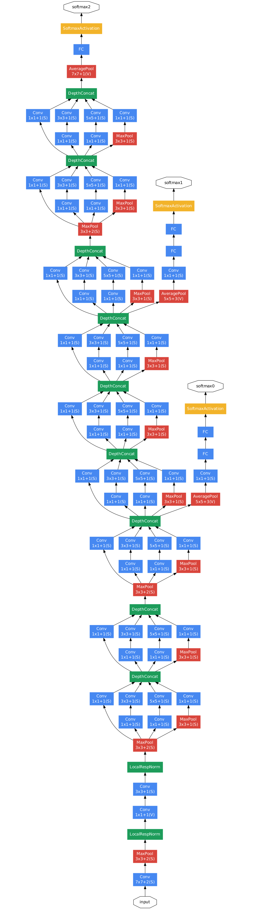

# GoogLeNet

## 网络结构

### Network In Network

- 普通卷积层做一次卷积得到一组特征图，学习的特征不是很精确

- 对于同一输入，通过组合不同尺度的卷积核，可以进行更好的学习

### Inception 结构

- 整个网络由 \\(9\\) 个 Inception 节点组成，而 Inception 结构如下：

	

### 特征提取

- 采用 \\(1 \times 1, \ 3 \times 3, \ 5 \times 5\\) 的卷积核，分别提取特征

- 由于池化层在 CNN 中效果显著，使用额外的池化层进行特征处理

- 将上述 \\(4\\) 组特征按深度拼接，得到当前 Inception 节点的最终特征图

### 加速计算

- 特征图较多时，\\(3 \times 3, \ 5 \times 5\\) 的卷积操作计算量巨大

- 因此先进行 \\(1 \times 1\\) 卷积，通过减少特征图数量加速计算

## 主要改进

- 使用 Inception 结构后参数减少，缓解过拟合

- 网络变得更深、更宽，性能提高 \\(2-3\\) 倍