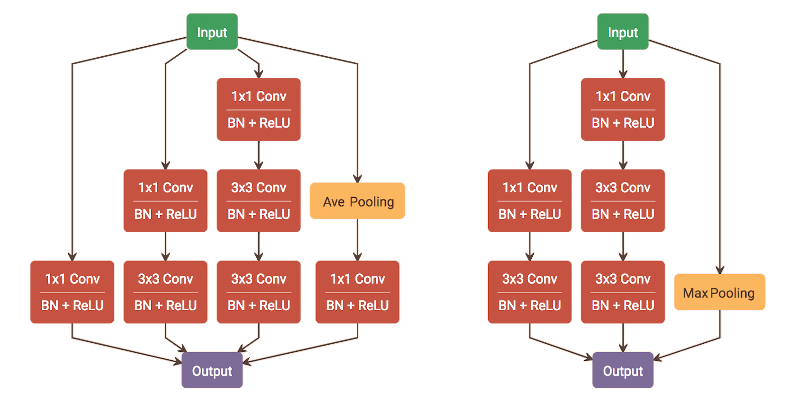
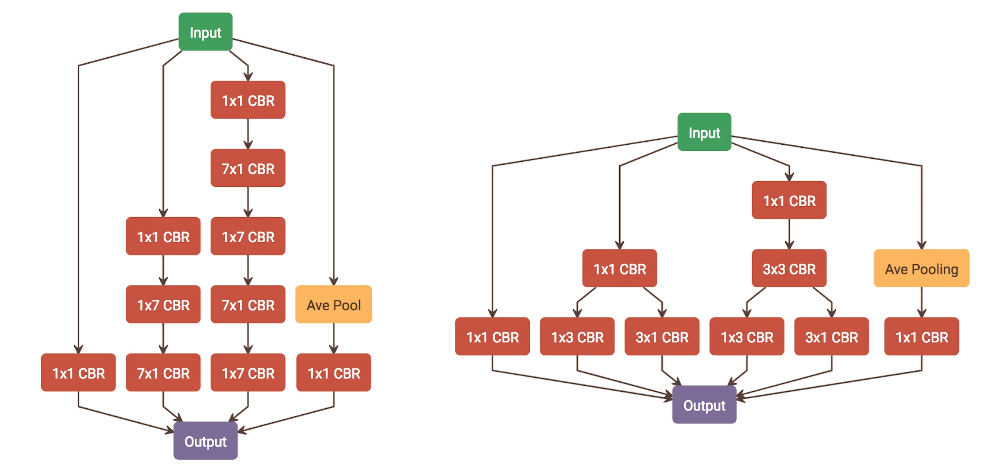

# Inception

## Inception v1

### Network In Network

- 为了提升网络性能，需要增加网络的深度或宽度，意味着大量参数：

	- 一方面会导致过拟合

	- 另一方面会导致计算量增加

- 在保证计算量不变的前提下，通过设计 Inception 结构，增加网络深度和宽度

	- 对于同一输入，通过组合不同尺度的卷积核，可以进行更好的提取特征

### Inception 结构

- 整个网络由多个 Inception 节点组成，而 Inception 节点的结构如下：

	

#### 特征提取

- 采用 \\(1 \times 1, \ 3 \times 3, \ 5 \times 5\\) 的卷积核，分别提取特征

- 使用 \\(stride = 2\\) 的 \\(3 \times 3\\) pooling 提取特征，提高效率

- 将上述 \\(4\\) 组特征拼接后，作当前 Inception 节点的输出

#### 加速计算

- 特征图较多时，\\(3 \times 3, \ 5 \times 5\\) 卷积计算量巨大

- 因此先进行 \\(1 \times 1\\) 卷积，通过减少特征图通道数加速计算

### 主要改进

- 使用 Inception 结构后参数减少，缓解过拟合

- 浅层使用普通卷积，深层使用 Inception 结构

- 相比 AlexNet，参数更少，速度更快，精度更高

- 训练时，为缓解网络加深导致的梯度消失，在中间层添加两个辅助 Softmax 传播梯度

- 测试时，去掉这两个 Softamx 层，只保留网络的最后输出

## Inception v2

### Inception 结构

#### BatchNorm

- 在每一个卷积层之后添加 BatchNorm 层，解决 Covariate Shift 问题，加速收敛

#### 小卷积堆叠

- 用两个 \\(3 \times 3\\) 卷积代替 Inception v1 中的 \\(5 \times 5\\) 卷积（上图，左）

	- 减少参数量和计算量

	- 新加的 ReLU 层可以增加模型的非线性

#### 并行 pooling

- 将 Inception 节点之后的 pooling 合并到节点内（上图，右）

	- 假设输入特征图维度为 \\(c \times n \times n\\)，输出特征图维度为 \\(c \times \frac{n}{2} \times \frac{n}{2}\\)

		- 先 inception 再 pooling，计算量较大

			$$ n \cdot n \cdot (c \cdot 2c) = 2c^{2}n^{2} $$

		- 先 pooling 再 inception，计算量较小，但容易导致特征丢失

			$$ \frac{n}{2} \cdot \frac{n}{2} \cdot (c \cdot 2c) = 2c^{2}\left(\frac{n}{2}\right)^{2} $$

		- 同时通过 \\(stride = 2\\) 的 \\(3 \times 3, \ 5 \times 5\\) 卷积和 pooling，实现特征图降维

## Inception v3

### Inception 结构

#### 小卷积堆叠

- 输入图像的尺度提升到 \\(299 \times 299\\)

- 将 Inception 节点之前的 \\(7 \times 7\\) 卷积分解成三个 \\(3 \times 3\\) 卷积

- \\(n\\) 个 \\(stride = 1\\) 的 \\(k \times k\\) 卷积相当于 \\(1\\) 个 \\(stride = 1\\) 的 \\(t \times t\\) 卷积

	$$ t = n \cdot (k - 1) + 1 $$

#### 非对称分解

- 将 \\(n \times n\\) 卷积分解为 \\(1 \times n\\) 卷积和 \\(n \times 1\\) 卷积，降低参数量，加速计算

	- 实验表明，当特征图尺度在 \\([12, 20]\\) 范围时，上述分解效果较好

- 在 Inception v2 的基础上，对于 \\(17 \times 17\\) 的特征图，使用 \\(7 \times 7\\) 卷积，并将其分解成串行的 \\(1 \times 7\\) 和 \\(7 \times 1\\) 卷积（上图，左）

- 在 Inception v2 的基础上，对于 \\(8 \times 8\\) 的特征图，将 Inception 节点内的 \\(3 \times 3\\) 卷积分解成并行的 \\(1 \times 3\\) 和 \\(3 \times 1\\) 卷积（上图，右）

## Xception

### 深度可分离卷积

- 从原始的 Inception 结构到 Xception 结构的演变如下：

	- 只考虑 \\(1 \times 1, \ 3 \times 3\\) 卷积，得到下图的简化形式

	- \\(1 \times 1\\) 对所有输入通道做卷积，等价于更宽的 \\(1 \times 1\\) 对所有输入通道做卷积，再拆分；得到下图的等价形式

	- 当拆分组数与输出通道相通时，得到下图的极端形式

	

- 从整个网络的角度看，由于多个模块堆叠，\\(1 \times 1\\) 和 \\(3 \times 3\\) 的顺序不影响最后的结果；将 \\(1 \times 1\\) 和 \\(3 \times 3\\) 互换位置，可以得到深度可分离卷积的形式

	- 首先通过 depthwise 卷积提取每个通道的特征

	- 再通过 pointwise 卷积对不同通道的特征进行融合

- 实验结果表明，\\(3 \times 3\\) 和 \\(1 \times 1\\) 卷积之间不使用 ReLU 效果较好；原因可能是 ReLU 造成特征丢失，影响了后续的特征融合

### 网络结构

- 网络的主体是 8 个 Xception 结构：

	- 用于处理 \\(19 \times 19\\) 的特征图，通道数始终为 \\(728\\)

	- 每个 Xception 节点堆叠了 3 个深度可分离卷积，同时也采用 ResNet 的思想

		- 在这种 Xception 结构下，shortcut 分支可以加速收敛，提高分类性能

		- 不用 shortcut 分支，使用类似 VGG 的结构时，同样可以达到相同的性能

- 与 Inception v3 相比，参数量基本相同，分类性能更好