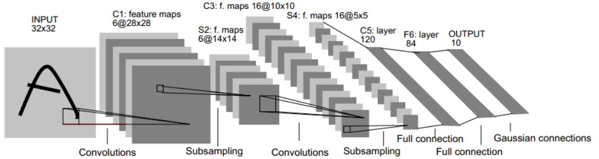

# LeNet

## 网络结构

- 从输入到输出一共 \\(8\\) 层

	

### 输入层 Input

- 输入为 \\(32 \times 32\\) 的灰度图

### 卷积层 Conv1

- 对 Input 数据进行卷积，特征图维度为 \\(28 \times 28\\)

	- 卷积核大小为 \\(5\\)，步长为 \\(1\\)，不进行 padding

### Pooling 层 Pool1

- 对 Conv1 结果进行 Pooling，特征图维度为 \\(14 \times 14\\)

	- 步长为 \\(2\\) 的 \\(2 \times 2\\) max polling

### 卷积层 Conv2

- 对 Pool1 结果进行卷积，特征图维度为 \\(10 \times 10\\)

	- 卷积核大小为 \\(5\\)，步长为 \\(1\\)，不进行 padding

### Pooling 层 Pool2

- 对 Conv2 结果进行 Pooling，特征图维度为 \\(5 \times 5\\)

	- 步长为 \\(2\\) 的 \\(2 \times 2\\) max polling

### 全连接层 FC1

- 与 Pool2 进行全连接，生成向量维度为 \\(120\\)

### 全连接层 FC2

- 与 FC1 进行全连接，生成向量维度为 \\(84\\)

### 输出层 Output

- 与 FC2 进行全连接，生成向量维度为 \\(10\\)

	- 生成向量经过 softmax 处理，分别代表每一类的概率