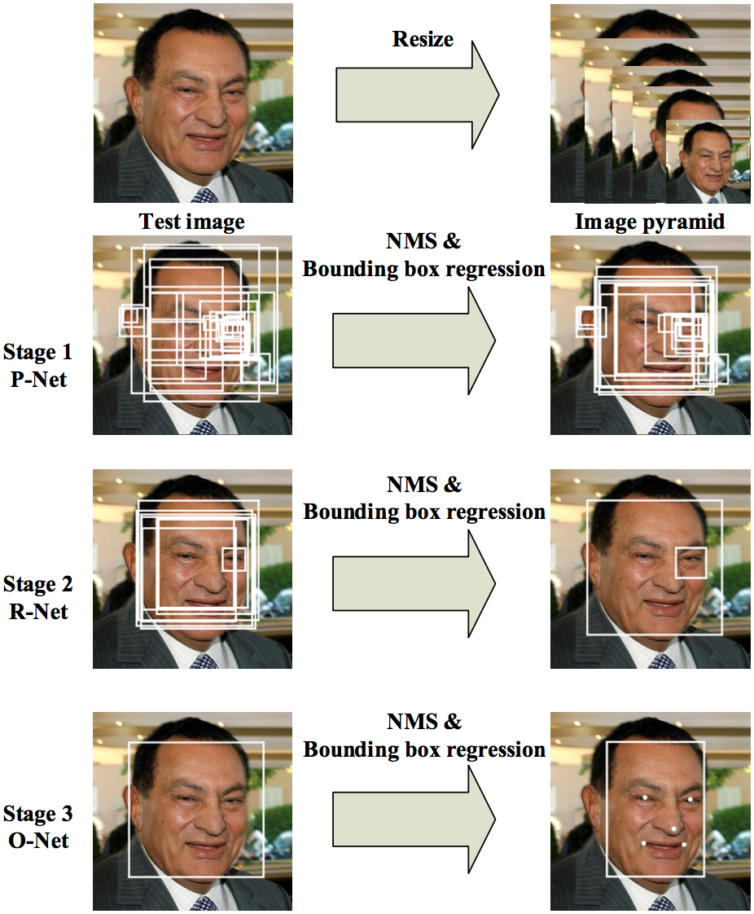

# $\mathrm{MTCNN}$

## 思想

### 级联网络

- 引入三个级联网络，采用从粗到细的处理方法进行检测

- 整个网络由三部分组成：$\mathrm{P-Net, \ R-Net, \ O-Net}$

  - 其中 $\mathrm{P-Net}$ 是全卷积网络，$\mathrm{R-Net, \ O-Net}$ 均为普通 $\mathrm{CNN}$

    - $\mathrm{P-Net}$ 在训练时的输入为 $\mathrm{12 \times 12}$，在预测时的输入不受限制

    - $\mathrm{R-Net}$ 的输入始终为 $\mathrm{24 \times 24}$

    - $\mathrm{O-Net}$ 的输入始终为 $\mathrm{48 \times 48}$

  - 子网络越来越深，准确率越来越高

### 多任务

- 人脸检测与人脸对齐相互配合、联合训练，以达到更好的性能

- 对于每个子网络，同时进行人脸判别、$\mathrm{BBox}$ 回归、关键点预测

  - 其中前两个任务用于人脸检测、后一个任务用于人脸对齐

- 对于 $\mathrm{BBox}$ 回归，网络的直接输出是 $4$ 个点相对于 $\mathrm{Box}$ 尺寸的偏移百分比

- 对于关键点预测，网络的直接输出是特征点相对当前 $\mathrm{Box}$ 左上角的偏移百分比

### $\mathrm{OHEM}$

- 通过在线难样本挖掘（$\mathrm{OHEM}$，即 $\mathrm{online \ hard \ example \ mining}$）进行训练，无需人工操作，提升网络性能

  - 每次训练时，对当前 $\mathrm{batch}$ 内的样本按 $\mathrm{loss}$ 值排序，选取前 $70\%$ 用于反向传播，以更新参数

## 预测过程

### $\mathrm{P-Net}$

- 根据指定的最小人脸 $F$，对原始图像按 $0.709$ 等间隔缩放，依次送入 $\mathrm{P-Net}$ 进行预测

  - $\mathrm{P-Net}$ 训练时的输入为 $12 \times 12$，预测时总是假设当前分辨率下的人脸为 $12 \times 12$

  - 最大尺度的短边为 $\min \left\{H, \ W \right\} \cdot \frac{12}{F}$，最小尺度的短边为 $12$

    - 同一图像缩放后的分辨率越小，对应的人脸越大；最小人脸只可能在原图上检测到

    - 以 $F = 24$ 为例，原图上的 $12 \times 12$ 人脸不在考虑范围内；将原图缩放 $\frac{12}{24} = 0.5$ 后，新图像上的人脸大小变为 $12 \times 12$，对应原图上的 $24 \times 24$ 区域，在检测范围内

  - $0.709$ 是为了保证相邻尺度的图像面积比 $\approx 2: 1$

- 遍历概率特征图，按阈值筛选特征点，并映射回缩放前的原始图像

  - 首先根据 $\mathrm{stride}$ 映射到网络输入的 $12 \times 12$ 区域

  - 再根据缩放比例，得到缩放前原始图像上的人脸位置

- 对于每个缩放尺度，依次进行 $\mathrm{NMS}$，以过滤重叠区域

- 通过 $\mathrm{BBox}$ 回归，得到实际人脸位置

- 进行一次跨尺度的 $\mathrm{NMS}$，得到 $\mathrm{P-Net}$ 的最终输出

### $\mathrm{R-Net}$

- 对于 $\mathrm{P-Net}$ 的每个输出，缩放到 $24 \times 24$，送入 $\mathrm{R-Net}$ 进行预测

- 根据阈值筛选特征点，按输入位置（原图）进行 $\mathrm{NMS}$，以过滤重叠区域

- 通过 $\mathrm{BBox}$ 回归，得到实际人脸位置

### $\mathrm{O-Net}$

- 对于 $\mathrm{R-Net}$ 的每个输出，缩放到 $48 \times 48$，送入 $\mathrm{O-Net}$ 进行预测

- 根据阈值筛选特征点，按输入位置（原图）进行 $\mathrm{NMS}$，以过滤重叠区域

- 通过 $\mathrm{BBox}$ 回归，得到最终的人脸位置

- 根据$\mathrm{Box}$ 尺寸和位置，同时输出与每个人脸对应的关键点位置

## 训练过程

### $\mathrm{P-Net}$

- 从 $\mathrm{WIDER}$ 和 $\mathrm{CelebA}$ 中随机裁剪，作为 $\mathrm{P-Net}$ 的训练样本，通过 $\mathrm{OHEM}$ 进行多任务训练

  - 进行关键点预测只是为了提升训练时的模型性能，并不用于实际预测过程

### $\mathrm{R-Net}$

- 使用 $\mathrm{P-Net}$ 在 $\mathrm{WIDER}$ 和 $\mathrm{CelebA}$ 上进行预测，根据 $\mathrm{GroundTruth}$ 划分 $\mathrm{R-Net}$ 的训练样本，通过 $\mathrm{OHEM}$ 进行多任务训练

  - 进行关键点预测只是为了提升训练时的模型性能，并不用于实际预测过程

### $\mathrm{O-Net}$

- 使用 $\mathrm{P-Net}$ 与 $\mathrm{R-Net}$ 的级联检测结果，在 $\mathrm{WIDER}$ 和 $\mathrm{CelebA}$ 上进行预测，根据 $\mathrm{GroundTruth}$ 划分 $\mathrm{O-Net}$ 的训练样本，通过 $\mathrm{OHEM}$ 进行多任务训练

  - 由于 $\mathrm{O-Net}$ 的准确率最高，预测时的最终关键点位置来自 $\mathrm{O-Net}$ 输出