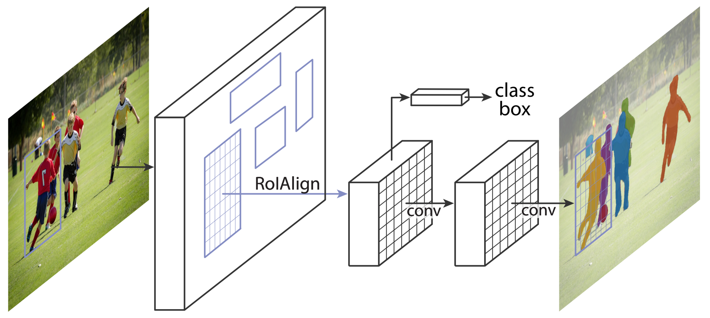

# $\mathrm{Mask R-CNN}$

## 思想

- 对 $\mathrm{Faster \ R-CNN}$ 进行简单扩展，在预测类别、$\mathrm{BBox}$ 的同时，生成 $\mathrm{BBox}$ 内的实例分割结果

- 用 $\mathrm{ROIAlign}$ 替代 $\mathrm{ROIPool}$，以解决在 $\mathrm{Fast \ R-CNN}$ 特征提取阶段因坐标量化导致的精度下降问题

## $\mathrm{ROIAlign}$

- $\mathrm{Faster \ R-CNN}$ 中使用的 $\mathrm{ROIPool}$ 操作会经过两次坐标量化（近似取整）：

  - 从原图坐标映射到特征图坐标时，经过一次量化，即 $\mathrm{round \left( coord / stride \right) } $

  - 将特征图 $\mathrm{ROI}$ 划分成 $\mathrm{bin}$（比如 $7 \times 7$）时，经过另一次量化，导致最后一行/列的 $\mathrm{bin}$ 偏小

- 上述两次量化操作，对检测和分类结果，影响较小；但对分割这种像素级任务，影响较大

- 针对解决量化导致的问题，提出 $\mathrm{ROIAlign}$ 替代 $\mathrm{ROIPool}$

  - 从原图映射到特征图坐标时，直接记录特征图上的浮点坐标，不进行量化

  - 将特征图 $\mathrm{ROI}$ 划分成 $\mathrm{bin}$ 时，首先计算每个 $\mathrm{bin}$ 的浮点坐标，之后根据 $\mathrm{ROI}$ 和 $\mathrm{bin}$ 的尺寸计算实际采样的浮点步长，并在每个 $\mathrm{bin}$ 内进行均匀采样；由于采样坐标为浮点数，使用双线性插值计算最终采样值

## $\mathrm{Mask}$ 分支

- 对 $\mathrm{Faster \ R-CNN}$ 进行简单扩展，在预测 $\mathrm{ROI}$ 类别、$\mathrm{BBox}$ 的同时，生成 $\mathrm{BBox}$ 内的实例分割结果

- 在训练时，生成所有类别的分割结果，但只对 $\mathrm{GroundTruth}$ 类别计算分割损失

- 在测试时，只对 $\mathrm{NMS}$ 后保留的目标生成分割结果，以提高性能

### 减少类间竞争

- 训练过程中，在生成 $\mathrm{ROI}$ 分割结果时，针对每一类，通过 $\mathrm{Sigmoid}$ 函数预测像素点属于该类的概率；相比使用 $\mathrm{Softmax}$ 预测像素点属于每一类的概率的方式，实际效果更好

- 一个可能的原因是，$\mathrm{Sigmoid}$ 函数不涉及类间竞争，模型更容易训练