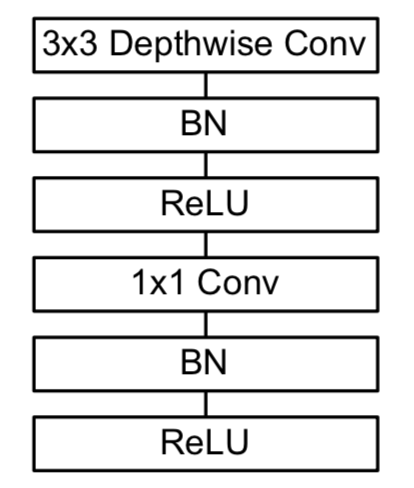
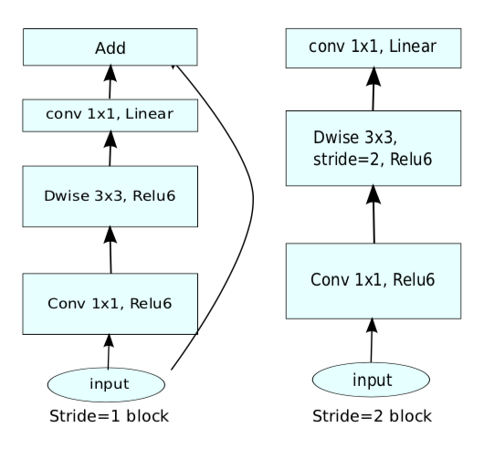

# MobileNet

## MobileNet v1

### 设计思想

- 在保证精度的前提下，通过深度可分离卷积提高运行速度，同时也减少参数量

- 模型较小，不易过拟合，可以减少正则化的使用

#### 深度可分离卷积

- 将标准卷积层分解成两个卷积层：depthwise 卷积和 pointwise 卷积

	- 第一个卷积层的每个 filter 只处理一个输入调整图

	- 第二个卷积层通过 \\(1 \times 1\\) 卷积将上述结果进行组合，提取新的特征

- 网络中大部分是 \\(1 \times 1\\) 卷积，可以最大程度的加速计算：

	- \\(1 \times 1\\) 卷积无需经过 im2col，可以直接按通道线性加权

### 网络结构

- 不使用 pooling 层，在 depthwise 卷积层中使用步长为 \\(2\\) 的 \\(3 \times 3\\) 卷积

- 网络的第一层是标准卷积层，最后一层通过 global average pooling 后进行 softmax 分类，中间层结构如下：

### 性能分析

- 假设输入特征图维度为 \\(D\_{F} \times D\_{F} \times M\\)，输出特征图维度为 \\(D\_{F} \times D\_{F} \times N\\)，卷积核尺度为 \\(D\_{K} \times D\_{K}\\)，步长 \\(stride = 1\\)

- 对于标准卷积，计算量如下：

	$$ D\_{F} \cdot D\_{F} \cdot M \cdot N \cdot D\_{K} \cdot D\_{K} $$

- 经过卷积分解，计算量如下：

	$$ D\_{F} \cdot D\_{F} \cdot M \cdot D\_{K} \cdot D\_{K} + D\_{F} \cdot D\_{F} \cdot M \cdot N $$

	- depthwise 卷积计算量：

		$$ D\_{F} \cdot D\_{F} \cdot M \cdot D\_{K} \cdot D\_{K} $$

	- pointwise 卷积计算量：

		$$ D\_{F} \cdot D\_{F} \cdot M \cdot N $$

- 相比标准卷积，运行时间变为：

	$$ T = \frac{1}{N} + \frac{1}{D\_{K}^{2}} $$

	- 对于 \\(3 \times 3\\) 卷积，理论上加速 \\(8-9\\) 倍

	- 使用 Caffe 训练时，实际速度较慢：

		- Caffe 的分组卷积按 group 依次运行，无法充分发挥 GPU 优势

		- 内核函数多次启动产生的额外时间，进一步降低了运行速度

		- 为加速训练，需要使用自定义的 Depthwise 卷积

- 相比标准卷积，参数量变为：

	$$ S = \frac{1}{N} + \frac{1}{D\_{K}^{2}}  $$

	- 对于标准卷积，参数量计算如下：

		$$ D\_{K} \times D\_{K} \times M \times N $$

	- 经过卷积分解，参数量计算如下：

		$$ D\_{K} \times D\_{K} \times M + M \times N $$
	
- 对于分类任务，运行速度是 VGG 的 27 倍，准确率接近

- 对于检测任务，相比 Faster R-CNN 和 SSD，准确率有所下降，但速度提升较大

### 超参数

- 除了上述基准模型，还可以实现更小的 MobileNet

- MobileNet 系列由以下两个超参数控制

#### 宽度乘子 \\(\alpha\\)

- \\(\alpha \in (0, 1]\\)，通常取值为 \\(0.25, \ 0.5, \ 0.75, \ 1.0\\)

- 对于给定层和宽度乘子 \\(\alpha\\)，输入通道数由 \\(M\\) 变为 \\(\alpha M\\)，输出通道数由 \\(N\\) 变为 \\(\alpha N\\)

- 总计算量变为：

	$$ D\_{F} \cdot D\_{F} \cdot \alpha M \cdot D\_{K} \cdot D\_{K} + D\_{F} \cdot D\_{F} \cdot \alpha M \cdot \alpha N $$

	- 即 \\(\alpha\\) 对计算量的影响是平方关系

#### 分辨率乘子 \\(\rho\\)

- 对于给定层和分辨率乘子 \\(\rho\\)，输入图像尺度由 \\(D\_{F}\\) 变为 \\(\rho D\_{F}\\)

- 实际实现时，通过控制输入尺寸实现衰减，输入尺寸分别为 \\(\\{224, \ 192, \ 160, \ 128\\}\\)

- 总计算量变为：

	$$ \rho D\_{F} \cdot \rho D\_{F} \cdot M \cdot D\_{K} \cdot D\_{K} + \rho D\_{F} \cdot \rho D\_{F} \cdot M \cdot N $$

	- 即 \\(\rho\\) 对计算量的影响也是平方关系

## MobileNet v2

### 设计思想

#### Linear Bottleneck

- 经过激活层之后的（非零）特征称为感兴趣流形（manifold of interest），神经网络中的感兴趣流形是输入的一个低维子空间；为了提升运算速度，可以适当降维

- 通道数太少时，由于 ReLU 层将部分输出置 0，会造成流形空间有用信息的丢失；为了缓解这一问题，需要使用线性激活函数，即不使用任何激活函数

#### Inverted Residual

- 在 MobileNet v1 中，\\(3 \times 3\\) 的 depthwise 卷积只按通道进行，会影响有效特征的提取，解决如下：

	- 先通过 pointwise 卷积将特征扩展为原来的 6 倍，以增加冗余

	- 再通过 \\(3 \times 3\\) 的 depthwise 卷积选择更有效的特征

	- 最后通过 pointwise 卷积整合通道间的信息，并实现通道降维

- 采用 ResNet 思想，在残差块的输入、输出间建立 shortcut，方便信息流动

- 残差块的输入、输出通道数较低，中间特征通道数较高，与 ResNet 的 bottleneck 相反

### 网络结构

- 网络第一层是标准卷积层，最后一层通过 average pooling 后进行 softmax 分类

- 不使用 pooling 层，在 depthwise 卷积层中使用步长为 \\(2\\) 的 \\(3 \times 3\\) 卷积

- 结合 Linear Bottleneck 和 Inverted Residual 的思想，进行卷积分解时，第二个 pointwise 卷积后不使用 ReLU 激活函数

- 当 \\(stride=1, \ 2\\)时，中间层结构分别如下：

### 超参数

#### 扩展因子 \\(t\\)

- 第一个 pointwise 的输出通道数与输入通道数之比：

	- \\(t = 0\\) 时卷积失效，相当于恒等映射

	- \\(t < 1\\) 时是正常的 bottleneck

	- \\(t > 1\\) 时是 Inverted Residual

- 实验表明，当 \\(t = 6\\) 时效果较好

### 内存优化

- 第一个 pointwise 卷积、depthwise 卷积产生的中间特征会占用大量内存

- 根据（残差）块内的计算特性，可按以下方式优化：

	- 将 bottleneck 共 \\(t \ M\\) 个通道的特征分为 \\(G\\) 组，每组有 \\(\frac{t \ M}{G}\\) 个通道

	- 依次处理每一组：

		- 首先根据（残差）块的输入进行第一次 pointwise 卷积

		- 按通道进行 depthwise 卷积

		- 进行第二次 pointwise 卷积，将结果叠加到输出特征图的所有位置

	- 对于 bottleneck 部分，优化后的内存使用量为 \\(\frac{t \ M}{G}\\)；当 \\(G = t \ M\\) 时，只使用一个通道的内存量

	- 由于内存共享，在反向传播时需要重新计算中间特征，会造成速度下降

### 性能分析

- 假设输入特征图维度为 \\(D\_{F} \times D\_{F} \times M\\)，输出特征图维度为 \\(D\_{F} \times D\_{F} \times N\\)，卷积核尺度为 \\(D\_{K} \times D\_{K}\\)，步长 \\(stride = 1\\)

- 单个（残差）块的计算量如下：

	$$ D\_{F} \cdot D\_{F} \cdot M \cdot t \ \left(M + D\_{K} \cdot D\_{K} + N \right) $$

	- 第一个 pointwise 卷积计算量：

		$$ D\_{F} \cdot D\_{F} \cdot M \cdot t \ M $$

	- depthwise 卷积计算量：

		$$ D\_{F} \cdot D\_{F} \cdot t \ M \cdot D\_{K} \cdot D\_{K} $$

	- 第二个 pointwise 卷积计算量：

		$$ D\_{F} \cdot D\_{F} \cdot t \ M \cdot N $$

- 相比 MobileNet v1，多了扩展因子 \\(t\\) 和第一个 pointwise 卷积；由于第一个 pointwise 可以实现特征升维，MobileNet v2 可以使用更窄的输入、输出特征

- 相比 MobileNet v1，由于特征升维的作用，准确率有所提升