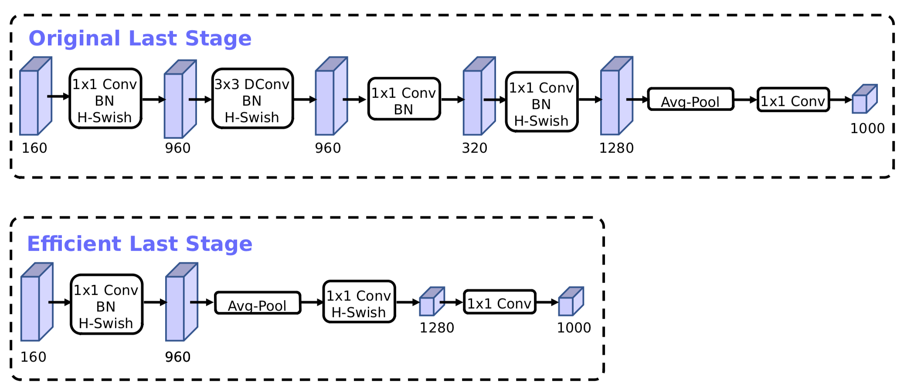
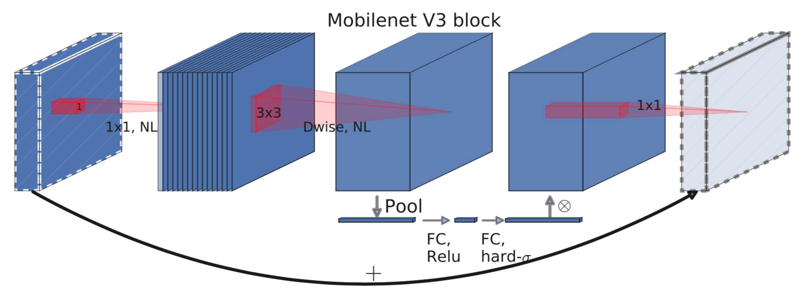

# $\mathrm{MobileNet}$

## $\mathrm{MobileNet \ v1}$

### 设计思想

- 在保证精度的前提下，通过深度可分离卷积提高运行速度，同时也减少参数量

- 模型较小，不易过拟合，可以减少正则化的使用

#### 深度可分离卷积

- 将标准卷积层分解成两个卷积层：$\mathrm{depthwise}$ 卷积和 $\mathrm{pointwise}$ 卷积

  - 第一个卷积层的每个 $\mathrm{filter}$ 只处理一个输入特征图

  - 第二个卷积层通过 $1 \times 1$ 卷积将上述结果进行组合，提取新的特征

- 网络中大部分是 $1 \times 1$ 卷积，可以最大程度的加速计算：

  - $1 \times 1$ 卷积无需经过 $\mathrm{im2col}$，可以直接按通道线性加权

### 网络结构

- 不使用 $\mathrm{pooling}$ 层，在 $\mathrm{depthwise}$ 卷积层中使用步长为 $2$ 的 $3 \times 3$ 卷积

- 网络的第一层是标准卷积层，最后一层通过 $\mathrm{global \ average \ pooling}$ 后进行 $\mathrm{softmax}$ 分类，中间层结构如下：

### 性能分析

- 假设输入特征图维度为 $D_{F} \times D_{F} \times M$，输出特征图维度为 $D_{F} \times D_{F} \times N$，卷积核尺度为 $D_{K} \times D_{K}$，步长 $\mathrm{stride} = 1$

- 对于标准卷积，计算量如下：

  $$
  D_{F} \cdot D_{F} \cdot M \cdot N \cdot D_{K} \cdot D_{K}
  $$

- 经过卷积分解，计算量如下：

  $$
  D_{F} \cdot D_{F} \cdot M \cdot D_{K} \cdot D_{K} + D_{F} \cdot D_{F} \cdot M \cdot N
  $$

  - $\mathrm{depthwise}$ 卷积计算量：

    $$
    D_{F} \cdot D_{F} \cdot M \cdot D_{K} \cdot D_{K}
    $$

  - $\mathrm{pointwise}$ 卷积计算量：

    $$
    D_{F} \cdot D_{F} \cdot M \cdot N
    $$

- 相比标准卷积，运行时间变为：

  $$
  T = \frac{1}{N} + \frac{1}{D_{K}^{2}}
  $$

  - 对于 $3 \times 3$ 卷积，理论上加速 $8 - 9$ 倍

  - 使用 $\mathrm{Caffe}$ 训练时，实际速度较慢：

    - $\mathrm{Caffe}$ 的分组卷积按 $\mathrm{group}$ 依次运行，无法充分发挥 $\mathrm{GPU}$ 优势

    - 内核函数多次启动产生的额外时间，进一步降低了运行速度

    - 为加速训练，需要使用自定义的 $\mathrm{Depthwise}$ 卷积

- 相比标准卷积，参数量变为：

  $$
  S = \frac{1}{N} + \frac{1}{D_{K}^{2}}
  $$

  - 对于标准卷积，参数量计算如下：

    $$
    D_{K} \times D_{K} \times M \times N
    $$

  - 经过卷积分解，参数量计算如下：

    $$
    D_{K} \times D_{K} \times M + M \times N
    $$

- 对于分类任务，运行速度是 $\mathrm{VGG}$ 的 27 倍，准确率接近

- 对于检测任务，相比 $\mathrm{Faster \ R-CNN}$ 和 $\mathrm{SSD}$，准确率有所下降，但速度提升较大

### 超参数

- 除了上述基准模型，还可以实现更小的 $\mathrm{MobileNet}$

- $\mathrm{MobileNet}$ 系列由以下两个超参数控制

#### 宽度乘子 $\alpha$

- $\alpha \in \left( 0, \ 1 \right]$，通常取值为 $0.25, \ 0.5, \ 0.75, \ 1.0$

- 对于给定层和宽度乘子 $\alpha$，输入通道数由 $M$ 变为 $\alpha M$，输出通道数由 $N$ 变为 $\alpha N$

- 总计算量变为：

  $$
  D_{F} \cdot D_{F} \cdot \alpha M \cdot D_{K} \cdot D_{K} + D_{F} \cdot D_{F} \cdot \alpha M \cdot \alpha N
  $$

  - 即 $\alpha$ 对计算量的影响是平方关系

#### 分辨率乘子 $\rho$

- 对于给定层和分辨率乘子 $\rho$，输入图像尺度由 $D_{F}$ 变为 $\rho D_{F}$

- 实际实现时，通过控制输入尺寸实现衰减，输入尺寸分别为 $224, \ 192, \ 160, \ 128$

- 总计算量变为：

  $$
  \rho D_{F} \cdot \rho D_{F} \cdot M \cdot D_{K} \cdot D_{K} + \rho D_{F} \cdot \rho D_{F} \cdot M \cdot N
  $$

  - 即 $\rho$ 对计算量的影响也是平方关系

## $\mathrm{MobileNet \ v2}$

### 设计思想

#### $\mathrm{Linear \ Bottleneck}$

- 经过激活层之后的（非零）特征称为感兴趣流形（$\mathrm{manifold \ of \ interest}$），神经网络中的感兴趣流形是输入的一个低维子空间；为了提升运算速度，可以适当降维

- 通道数太少时，由于 $\mathrm{ReLU}$ 层将部分输出置 $\mathrm{0}$，会造成流形空间有用信息的丢失；为了缓解这一问题，需要使用线性激活函数，即不使用任何激活函数

#### $\mathrm{Inverted \ Residual}$

- 在 $\mathrm{MobileNet \ v1}$ 中，$3 \times 3$ 的 $\mathrm{depthwise}$ 卷积只按通道进行，会影响有效特征的提取，解决如下：

  - 先通过 $\mathrm{pointwise}$ 卷积将特征扩展为原来的 $6$ 倍，以增加冗余

  - 再通过 $3 \times 3$ 的 $\mathrm{depthwise}$ 卷积选择更有效的特征

  - 最后通过 $\mathrm{pointwise}$ 卷积整合通道间的信息，并实现通道降维

- 采用 $\mathrm{ResNet}$ 思想，在残差块的输入、输出间建立 $\mathrm{shortcut}$，方便信息流动

- 残差块的输入、输出通道数较低，中间特征通道数较高，与 $\mathrm{ResNet}$ 的 $\mathrm{bottleneck}$ 相反

### 网络结构

- 网络第一层是标准卷积层，最后一层通过 $\mathrm{global \ average \ pooling}$ 后进行 $\mathrm{softmax}$ 分类

- 不使用 $\mathrm{pooling}$ 层，在 $\mathrm{depthwise}$ 卷积层中使用步长为 $2$ 的 $3 \times 3$ 卷积

- 结合 $\mathrm{Linear \ Bottleneck}$ 和 $\mathrm{Inverted \ Residual}$ 的思想，进行卷积分解时，第二个 $\mathrm{pointwise}$ 卷积后不使用 $\mathrm{ReLU}$ 激活函数

- 当 $\mathrm{stride} = 1, \ 2$时，中间层结构分别如下：

### 超参数

#### 扩展因子 $t$

- 第一个 $\mathrm{pointwise}$ 的输出通道数与输入通道数之比：

  - $t = 0$ 时卷积失效，相当于恒等映射

  - $t < 1$ 时是正常的 $\mathrm{bottleneck}$

  - $t > 1$ 时是 $\mathrm{Inverted \ Residual}$

- 实验表明，当 $t = 6$ 时效果较好

### 内存优化

- 第一个 $\mathrm{pointwise}$ 卷积、$\mathrm{depthwise}$ 卷积产生的中间特征会占用大量内存

- 根据（残差）块内的计算特性，可按以下方式优化：

  - 将 $\mathrm{bottleneck}$ 共 $t \ M$ 个通道的特征分为 $G$ 组，每组有 $\frac{t \ M}{G}$ 个通道

  - 依次处理每一组：

    - 首先根据（残差）块的输入进行第一次 $\mathrm{pointwise}$ 卷积

    - 按通道进行 $\mathrm{depthwise}$ 卷积

    - 进行第二次 $\mathrm{pointwise}$ 卷积，将结果叠加到输出特征图的所有位置

  - 对于 $\mathrm{bottleneck}$ 部分，优化后的内存使用量为 $\frac{t \ M}{G}$；当 $G = t \ M$ 时，只使用一个通道的内存量

  - 由于内存共享，在反向传播时需要重新计算中间特征，会造成速度下降

### 性能分析

- 假设输入特征图维度为 $D_{F} \times D_{F} \times M$，输出特征图维度为 $D_{F} \times D_{F} \times N$，卷积核尺度为 $D_{K} \times D_{K}$，步长 $\mathrm{stride} = 1$

- 单个（残差）块的计算量如下：

  $$
  D_{F} \cdot D_{F} \cdot M \cdot t \ \left( M + D_{K} \cdot D_{K} + N \right)
  $$

  - 第一个 $\mathrm{pointwise}$ 卷积计算量：

    $$
    D_{F} \cdot D_{F} \cdot M \cdot t \ M
    $$

  - $\mathrm{depthwise}$ 卷积计算量：

    $$
    D_{F} \cdot D_{F} \cdot t \ M \cdot D_{K} \cdot D_{K}
    $$

  - 第二个 $\mathrm{pointwise}$ 卷积计算量：

    $$
    D_{F} \cdot D_{F} \cdot t \ M \cdot N
    $$

- 相比 $\mathrm{MobileNet \ v1}$，多了扩展因子 $t$ 和第一个 $\mathrm{pointwise}$ 卷积；由于第一个 $\mathrm{pointwise}$ 可以实现特征升维，$\mathrm{MobileNet \ v2}$ 可以使用更窄的输入、输出特征

- 相比 $\mathrm{MobileNet \ v1}$，由于特征升维的作用，准确率有所提升

## $\mathrm{MobileNet \ v3}$

### 设计思想

#### 轻量级激活函数

- 用 $\mathrm{HardSigmoid}$ 替换 $\mathrm{Sigmoid}$，从而间接替换 $\mathrm{Swish}$ 函数，其中 $\mathrm{HardSigmoid}$ 函数定义如下：

  $$
  \mathrm{HardSigmoid} \left( x \right) = \frac{\mathrm{ReLU6 \left( x \right)}}{6}
  $$

- 与 $\mathrm{Sigmoid}$ 相比，$\mathrm{HardSigmoid}$ 所需的计算量极小，而且几乎不会导致模型精度下降

#### 起始模块优化

- 目前的移动端模型，一般使用 $32$ 通道的标准 $3 \times 3$ 卷积作为起始模块，得益于 $\mathrm{HardSwish}$ 更强的非线性，可以将该模块的通道数削减为 $16$，却不会导致模型精度下降

#### 预测输出模块优化

- $\mathrm{MobileNet \ v2}$ 在最后一个 $\mathrm{Bottleneck}$ 模块后，首先使用 $1 \times 1$ 卷积对 $7 \times 7$ 的特征图进行通道升维，然后对 $\mathrm{Global \ Average \ Pooling}$ 的结果进行分类

- 在 $\mathrm{MobileNet \ v3}$ 中，只保留该 $\mathrm{Bottleneck}$ 的 $\mathrm{Expasion} \ 1 \times 1$ 卷积，然后将 $\mathrm{Global \ Average \ Pooling}$ 的结果升维到 $1280$ 通道，最后进行分类

- 优化后，通道升维在 $1 \times 1$ 特征图生进行，可以进一步提升效率；而实验结果表明，该改动不会导致最终精度下降

- 输出模块优化前后的对比如下：

#### 引入 $\mathrm{SE}$ 模块进一步提升精度

- $\mathrm{Bottleneck}$ 的结构基本沿用了 $\mathrm{MobileNet \ v2}$ 的设计，$\mathrm{SE}$ 模块应用在 $\mathrm{Depthwise}$ 后的特征图上

- $\mathrm{SE}$ 模块中，通道降维系数固定为 $0.25$

### 网络结构

- 基本的 $\mathrm{MobileNet \ v3}$ 模块如下：

- 沿用 $\mathrm{MobileNet \ v2}$ 的模块设计，但由于使用 $\mathrm{NAS}$ 搜索最优网络结构，每个模块的 $\mathrm{Expansion}$ 比例不固定

- $\mathrm{NL}$ 表示 $\mathrm{ReLU}$ 或 $\mathrm{HardSwish}$，其中，起始模块和深层网络使用 $\mathrm{HardSwish}$，其他部分使用 $\mathrm{ReLU}$
