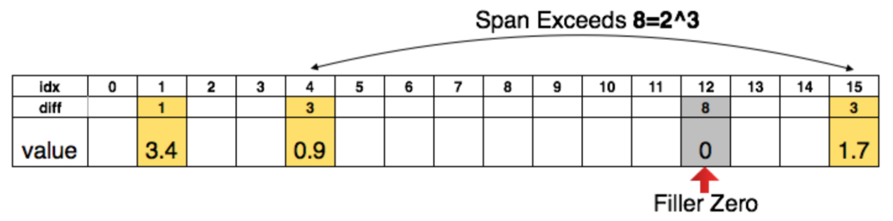
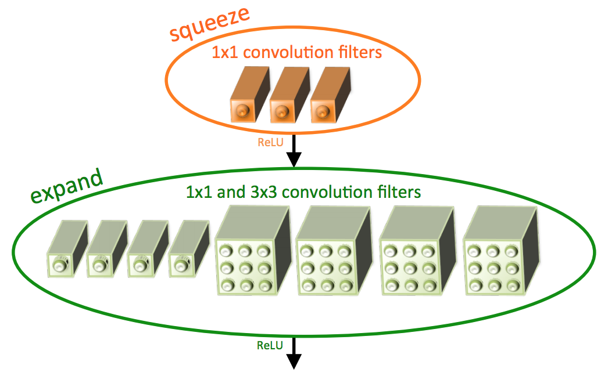
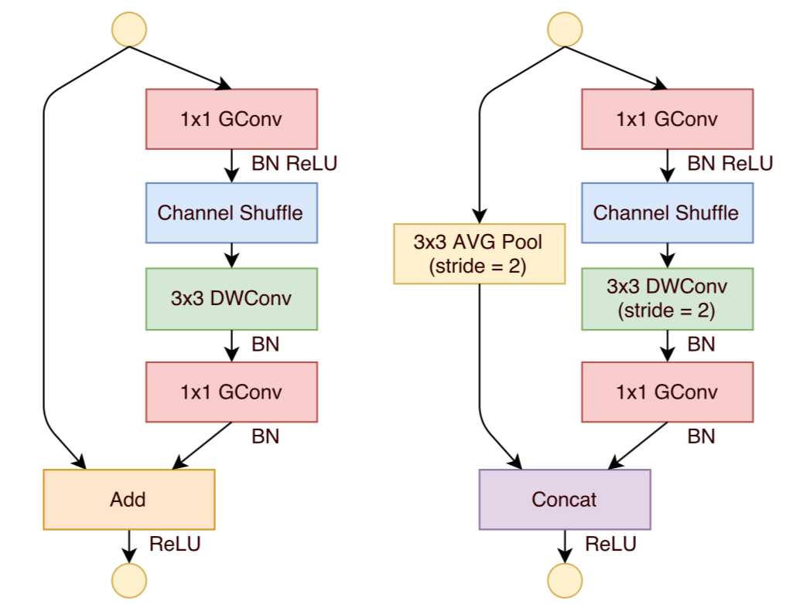

<script type="text/javascript" src="http://cdn.mathjax.org/mathjax/latest/MathJax.js?config=default"></script>

# 模型压缩

## 背景介绍

- 主流的 CNN 存在以下问题：

	- 模型参数量巨大，模型本身占空间较大
	
	- 卷积层和全连接层需要大量的矩阵乘法，计算开销也大

- 这样的 CNN 在终端部署、低延迟需求场景下难以应用

- 一般来说，CNN 的模型参数主要来自全连接层，计算开销主要来自卷积层

- 根据压缩角度，可以分为两类：

	- 从网络权重角度

	- 从网络结构角度

- 从计算速度方面，也可以分为两类：

	- 仅压缩尺寸

	- 压缩尺寸的同时，提升速度

## 方法比较

方法 | 压缩角度 | 计算速度
:---: | :---: | :---:
Deep Compression | 权重 | No
SqueezeNet | 结构 | No
XNOR-Net | 权重 | Yes
MobileNet | 结构 | Yes
ShuffleNet | 结构 | Yes

## Deep Compression

- 不影响精度的前提下，把 AlexNet 模型压缩 35 倍，把 VGG 模型压缩 49 倍

- 计算速度提升 3～4 倍，能耗降低 3～7 倍

### 网络剪枝

- 对 CNN 进行正常预训练

- 删除权重小于一定阈值的所有连接

- 重新训练得到的稀疏网络

- 对于得到的稀疏权值矩阵，只存储非零值、与前一个非零值的索引距离：

	- 对于卷积层，每个距离占 \\(d=8 \ bit\\)

	- 对于全连接层，每个距离占 \\(d=5 \ bit\\)

	- 如果索引 \\(a, b\\) 的距离超过 \\(2^{d}\\)，需要存储 \\(a + 2^{d}\\) 处的零值，以防距离溢出

	

### 权值共享与量化

- 将同一层的所有权值划分为 \\(k\\) 个簇，计算每个权值对应聚类中心：

	- 对于每个权值，用相应的簇中心进行替换

	- 假设原始权值有 \\(n\\) 个，每个权值占 \\(b\\) 位，压缩前需要的空间为 \\(nb\\)

	- 压缩后，存储簇中心需要的空间为 \\(kb\\)

	- 对于每个权值，只需记录与其对应的簇索引，需要的总空间为 \\(n \log\_{2}k\\)

		- 对于卷积层，每个索引为 \\(8 \ bit\\)，即 256 种共享权值

		- 对于全连接层，每个索引为 \\(5 \ bit\\)，即 32 种共享权值

	- 压缩率计算如下：

		$$ r = \frac{nb}{n \log\_{2}k + kb} $$

- 反向传播时，将簇内梯度和作为簇的总梯度，并更新簇中心

- 使用 k-means 进行聚类：

	- 计算当前层权值的边界 \\(min, \ max\\)，将 \\([min, max]\\) 切为等长区间，将切分点作为初始聚类中心

	- 大的权值对 CNN 影响较大，但是占的比例较小
	
	- 无论是基于密度，还是随机选择聚类中心，都会降低大权值被选中的概率

### Huffman 编码

- 训练结束后，通过 Huffman 编码处理权值和索引，可以进一步压缩存储空间

## SqueezeNet

- 不影响精度的前提下，把 AlexNet 的参数量压缩 50 倍

- 结合 Deep Compression 的思想，可以将 AlexNet 模型压缩 510 倍

### 设计思想

- 用 \\(1 \times 1\\) 的卷积核代替 \\(3 \times 3\\) 的卷积核

	- \\(1 \times 1\\) 的卷积核可以将参数量压缩 9 倍

	- 为了不影响精度，只替换部分 \\(3 \times 3\\) 卷积核

- 减少输入 \\(3 \times 3\\) 卷积的特征图通道数

	- 将原来的卷积层拆解为两层，并封装为一个 Fire Module

- 减少或延迟 pooling 操作

	- 特征图分辨率越大，分类精度越高，但相应的计算量也越大

	- 减少或延迟 pooling，可以在深层得到更大的特征图

- 用 global average pooling 层代替最后的全连接层，最大程度减少参数量

### Fire Module



- 首先通过 squeeze 层对特征图通道进行压缩

	- 使用 \\(1 \times 1\\) 卷积核

	- 减少特征图通道数，不改变特征图维度

- 在 expand 层使用等量的 \\(1 \times 1\\) 和 \\(3 \times 3\\) 卷积核，之后对特征图进行拼接

- squeeze 层和 expand 层都使用 ReLU 激活函数

- 经过最后一个 Fire Module 后，按 0.5 的概率进行 Dropout

## XNOR-Net

- Binary Weight Network（BWN）对权重进行二值化，可以将模型压缩 32 倍，而不会造成太大的性能损失

- XNOR-Net 对权重、输入图像同时进行二值化，用位操作代替卷积乘法，可以将计算速度提高 58 倍，代价是一定程度的性能损失

- 可以直接训练，无需预训练

### BWN

- 对卷积核进行二值化后，可以将模型压缩 32 倍

- 只用加减运算即可实现卷积，能在一定程度上加速运算

#### 数学推导

- 令 \\(I^{c \times w\_{in} \times h\_{in}}\\) 表示当前特征图，\\(W^{c \times w \times h}\\) 表示卷积核，\\(B \in \\{-1, +1\\}^{c \times w \times h}\\) 表示二值化的卷积核，\\(\alpha \in R^{+}\\) 表示满足 \\(W \approx \alpha B\\) 的缩放因子；

- 为方便表示，令 \\(n = c \times w \times h\\)

- 卷积计算近似如下：

	$$ I \odot W \approx (I \oplus B) \alpha $$

	- 其中 \\(\oplus\\) 是不用乘法的卷积

		- 由于卷积核 \\(B\\) 取值为 \\(\\{-1, +1\\}\\)，通过加减运算即可实现卷积

- 优化目标：

	$$ \arg \min\_{\alpha, B} J(B, \alpha) = \arg \min\_{\alpha, B} ||W - \alpha B||^{2} $$

	- 对上式展开可得：

		$$ J(B, \alpha) = \alpha^{2} B^{T} B - 2 \alpha W^{T} B + W^{T} W $$

		- 由 \\(B \in \\{-1, +1\\}^{n}\\) 可得 \\(B^{T} B = n\\)

		- 由于 \\(W\\) 已知，\\(W^{T} W\\) 的值为常量 \\(c\\)

- \\(B\\) 的最优解计算如下：

	$$ B^{\*} = \arg \min\_{B} \left( \alpha^{2} n - 2 \alpha W^{T} B + c \right) = \arg \max\_{B} \left( W^{T} B \right) $$

	- 由 \\(B \in \\{-1, +1\\}^{n}\\) 可得 \\(B^{\*} = sign(W)\\)

	- 即，\\(B\\) 的最优解是 \\(W\\) 的符号矩阵

- \\(\alpha\\) 的最优解计算如下：

	- 令 \\(\frac{\partial J}{\partial \alpha} = 0\\) 可得：

		$$ \alpha^{\*} = \frac{W^{T} B^{\*}}{n} $$

		- 将 \\(B^{\*}\\) 代入可得：

			$$ \alpha^{\*} = \frac{W^{T} sign(W)}{n} = \frac{\sum|W\_{i}|}{n} = \frac{1}{n} ||W||\_{1} $$

	- 即，\\(\alpha\\) 的最优解与 \\(W\\) 的 \\(L\_{1}\\) 范数有关

#### 训练过程

- 前向计算预测值、反向传播计算梯度时，使用二值权重 \\(B\\) 和缩放因子 \\(\alpha\\)

- 在更新参数时，对原始权重 \\(W\\) 进行更新

	- 由于精度要求较高，更新 \\(B\\) 可能会导致更新前后结果一样，无法收敛

- 训练结束后，直接丢弃原始权重 \\(W\\)，用二值权重 \\(B\\)、缩放因子 \\(\alpha\\) 进行预测

### XNOR-Net

- 除了卷积核，对输入图像、特征图也进行二值化

- 对于 \\(\\{-1, +1\\}^{n}\\) 上的卷积操作，可以通过位运算实现，实现 58 倍加速

#### 数学推导

- 令 \\(X^{c \times w \times h}\\) 表示卷积核划过的当前特征图区域，\\(H^{c \times w \times h}\\) 表示该区域的二值近似，\\(\beta \in R^{+}\\) 表示该区域的缩放因子

- 优化目标：

	$$ \arg \min_{\alpha, B, \beta, H} ||X \odot W - \beta \alpha H \odot B||^{2} $$

	- 令 \\(Y \in R^{n}\\) 且 \\(Y\_{i} = X\_{i} W\_{i}\\)，令 \\(C \in \\{-1, +1\\}^{n}\\) 且 \\(C\_{i} = H\_{i} B\_{i}\\)，令 \\(\gamma \in R^{+}\\) 且 \\(\gamma = \beta \alpha\\)，优化目标转换为：

		$$ \gamma^{\*}, C^{\*} = \arg \min_{\gamma, C} ||Y - \gamma C||^{2} $$

- 由 BWN 同理可得，\\(C\\) 的最优解计算如下：

	$$ C^{\*} = sign(Y) = sign(X) \odot sign(W) $$

	- 此时，\\(H^{\*} = sign(X), \ B^{\*} = sign(W)\\)

- 由 BWN 同理可得，\\(\gamma\\) 的最优解计算如下：

	$$ \gamma^{\*} = \frac{\sum|Y\_{i}|}{n} = \frac{\sum|X\_{i}| |W\_{i}|}{n} $$
	
	- 由于 \\(X, W\\) 相互独立：

		$$ E[|X\_{i}| |W\_{i}|] = E[|X\_{i}|] E[|W\_{i}|] $$

	- 代入上式可得：

		$$ \gamma^{\*} = \left( \frac{1}{n} ||X||\_{1} \right) \left( \frac{1}{n} ||W||\_{1} \right) $$

	- 此时，\\(\beta^{\*} = \frac{1}{n} ||X||\_{1}, \ \alpha^{\*} = \frac{1}{n} ||W||\_{1}\\)

#### 缩放因子计算加速

- 计算 \\(\beta^{\*} = \frac{1}{n} ||X||\_{1}\\) 时，不同组的卷积核之间会有大量重复计算，采用以下加速方案：

	- 先计算当前特征图 \\(I^{c \times w\_{in} \times h\_{in}}\\) 每个位置、所有通道的 \\(L\_{1}\\) 范数：

		$$ A(i,j) = \sum |I(:,i,j)| $$

	- 用卷积核 \\(k \in R^{w \times h}\\) 与 \\(A\\) 卷积得到 \\(K = A * k\\)：

		- \\(k\_{ij} = \frac{1}{c \times w \times h}\\)，可以得到当前卷积区域 \\(X^{c \times w \times h}\\) 的 \\(L\_{1}\\) 均值，即 \\((i,j)\\) 处的 \\(\beta^{\*}\\)

	- 此时卷积计算近似如下：

		$$ I * W \approx (sign(I) * sign(W)) \odot K \alpha $$

#### 二值卷积加速

- 以长度为 \\(32\\) 的一维数组为例，说明二值卷积的位运算实现：

	- 将数组压缩成一个值：

		```
		value = 0
		for(int i = 0; i < 32; i++){
			sign = array[i] >= 0;
			value = value | (sign << i);
		}
		```
		
		- 原数组中的 \\(1\\) 在压缩值中依旧为 \\(1\\)

		- 原数组中的 \\(-1\\) 在压缩值中变为 \\(0\\)
		
	- 对压缩后的两个值进行“同或”运算：

		```
		xnor = ~(val1 ^ val2);
		```
		
	- 统计“同或”结果的二进制中 \\(1\\) 的个数 \\(c\\)：

		- 某一位的“同或”结果为 \\(1\\) 时，对应位的“异或”结果为 \\(0\\)

		- 某一位的“异或”结果为 \\(0\\) 时，参与运算的两个位均为 \\(1\\) 或 \\(0\\)，分别对应原始数组中的 \\(1, 1\\) 或 \\(-1,-1\\)，相乘结果为 \\(1\\)

		- 最终计算结果为：

			$$ c \cdot 1 + (n - c) \cdot (-1) = 2c - n $$

#### 训练过程

- 需要将网络的层间关系调整如下：

	- Batch Normalization、Binary Activation、Binary Convolution、Pooling

		- Binary Activation 层计算 \\(\beta\\) 缩放因子矩阵 \\(K\\)，符号矩阵 \\(sign(I)\\)
		
		- 对二值化的数据进行 max pooling 时，得到一个几乎所有元素为 \\(1\\) 的矩阵，会对后续计算造成很大的精度损失；因此将 Pooling 层直接放在 Convolution 层之后

		- 在 Binary Activation 之前进行 Batch Normalization，可以得到零均值的输入分布，减少二值化的时损失

- 训练过程与 BWN 相同

## MobileNet

- 关于 MobileNet，参考 [MobileNet v1.md](MobileNet v1.md)、[MobileNet v2.md](MobileNet v2.md)

## ShuffleNet

- 实际运行速度比 AlexNet 快 13 倍，精度与 VGG 持平

### 设计思想

- 通过分组 pointwise 卷积减少普通 pointwise 卷积的计算量

- 通过 channel shuffle，加强不同组之间的信息交流，提升模型的表示能力

### ShuffleNet 单元

- 采用 ResNet 的 bottleneck 思想

	- 将输入通道分为 \\(g\\) 组，每组 \\(n\\) 个通道

	- 在每一组内进行 pointwise 卷积，减少特征图通道数

	- 通过 channel shuffle 加强组间信息交流：

		- 将特征图通道 reshape 成新维度 \\((g, n)\\)

		- 对上述通道进行转置，得到 \\((n, g)\\)

		- 将通道展开，得到 \\(n \times g\\) 个特征图

		- 把相邻 \\(n\\) 个通道划分为一组

	- 进行 depthwise 卷积

	- 在每一组内进行 pointwise 卷积

- 当 depthwise 卷积步长为 \\(1, 2\\) 时，shufflenet 单元的结构分别如下：

	- 步长为 \\(1\\) 时，卷积分支与 shortcut 分支直接相加，第二个 pointwise 卷积是为了匹配 shortcut 特征图的通道数

	- 步长为 \\(2\\) 时，卷积分支与 shortcut 分支按通道拼接，shortcut 分支通过步长为 \\(2\\)、核为 \\(3\\) 的 average-pooling 进行下采样

	- 去掉 depthwise 卷积和第二个 pointwise 卷积后的 ReLU 激活函数

	

### 网络结构

- 第一层是步长为 \\(2\\) 的 \\(3 \times 3\\) 卷积

- 第二层是步长为 \\(2\\) 的 \\(3 \times 3\\)  max-pooling

- 最后一层通过 global average pooling 后进行 softmax 分类

- 其余层分为 3 组，每组包含若干个 ShuffleNet 单元

### 缩放因子 \\(t\\)

- 将每一层的通道数缩放为标准 ShuffleNet 的 \\(t\\) 倍，可以得到不同的模型

### 性能分析

- 假设 bottleneck 的输入为 \\(c \times h \times w\\)，中间层通道数为 \\(m\\)，输入特征图分为 \\(g\\) 组

- ResNet 残差块的计算量如下：

	$$ h \cdot w \cdot \left( 2 \cdot c \cdot m + 9 \cdot m^{2} \right) $$

	- 第一个 \\(1 \times 1\\) 卷积计算量：

		$$ h \cdot w \cdot c \cdot m $$

	- \\(3 \times 3\\) 卷积计算量：

		$$ h \cdot w \cdot m \cdot m \cdot 3 \cdot 3 $$

	- 第二个 \\(1 \times 1\\) 卷积计算量：

		$$ h \cdot w \cdot m \cdot c $$

- ShuffleNet 单元的计算量如下：

	$$ h \cdot w \cdot \left( \frac{2 \cdot c \cdot m}{g} + 9 \cdot m \right) $$

	- 第一个 pointwise 分组卷积计算量：

		$$ h \cdot w \cdot g \cdot \left( \frac{c}{g} \cdot \frac{m}{g} \right) $$

	- depthwise 卷积计算量：

		$$ h \cdot w \cdot g \cdot \left( \frac{m}{g} \cdot 3 \cdot 3 \right) $$

	- 第二个 pointwise 分组卷积计算量：

		$$ h \cdot w \cdot g \cdot \left( \frac{m}{g} \cdot \frac{c}{g} \right) $$

- 同等的计算量下，ShuffleNet 比 ResNet 更宽；对于小网络而言，提取的特征更充分

	- 在一定程度上，使用较大的 \\(g\\) 可以抵消 \\(m\\) 增加带来的计算量

- 同等的计算量下，在一定的范围内，分组越多，模型准确率越高

- 实验结果表明，\\(g = 3\\) 时能较好的平衡速度和准确率之间的关系