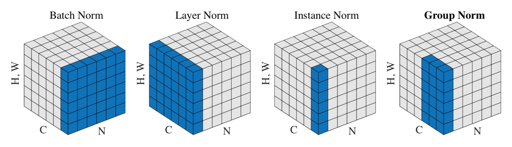

# $\mathrm{Normalization}$

## $\mathrm{Batch \ Normalization}$

### 背景介绍

#### $\mathrm{Covariate \ Shift}$

- 网络浅层参数的改变，导致深层的输入分布发生变化，是神经网络训练困难的原因

#### $\mathrm{Whitening}$

- 对输入进行白化（零均值、单位标准差）能够加速网络收敛

- 对于 $\mathrm{Sigmoid}$ 激活函数，可以避免输入层的梯度消失，但深层数据分布依旧不可控

#### $\mathrm{Batch \ Normalization}$

- 核心思想是通过对中间层数据进行归一化和特征恢复，减少浅层网络输出分布变化对深层网络输入的影响，加速训练

### 数学推导

#### 训练过程

- 计算输入 $x$ 的均值 $\mu_{B}$ 与方差 $\sigma_{B}^{2}$：

  $$
  \mu_{B} = \frac{1}{m} \sum_{i = 1}^{m} x_{i} \qquad \sigma_{B}^{2} = \frac{1}{m} \sum_{i = 1}^{m} \left( x_{i} - \mu_{B} \right)^{2}
  $$

- 将输入 $x$ 归一化为零均值、单位方差的 $\hat{x_{i}}$：

  $$
  \hat{x_{i}} = \frac{x_{i} - \mu_{B}}{\sqrt{\sigma_{B}^{2} + \epsilon}}
  $$

- 由于 $\hat{x_{i}}$ 改变了输入的分布，通过两个可学习的参数还原输入分布：

  $$
  y_{i} = \gamma \hat{x_{i}} + \beta
  $$

  - $y_{i}$ 即为 $\mathrm{Batch \ Normalization}$ 后的输出

  - 由于 $\hat{x_{i}}$ 分布固定， $y_{i}$ 的分布不再受浅层网络参数的影响，可以加速训练过程

  - $\hat{x_{i}}$ 被归一化为标准正态分布，直接作为下一层输入会限制网络表达能力；需要通过参数 $\gamma, \ \beta$ 进行恢复，具体恢复程度在训练过程中由神经网络自主决定

#### 测试过程

- 首先计算训练过程中所有 $\mathrm{batch}$ 的均值和方差：

  $$
  \mu = \mathbb{E} \left[\mu_{B} \right] \qquad \sigma^{2} = \frac{m}{m - 1} \mathbb{E} \left[ \sigma_{B}^{2} \right]
  $$

- 此时 $\mathrm{Batch \ Normalization}$ 的输出值为：

  $$
  y = \gamma \left( \frac{x - \mu}{\sqrt{\sigma^{2} + \epsilon}} \right) + \beta = \frac{\gamma}{\sqrt{\sigma^{2} + \epsilon}} \cdot x + \left( \beta - \frac{\gamma \mu}{\sqrt{\sigma^{2} + \epsilon}} \right)
  $$

- 在 $\mathrm{CNN}$ 中，通常为每个特征图设置一个 $\gamma, \ \beta$，以减少参数量

#### 偏置项

- 对于使用 $\mathrm{Batch \ Normalization}$ 的层，无需使用偏置项 $b$：

  - $\mathrm{Batch \ Normalization}$ 层的 $\beta$ 会抵消掉 $b$ 的影响

    $$
    \mathrm{BN} \left( w^{T} x \right) = \mathrm{BN} \left( w^{T} x + b \right)
    $$

#### 激活层

- $\mathrm{Batch \ Normalization}$ 层通常放在激活层之前：

  - 在原始 $\mathrm{ResNet}$ 中，$\mathrm{Batch \ Normalization}$ 放在卷积层之后、激活层之前

  - 在 $\mathrm{pre-activation}$ 结构的 $\mathrm{ResNet}$ 中，顺序是 $\mathrm{Batch \ Normalization}$、激活层、卷积层

### 性能分析

#### 加速训练

- 解决 $\mathrm{Covariate \ Shift}$：

  - 对特征进行归一化，通过两个可学习的参数 $\gamma, \ \beta$ 进行恢复，可以避免参数更新后浅层输出对深层输入的影响

- 直接使用较高的学习率：

  - 如果每一层、每一维的数据范围不同，其需要的学习率也不同，通常使用最小的学习率才能保证损失函数下降

  - $\mathrm{Batch \ Normalization}$ 将每一层、每一维的数据范围保持一致，可以直接使用较高的学习率进行训练

#### 解决梯度问题

- 对于 $x_{l} = w^{T}_{l} x_{l - 1}$，在反向传播时计算如下：

  $$
  \frac{\partial{l}}{\partial{x_{l - 1}}} = \frac{\partial{l}}{\partial{x_{l}}} \cdot \frac{\partial{x_{l}}}{\partial{x_{l - 1}}} = \frac{\partial{l}}{\partial{x_{l}}} w_{l}
  $$

  - 从第 $l$ 层传到第 $k$ 层时计算如下：

    $$
    \frac{\partial{l}}{\partial{x_{k}}} = \frac{\partial{l}}{\partial{x_{l}}} \prod_{i = k + 1}^{l} w_{i}
    $$

  - 如果大部分 $w_{i} > 1$，会导致梯度爆炸

  - 如果大部分 $w_{i} < 1$，会导致梯度消失

- 由 $\mathrm{Batch \ Normalization}$ 过程可得：

  $$
  x_{l} = \mathrm{BN} \left( w^{T}_{l} x_{l - 1} \right) = \mathrm{BN} \left( a w^{T}_{l} x_{l - 1} \right)
  $$

  - 反向传播时求导如下：

    $$
    \frac{\partial{x_{l}}}{\partial{x_{l - 1}}} = \frac{\partial{\mathrm{BN} \left( w^{T}_{l} x_{l - 1} \right)}}{\partial{x_{l - 1}}} = \frac{\partial{\mathrm{BN} \left( \alpha w^{T}_{l} x_{l - 1} \right)}}{\partial{x_{l - 1}}}
    $$

  - 反向传播时的残差与 $w$ 的尺度无关

#### 防止过拟合

- 由 $\mathrm{Batch \ Normalization}$ 过程可知，某个样本的中间层特征不再仅取决于样本本身，也取决于这个样本所属的 $\mathrm{mini-batch}$

- 同一个样本与不同的样本组成 $\mathrm{mini-batch}$ 时，输出也不同，一定程度上可以抑制过拟合

## $\mathrm{Group \ Normalization}$

### 背景介绍

- $\mathrm{Batch \ Normalization}$ 在小 $\mathrm{batch}$ 下性能较差；以检测为例，由于单张图像占用显存过高，每张卡的 $\mathrm{batch}$ 只能设置为 $1$ 或 $2$

  - 此时 $\mathrm{Batch \ Normalization}$ 不够稳定，通常做法是冻结参数，将其作为普通的仿射变换层

  - 但$\mathrm{ImageNet}$ 上预训练的模型，$\mathrm{Batch \ Normalization}$ 的统计参数与检测时的统计量通常不同，可能会影响检测模型的性能

- 为解决问题，需要避免在 $\mathrm{batch}$ 维度对特征图进行归一化处理

- 对于特定层的卷积核，提取的特征并不是孤立的，可能部分是形状特征，部分是纹理特征，部分是亮度特征等；理论上，这些特征可以被分为不同的组

### 计算过程

- $\mathrm{Group \ Normalization}$ 与 $\mathrm{Batch \ Normalization}$、$\mathrm{Layer \ Normalization}$、$\mathrm{Instance \ Normalization}$ 的计算过程基本相同，不同的是计算统计量时使用的特征图不同

- 与 $\mathrm{Batch \ Normalization}$ 相比，$\mathrm{Group \ Normalization}$ 在计算统计量时，不会跨越 $\mathrm{batch}$ 维度

- 与 $\mathrm{Layer \ Normalization}$ 相比，$\mathrm{Group \ Normalization}$ 在计算统计量时，将当前层的特征图分为 $\mathrm{G=32}$ 组，每组分别统计和计算，更加灵活

  - 当 $\mathrm{G=1}$ 时，$\mathrm{Group \ Normalization}$ 退化为 $\mathrm{Layer \ Normalization}$

  - 同层特征图通常包含不同方面的特征，$\mathrm{Layer \ Normalization}$ 对所有特征图进行归一化，反而会降低模型的表达能力

- 与 $\mathrm{Instance \ Normalization}$ 相比，$\mathrm{Group \ Normalization}$ 在计算统计量时，会更充分地考虑通道间关系

  - 当 $\mathrm{G=C}$ 时，$\mathrm{Group \ Normalization}$ 退化为 $\mathrm{Instance \ Normalization}$

- 训练和测试的计算过程相同：使用当前特征图计算相关统计量

### 性能分析

- 在大多数情况下，可以作为 $\mathrm{Batch \ Normalization}$ 的替代品，在小 $\mathrm{batch}$ 下优势更明显