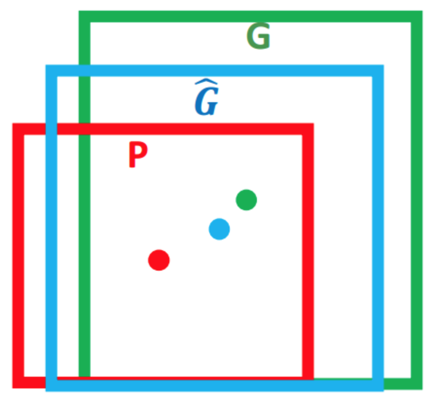

# R-CNN

## 思想

- 将 CNN 引入目标检测领域

- 采用 Selective Search 减少搜索与计算

- 算法流程：

	- 选出一部分可能是目标物体的区域（ROI）
	
	- 对 CNN 进行 fine tuning 并训练二分类 SVM

	- 对 ROI 区域进行特征提取和分类

	- 得到各个目标物体的位置和类别

	- 对目标物体做 Bounding Box 回归，得到最终位置

- ROI 重叠导致 CNN 的重复计算，处理速度较慢：

	- CPU：每张 53 秒

	- GPU：每张 13 秒

## 候选区域选择

### Exhaustive Search

- 采用滑窗的方式，在整张图像上进行滑动，得到所有可能的区域

- 由于采用了穷举策略，时间复杂度较高

### Selective Search

- 对图像进行分割，生成一些小的目标区域

- 计算这些区域与相邻区域的相似度，合并两个最相似的区域

- 重复上一步，直到剩下指定数量的区域（\\(2000\\) 个）

## 特征提取与分类

- 对 Selective Search 的结果进行拉伸或填充，使其满足 CNN 的输入尺寸要求

- 对 AlexNet、VGG 进行 fine-tuning，修改最后的全连接层，对候选区域训练 \\(N+1\\) 类（前景、背景）分类器

- 用 CNN 提取候选区域的 4096 维特征，通过二分类 SVM，判断该特征是否属于某个类别

	- 由于在训练 CNN 时，为防止过拟合进行数据增强时，对正样本定义比较宽松

	- 如果直接对提取的特征进行 Softmax，分类效果不好

### CNN fine-tuning

- 不进行 fine-tuning 时，使用 fc6 层特征效果较好

- 进行 fine-tuning 时，fc6 和 fc7 层特征的结果差距不大

- 相对于背景类，前景类样本数量较少；为平衡正负样本比例，需要放宽正样本的限制

	- 计算每个 Region Proposal 与 Ground Truth 的 \\(IoU\\)
	
	- 将 \\(IoU \geq 0.5\\) 的 Region Proposal 视为正样本

	- 将 \\(IoU < 0.5\\) 的 Region Proposal 视为负样本

- 相对于背景框，前景目标较少；训练时每个 batch 内包含 32 个正样本，96 个负样本

### SVM 预训练

- 计算每个 Region Proposal 与 Ground Truth 的 \\(IoU\\)

- 正负样本的 \\(IoU\\) 阈值设置太高或太低都会影响最终的分类准确性：

	- 只把 Ground Truth 视为正样本

	- 将 \\(IoU < 0.3\\) 的 Region Proposal 视为负样本（阈值通过实验确定）

	- 对于其他候选区域，不作为 SVM 训练的样本

## 非极大值抑制

- Selective Search 的结果可能互相重叠，需要从中选出得分最高的几个独立区域

- 因此对于每一类，按得分从高到低进行排序：

	- 只有当前区域与之前已选区域的重叠率不超过某个阈值，才保留该区域

## Bounding Box 回归

### 目的

- 红色框 \\(P\\) 是 Region Proposal，绿色框 \\(G\\) 是 Bounding Box；由于偏差较大导致重叠率较小，相当于检测失败

- 可以对 Region Proposal 进行微调得到蓝色框 \\(\hat{G\_{}}\\)，使其更接近 Bounding Box，以提高检测精度

- 每个框都可以用 \\((x, \ y, \ w, \ h)\\) 表示，其中 \\(x, \ y\\) 是中心坐标，\\(w, \ h\\) 是宽和高

- Bounding Box Regression 的目标就是寻找一个映射 \\(f\\)：

	$$ f(P\_{x}, \ P\_{y}, \ P\_{w}, \ P\_{h}) = (\hat{G\_{x}}, \ \hat{G\_{y}}, \ \hat{G\_{w}}, \ \hat{G\_{h}}) $$

	- 使下式成立：

		$$ (\hat{G\_{x}}, \ \hat{G\_{y}}, \ \hat{G\_{w}}, \ \hat{G\_{h}}) \approx (G\_{x}, \ G\_{y}, \ G\_{w}, \ G\_{h}) $$

### 实现

- 为每一类训练一个 Bounding Box 回归器

- 实验结果表明，当 Region Proposal 与 Ground Truth 的 \\(IoU \geq 0.6\\) 时，作为 Bounding Box 的训练样本效果较好

- 需要学习的变换：\\(d\_{x}(P), \ d\_{y}(P), \ d\_{w}(P), \ d\_{h}(P)\\)：

	- \\(d\_{\*}(P)\\) 框内物体特征 \\(\Phi(P)\\) 的某个函数：

		$$ d\_{\*}(P) = w\_{\*}^{T} \cdot \Phi(P) $$

#### 平移

$$ \hat{G\_{x}} = P\_{w} d\_{x}(P) + P\_{x} $$
	
$$ \hat{G\_{y}} = P\_{h} d\_{y}(P) + P\_{y} $$

- 引入 \\(P\_{w}, \ P\_{h}\\) 是为了解决特征的尺度变换问题：

	- 如果图像中有不同尺度的同一物体 \\(A, \ B\\)，一个完好的特征应该满足 \\(d\_{\*}(A) = d\_{\*}(B)\\)，但是大尺度 Region Proposal 平移量应该更大

#### 缩放

$$ \hat{G\_{w}} = P\_{w} \exp(d\_{w}(P)) $$

$$ \hat{G\_{h}} = P\_{h} \exp(d\_{h}(P)) $$

- 对缩放比 \\(d\_{\*} = \frac{\hat{G\_{\*}}}{P\_{\*}}\\) 做对数变换，可能是由数据本身性质决定：

	- 大部分缩放比接近 \\(1\\)，少量缩放比小于 \\(1\\)，还有极少量缩放比远大于 \\(1\\)

	- 采用对数变换，可以将上述长尾分布近似转换为正态分布

#### 回归

- 根据上述公式，Region Proposal 与 Bounding Box 平移量、缩放尺度计算如下：

	- 平移因子：

		$$ t\_{x} = \frac{G\_{x} - P\_{x}}{P\_{w}} $$

		$$ t\_{y} = \frac{G\_{y} - P\_{y}}{P\_{h}} $$

	- 缩放因子：

		$$ t\_{w} = \log \left( \frac{G\_{w}}{P\_{w}} \right) $$
		
		$$ t\_{h} = \log \left( \frac{G\_{h}}{P\_{h}} \right) $$

	- 由 \\(\hat{G\_{}} \approx G\\) 可得：

		$$ t\_{\*} \approx d\_{\*}(P) $$

- 由于目标特征由同一个 CNN 提取，对 \\(t\_{\*}\\) 的学习本质上是对 \\(w\_{\*}\\) 的学习，正则化的损失函数如下：

	$$ Loss = \sum\_{i=1}^{N} \left( t\_{\*}^{(i)} - w\_{\*}^{T} \cdot \Phi(P^{i}) \right)^{2} + \lambda ||w\_{\*}||^{2} $$

	- 通过梯度下降或最小二乘即可求出 \\(w\_{\*}\\) 的最优解