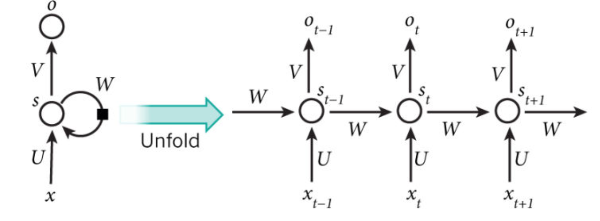

# $\mathrm{Recurrent \ Neural \ Networks}$

## 背景介绍

- 在自然语言处理中，序列的当前输出与之前的输出有关：

  - 即 $\mathrm{RNN}$ 记忆到了目前为止已经计算过的信息

## 数学原理

- $x_{t}$ 是 $t$ 时刻的输入：

  - 比如某个词的 $\mathrm{one-hot}$ 编码向量

- $s_{t}$ 是 $t$ 时刻的隐状态，通过当前时刻的输入和前一时刻的隐状态得到：

  $$
  s_{t} = f \left( Ux_{t} + Ws_{t - 1} \right)
  $$

  - 其中 $f$ 为激活函数：$\mathrm{ReLU}$ 或 $\mathrm{Tanh}$

  - $s_{t}$ 可以捕获到之前所有时刻产生的信息

- $o_{t}$ 是 $t$ 时刻的输出：

  - 如果要预测句子的下一个词，那么 $o_{t}$ 就是包含所有词的概率向量：

    $$
    o_{t} = \mathrm{softmax} \left( Vs_{t} \right)
    $$

  - $o_{t}$ 只依赖于 $t$ 时刻的隐状态

- $\mathrm{RNN}$ 中所有时刻共享相同的参数 $U, \ V, \ W$，减少了需要学习的参数量