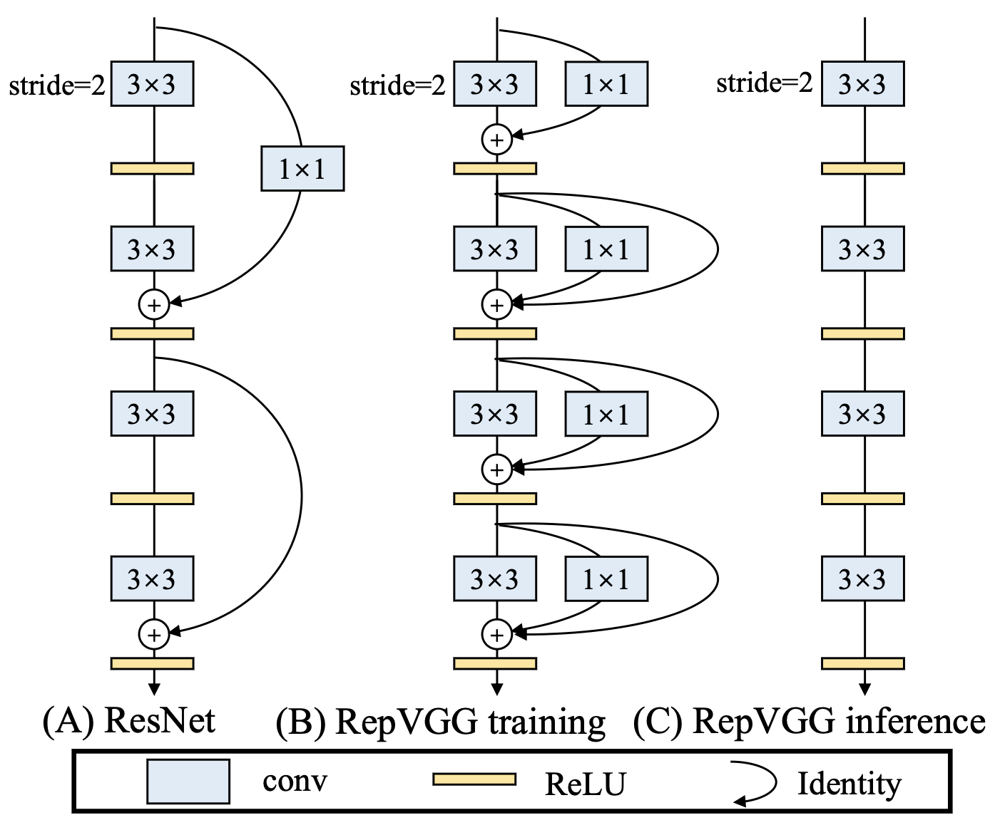

# $\mathrm{RepVGG}$

## 背景

### $\mathrm{VGG}$

- $\mathrm{VGG}$ 式的网络具有以下优点：

  - $\mathrm{3 \times 3}$ 卷积在 $\mathrm{GPU}$ 上非常快

  - 单路结构推理速度更快，因为并行度高

  - 单路结构推理时更省显存，因为不用像 $\mathrm{ResNet}$ 一样保留残差前的特征图

  - 单路结构灵活性更高，相对容易改变各层通道数（比如剪枝操作）

- 但 $\mathrm{VGG}$ 在 $\mathrm{ImageNet}$ 上的准确率略微超过 $70\%$，性能较差

### $\mathrm{ResNet}$

- $\mathrm{ResNet}$ 的多分支结构在推理时会有速度、显存问题，但却更容易训练时得到较高精度

## 思想

- 同时利用 $\mathrm{ResNet}$ 和 $\mathrm{VGG}$ 优点

  - 训练时使用类 $\mathrm{ResNet}$ 的多分支结构，以提高精度

  - 推理时等效转为类 $\mathrm{VGG}$ 的单路结构，以提高速度、优化显存

### 结构重参数化

- 训练时，同时使用 $\mathrm{3 \times 3}$ 卷积、$\mathrm{1 \times 1}$ 卷积、$\mathrm{shortcut}$ 连接

  - 先对三部分相加，再经过 $\mathrm{ReLU}$ 非线性激活层

- 测试时，通过结构重参数化，对基本 $\mathrm{block}$ 进行等效变换，得到单路结构：

  - 将 $\mathrm{shortcut}$ 连接转为权重为 $1$ 的 $\mathrm{1 \times 1}$ 卷积

  - 将两个 $\mathrm{1 \times 1}$ 卷积转换为 $\mathrm{3 \times 3}$ 卷积

    - $\mathrm{3 \times 3}$ 卷积核中心为 $\mathrm{1 \times 1}$ 卷积权重，其余位置为 $0$

  - 将各个 $\mathrm{BatchNorm}$ 层合并到相应的卷积层中

  - 基于 $\mathrm{Eltwise-Add}$ 操作，将三个 $\mathrm{3 \times 3}$ 卷积合并为一个$\mathrm{3 \times 3}$ 卷积

## 优缺点

- 速度快，精度超过 $\mathrm{ResNet}$ 系列

- 针对 $\mathrm{GPU}$ 等专用并行硬件设计，在低算力设备上可能不如 $\mathrm{MobileNet}$、$\mathrm{ShuffleNet}$ 系列