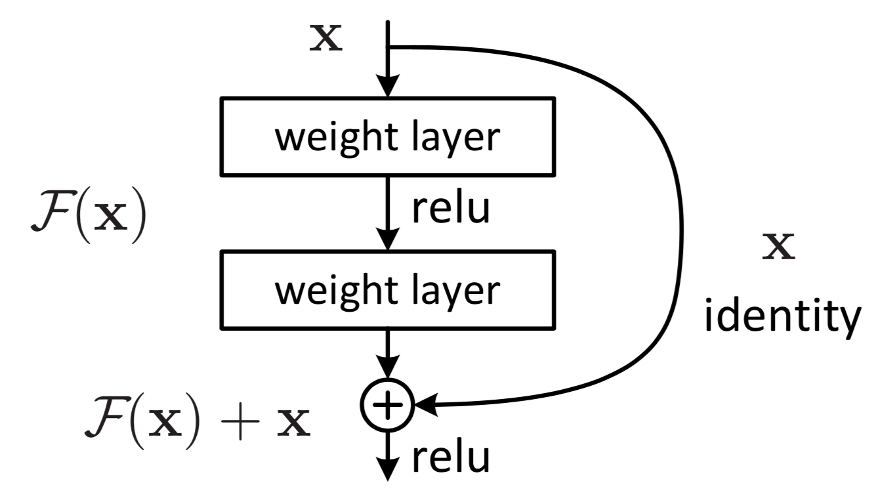
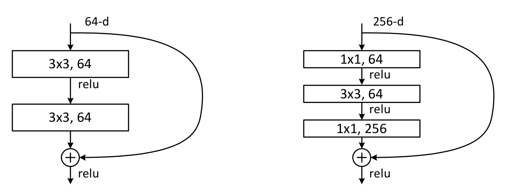
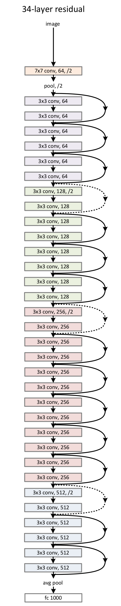

# ResNet

## 基本思想

### 网络退化

- 浅网络的解空间是深网络的子集：

	- 对于结构相似的两个网络，如果将浅网络的参数复制到深网络，将深网络的其他层限制为恒等映射，那么深网络的性能不会比前网络差

	- 实验结果却表明发生了网络退化，即深网络的性能比浅网络更差

	- 深网络在训练集上的错误率更高，说明网络退化不是过拟合的原因，而是训练优化过程出了问题

### 残差块

- 整个网络由多个残差块组成，残差块内的特征图维度相同，基本的残差块结构如下：

	

- 实验表明，当恒等映射只跨越一层时效果较差，通常最少跨越两层

- 当 \\(x\\) 与 \\(F(x)\\) 维度相同时，直接按通道相加即可

- 当 \\(x\\) 与 \\(F(x)\\) 维度不同时，将 \\(W\_{s}x\\) 与 \\(F(x)\\) 按通道相加，其中 \\(W\_{s}\\) 是投影矩阵

#### 去除池化层

- 在残差块之间，用步长为 \\(2\\) 的 \\(1 \times 1\\) 卷积代替池化实现下采样

- 除第一组残差块外，每组第一个残差块的第一层都进行上述下采样

	- 第一个残差块的 shortcut 分支使用 \\(stride = 2\\) 的 \\(1 \times 1\\) 卷积实现 pooling

	- 对于其他残差块，shortcut 分支和卷积分支直接相加

#### 加速计算

- 当网络较浅时，采用下图左侧的残差块

- 当网络较深时，由于计算量较大，采用下图右侧的残差块加速计算：

	- 先进行 \\(1 \times 1\\) 卷积减少特征图通道数

	- 再进行 \\(3 \times 3\\) 卷积

	- 最后进行 \\(1 \times 1\\) 卷积恢复特征图通道数

	

### 恒等映射

#### 数学推导

- 把网络中的连续几层看作一个整体，假设输入为 \\(x\\)，真实映射关系为 \\(G(x)\\)，网络学习到的映射关系为 \\(F(x)\\)

	- 对于普通网络，优化目标是 \\(F(x) \approx G(x)\\)

	- 对于 ResNet，恒等映射不用学习，另一支的优化目标是 \\(F(x) \approx G(x) - x\\)

- 相对于浅网络，深网络的某些层应该逼近恒等映射，即 \\(G(x) \approx x\\)

	- 普通网络的优化目标是 \\(F(x) \approx x\\)

	- ResNet 的优化目标是 \\(F(x) \approx 0\\)

- 相比于普通网络，ResNet 更容易优化：

	- 恒等映射的卷积核为 \\(\left[\begin{matrix} 0 & 0 & 0 \\\\ 0 & 1 & 0 \\\\ 0 & 0 & 0\end{matrix}\right]\\)，零映射的卷积核为 \\(\left[\begin{matrix} 0 & 0 & 0 \\\\ 0 & 0 & 0 \\\\ 0 & 0 & 0\end{matrix}\right]\\)

	- 由于神经网络权重初始化时，多为均值为 \\(0\\) 的某种分布，学习零映射的卷积核比恒等映射的卷积核更容易

	- 另一方面，由于 ResNet 的 \\(x\\) 分支是恒等映射，\\(F(x)\\) 分支的初始权重集中在 \\(0\\) 附近，\\(F(x) + x\\) 相当于在 \\(x\\) 基础上学习恒等映射；相比于普通网络从零学习，ResNet 训练更容易学到恒等映射

- 如果不考虑 ReLU 的作用，ResNet 在正向计算时可以将信息直接从浅层传到深层，反向传播时可以将深层 loss 直接从深层传到浅层，减缓梯度问题

	- 残差网络的一般形式如下：

		$$ y\_{l} = H(x\_{l}) + F(x\_{l}, w\_{l}) $$

		$$ x\_{l+1} = \sigma(y\_{l}) $$

		- 其中 \\(x\_{l}\\) 是第 \\(l\\) 层输入，\\(H(x\_{l})\\) 表示 shortcut 分支，\\(F(x\_{l}, w\_{l})\\) 表示另一支，\\(\sigma\\) 是 ReLU 激活函数

	- 当 shortcut 是恒等映射，且不考虑 ReLU 的作用时：

		$$ x\_{l+1} = x\_{l} + F(x\_{l}, w\_{l}) $$

		- 当跨越多层时，递归计算如下：

			$$ x\_{L} = x\_{l} + \sum\_{i=1}^{L-1} F(x\_{i}, w\_{i}) $$

			- 因此，深层网络的输入与浅层网络的叠加有关

			- 相比于普通网络的叠乘 \\(x\_{L} = \sum\_{i=0}^{L-1} w\_{i} x\_{0}\\)，正向计算时，浅层信息可以不经变换直接传递到深层

		- 在反向传播时，误差计算如下：

			$$ \frac{\partial{J}}{\partial{x\_{l}}} = \frac{\partial{J}}{\partial{x\_{L}}} \cdot \frac{\partial{x\_{L}}}{\partial{x\_{l}}} = \frac{\partial{J}}{\partial{x\_{L}}} \cdot \left( 1 + \frac{\partial}{\partial{x\_{l}}} \sum\_{i=1}^{L-1} F(x\_{i}, w\_{i}) \right) $$

			- 由于最后一项不可能总为 \\(-1\\)，深层梯度可以很好的传递到浅层

	- 如果 shortcut 不是恒等映射，即 \\(H(x) = \lambda x\\) 时，由于 \\(\lambda\_{i}\\) 的叠乘，正向计算和反向传播的过程中容易发生梯度问题

#### Pre-Activation

- 经典残差块结构为 \\(Conv \rightarrow BN \rightarrow ReLU\\)，当使用 \\(BN \rightarrow ReLU \rightarrow Conv\\) 结构时，可进一步降低误差

	- 网络的两支相加后，不再经过激活函数，shortcut 分支成为真正的恒等映射

	- Batch Normalization 层前置，正则化效果更加明显

		- 原始 ResNet 中，卷积分支经过 Batch Normalization 后再与 shortcut 分支相加，会削弱 Batch Normalization 的作用

## 主要改进

- 使用残差块可以有效地训练 \\(1000\\) 层以上的网络

- 随着网络层数的加深，网络性能也变得更好

- 第一层使用普通卷积，第二层开始使用残差块

## 网络结构

- 第一层是步长为 \\(2\\) 的 \\(7 \times 7\\) 卷积

- 第二层是步长为 \\(2\\) 的 \\(3 \times 3\\) max-pooling

- 最后一层步长为 \\(1\\) 的 \\(7 \times 7\\) 的 average-pooling

- 其余层分为 \\(4\\) 组残差块，每组包含若干个残差块

