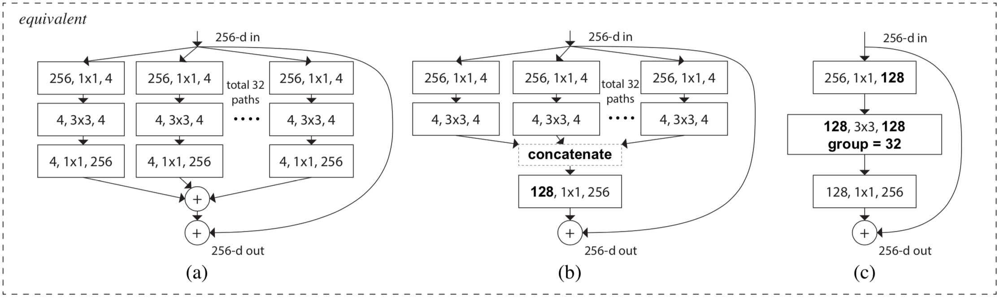

# ResNet Variants

## ResNet with Stochastic Depth

### 背景

- 深网络的表达能力更强，但是存在以下问题：

	- 反向传播时，容易发生梯度消失

	- 前向计算时，由于卷积和叠乘，深层网络无法有效利用浅层信息

	- 计算资源大、训练时间长

### 思想

- 创建深网络，训练时随机跳过部分残差块，测试时使用完整的网络

	- 训练时，按概率 \\(P\_{l}\\) 保留第 \\(l\\) 个残差块的卷积分支

		- 当跳过第 \\(l\\) 个残差块的卷积分支时，由于恒等映射无需前向计算和反向传播，相当于跳过整个残差块

			- 由于进入残差块前经过 ReLU 函数，该残差块的输入均为正数；再次经过残差块后的 ReLU 函数时，结果不变

		- 由于深层网络要用到浅层特征，一般浅层残差块的保留率较高，深层残差块的保留率较低

		- 实际训练中，保留率按深度递减时效果较好：

			$$ P\_{0} = 1 \quad P\_{L} = 0.5 \quad P\_{l} = 1 - \frac{l}{L} (1 - P\_{L}) $$
			
			- 其中 \\(P\_{0}\\) 表示输入层，\\(P\_{1}\\) 表示第一个残差块，\\(P\_{L}\\) 表示最后一个残差块

			- 在该组超参数下，训练时的网络平均深度为 \\(\frac{3L}{4}\\)
	
	- 测试时，使用完整的网络

		- 为了训练与测试的一致性，需要将残差块的卷积分支输出缩放到原来的 \\(P\_{l}\\)

- 每个 batch 经过的网络结构不同，相当于不同模型的集成学习，进一步降低错误率

- 网络深度的减少，更利于前向计算时的浅层特征利用，以及反向传播时的梯度流动

### 结果

- 原始 ResNet 在深度达到 1000 时出现网络退化，而随机深度的 ResNet 不存在该问题

- 相比原始 ResNet，训练时间减少 \\(25\%\\)

## Wide ResNet

### 思想

- 对原始 ResNet 进行改进：减小深度，增加宽度

	- 使用只有几十层的浅网络

	- 增加卷积层提取的特征数

- 使用 Pre-Activation 的残差块结构，同一块内的卷积层之间使用 Dropout：

	$$ BN \rightarrow ReLU \rightarrow Conv \rightarrow Dropout \rightarrow BN \rightarrow ReLU \rightarrow Conv $$

### 结果

- 证明了 ResNet 中发挥主要作用的残差块，而不是网络深度

- 参数量相同时，宽网络能充分利用 GPU 并行性，训练速度比原始 ResNet 快

- 参数量相同时，随着宽度增加，残差块提取的特征越来越强，分类错误率越来越低

## ResNeXt

### 背景

- 传统的模型要提高准确率，都是加深或加宽。但随着通道数、卷积核大小等超参数的增加，网络的设计难度和计算开销也会增加

- ResNeXt 的结构可以在同等参数量下提高准确度，同时也减少了超参数的数量

	- 残差块的子模块结构相同，减少了设计难度和超参数量

### 思想

- 同时采用 VGG 堆叠网络思想和 Inception “拆分-变换-合并”思想，构建如下残差块：

	

	- 图（a）是基本的 ResNeXt 结构

		- 分别对输入的 \\(256\\) 个特征图进行 \\(1 \times 1\\) 卷积，得到 \\(32\\) 组特征图，每组 \\(4\\) 个

		- 对每一组特征图，进行 \\(3 \times 3\\) 卷积

		- 对每一组特征图，进行 \\(1 \times 1\\) 卷积，得到 \\(256\\) 个特征图

		- 不同组的特征图按通道相加后，再与 shortcut 分支相加

	- 图（b）是 图（a）的等价形式

		- 每组特征图先做卷积再相加，相当于先拼接特征图再统一做卷积

	- 图（c）是图（b）的等价形式

		- 对所有输入通道分别做卷积再拼接，相当于对输入通道做分组卷积

	- 由于图（c）实现方便，在工程中采用图（c）的形式

		- 对输入的 \\(256\\) 个特征图进行 \\(1 \times 1\\) 卷积，得到 \\(128\\) 个特征图

		- 进行 \\(group = 32\\) 的 \\(3 \times 3\\) 分组卷积，得到 \\(128\\) 个特征图

		- 对 \\(128\\) 个特征图进行 \\(1 \times 1\\) 卷积，得到 \\(256\\) 个特征图

		- 与 shotcut 分支相加后作为整个残差块的输出

- 整个网络设计原则如下：

	- 残差块的输出特征图维度相同时，使用相同的超参数（通道数、卷积核大小等）

	- 特征图维度减半时，通道数翻倍，以保证所有残差块具有相似的计算复杂度

- 残差块的分组数又称为 Cardinality

### 结果

- 参数量相同时，ResNeXt 比 ResNet 结果更好

	- ResNeXt-50 可以达到 ResNet-101 的效果，但参数量更少

- 增加 Cardinality 比增加模型的深度或宽度效果更好

- ResNeXt 网络结构更简单，仅需要少量的超参数来描述