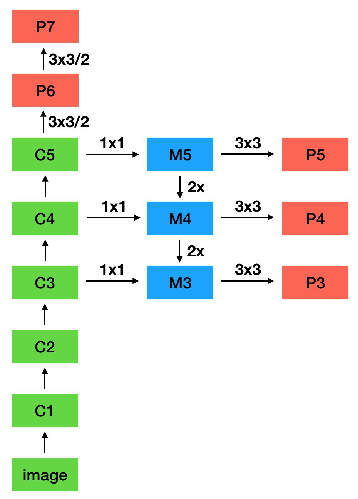
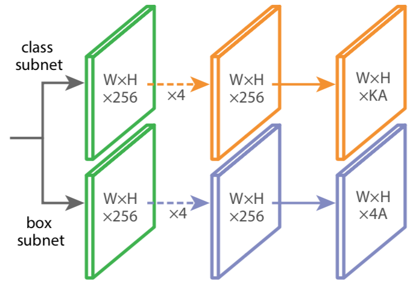

# $\mathrm{RetinaNet}$

## 思想

- 使用 $\mathrm{Focal \ Loss}$ 处理类别不平衡，同时替换 $\mathrm{OHEM}$（$\mathrm{Online \ Hard \ Example \ Mining}$），使 $\mathrm{one-stage}$ 的检测效果达到甚至超过 $\mathrm{two-stage}$

- 采用 $\mathrm{FPN}$ 的思想，同时利用浅层的高分辨率和深层的强语义，通过融合不同层的特征进行预测

## 网络结构

### $\mathrm{Focal \ Loss}$

- 以二分类为例，假设 $p$ 是类别为 $1$ 的概率，定义 $p_{t}$ 如下：

  $$
  p_{t} = \left\{ \begin{matrix} p && y = 1 \\ 1 - p && y = 0 \end{matrix} \right.
  $$

- 交叉熵计算如下：

  $$
  \mathrm{CE} \left( p, \ y \right) = \mathrm{CE} \left( p_{t} \right) = -\log p_{t}
  $$

- 可能需要做如下类别平衡：

  $$
  \mathrm{CE} \left( p_{t} \right) = -\alpha_{t} \log p_{t}
  $$

  - 其中 $\alpha_{t}$ 可以设置为正样本数的逆频率，也可以直接设置为超参数

- 上述方法可以处理类别不平衡，但无法区分容易分类和难以分类的样本

  - 训练时，应该更关注容易分错的样本；当 $p_{t} \rightarrow 1$ 时，尽管单个样本的 $\mathrm{loss}$ 很小，但大量样本累加后的 $\mathrm{loss}$ 较大，影响参数更新

- 为处理类别平衡，需要使用 $\mathrm{Focal \ Loss}$：

  $$
  \mathrm{FL} \left( p_{t} \right) = -\alpha_{t} \left( 1 - p_{t} \right)^{\gamma} \log p_{t}
  $$

  - $\alpha_{t}$ 用于处理类别不平衡

  - $\left( 1 - p_{t} \right)^{\gamma}$ 用于降低易分类样本的 $\mathrm{loss}$ 值

    - 当 $p_{t} \rightarrow 0$ 时，$\mathrm{focal \ loss}$ 近似交叉熵

    - 当 $p_{t} \rightarrow 1$ 时，$\mathrm{focal \ loss}$ 接近 0

### $\mathrm{FPN}$

- 采用 $\mathrm{FPN}$ 的思想，进行不同层之间的特征融合，利用浅层的高分辨率和深层的强语义

- 由于采用 $\mathrm{one-stage}$ 思想，为减少计算量，不使用 $C_{2}$ 特征

- 对 $C_{5}$ 进行 $\mathrm{stride} = 2$ 的 $3 \times 3$ 卷积，得到 $P_{6}$

- 对 $P_{6}$ 进行 $\mathrm{stride} = 2$ 的 $3 \times 3$ 卷积，得到 $P_{7}$

- $P_{3} - P_{7}$ 各接两个子网络用于最终预测：

  - 分类网络包含 $4$ 层 $256$ 通道的 $3 \times 3$ 卷积和 $1$ 层 $KA$ 通道的 $3 \times 3$ 卷积，用于 $\mathrm{sigmoid}$ 分类

  - $\mathrm{BBox}$ 网络包含 $4$ 层 $256$ 通道的 $3 \times 3$ 卷积和 $1$ 层 $4A$ 通道的 $3 \times 3$ 卷积，用于 $\mathrm{sigmoid}$ 分类

  - $K$ 是类别数，$A$ 是每个位置的 $\mathrm{anchor}$ 种类，分类网络和 $\mathrm{BBox}$ 网络不共享参数

  - $P_{3} - P_{7}$ 通道数均为 $256$，子网络的相同层之间共享参数

