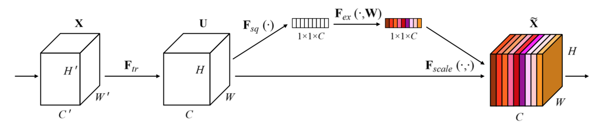
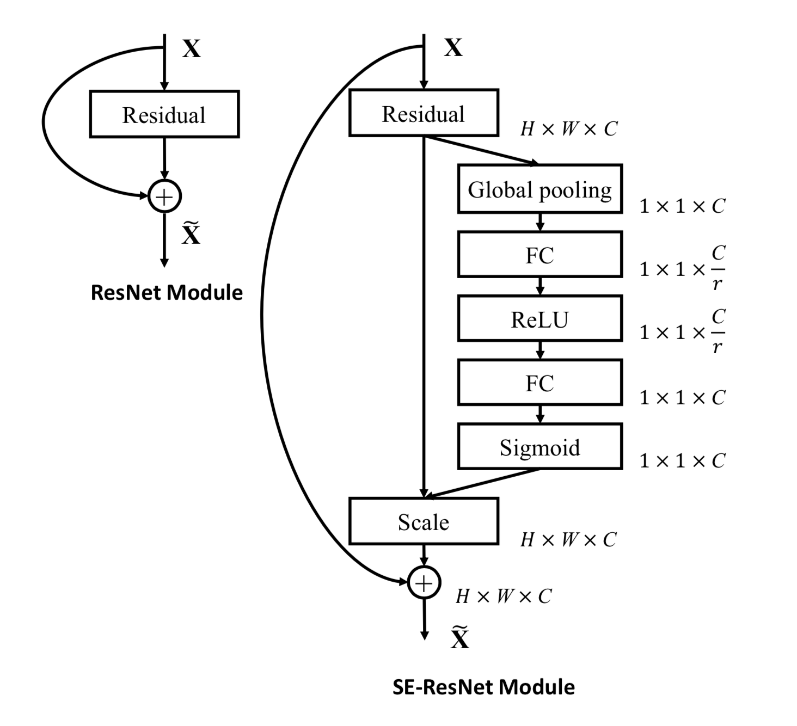

# $\mathrm{SENet}$

## 基本思想

### $\mathrm{Squeeze-and-Excitation}$

- 进行普通卷积时，实际上是对空间信息和通道间信息进行聚合

  - $\mathrm{Inception}$ 结构对多种感受野上的特征进行聚合，从空间维度提升网络性能

  - $\mathrm{SENet}$ 可以学习每个通道特征的重要程度，从通道维度提升网络性能

- 普通卷积也可以学习不同通道的重要程度，但是受到了空间维度的干扰；为了去除空间上的干扰，需要先将特征压缩成一个点再进行学习

#### $\mathrm{Squeeze}$

- 通过 $\mathrm{global \ average \ pooling}$ 去除空间维度的干扰：

  $$
  z_{c} = F_{\mathrm{sq}} \left( u_{c} \right) = \frac{1}{H \times W} \sum_{i = 1}^{H} \sum_{j = 1}^{W} u_{c} \left( i, \ j \right)
  $$

  - 可以屏蔽掉空间上的分布信息，同时使浅层也可以获得全局感受野，后续 $\mathrm{scale}$ 计算更准确

#### $\mathrm{Excitation}$

- 通过两个全连接层，计算每一个通道的激活值

  $$
  s = F_{\mathrm{ex}} \left( z, \ W \right) = \sigma \left( W_{2} \delta \left( W_{1} z \right) \right)
  $$

  - $\delta$ 表示 $\mathrm{ReLU}$ 函数，$\sigma$ 表示 $\mathrm{Sigmoid}$ 函数

  - 第一个全连接层将通道数降为原来的 $\frac{1}{16}$，并通过 $\mathrm{ReLU}$ 进行激活

  - 第二个全连接层对通道数进行还原，并通过 $\mathrm{Sigmoid}$ 计算每个通道的重要性

- 相对于只使用一个全连接层：

  - 具有更多的非线性，更好的拟合通道间复杂的相关性

  - 极大地减少了参数量和计算量

#### $\mathrm{Scale}$

- 将 $\mathrm{Excitation}$ 后的权重乘到每个通道的特征上

## 网络结构

- $\mathrm{SE}$ 单元与 $\mathrm{ResNet}$ 配合使用时：

  - 恒等映射分支不受影响

  - 对于卷积分支，通过 $\mathrm{SE}$ 单元重新计算其特征

  - 按 $\mathrm{ResNet}$ 方式，将上述两个分支相加