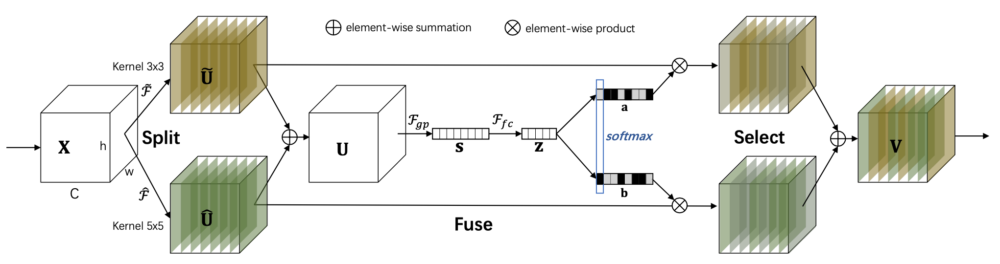

# $\mathrm{SKNet}$

## 基本思想

### $\mathrm{Split-Fuse-Select}$

- 对于正常网络，卷积核的尺寸通常是固定的，因此整个网络的感受野也被固定

- $\mathrm{SKNet}$ 使用不同大小的卷积核进行特征提取，通过 $\mathrm{softmax}$ 对多支特征进行加权融合，从而使每个神经元根据目标物体大小，动态调整感受野大小

#### $\mathrm{Split}$

- 对于输入特征，通过 $3 \times 3$ 和 $5 \times 5$ 卷积分别进行特征提取

  - 为了进一步提高效率， $5 \times 5$ 卷积通常被 $3 \times 3$ 扩展卷积替代

#### $\mathrm{Fuse}$

- 整合多个分支的信息（不同分支编码不同尺度信息）

  - $\mathrm{element-wise}$ 对多个分支结果进行相加

  - $\mathrm{global \ average \ pooling}$ 对 $\mathrm{element-wise}$ 结果进行处理

  - 全连接层对 $\mathrm{global \ average \ pooling}$ 结果进一步编码

#### $\mathrm{Select}$

- 跨通道的 $\mathrm{Softmax \ Attention}$ 自适应地选择不同的尺度空间特征

  - 全连接层对 $\mathrm{Fuse}$ 结果进一步编码（维度与每个分支相同）

  - 通道间的 $\mathrm{Softmax}$ 操作得到每个分支、每个通道的权重

  - 按通道对每个分支特征进行加权求和，得到最终特征图

## 网络结构

- 超参数包括：

  - $\mathrm{Split}$ 操作中分支数 $M$

  - $\mathrm{Fuse}$ 操作中全连接层收缩比例 $r$

  - 控制 $\mathrm{cardinality}$ 的 $G$（基于 $\mathrm{ResNeXt}$）

## 其他结论

- 当目标物体增大时，$\mathrm{SKNet}$ 底层、中间层会给大 $\mathrm{kernel}$ 分配更高权重；但高层不会有该现象，原因可能是高层特征已编码了较多的尺度信息

- 同等计算量、参数量时，$\mathrm{SKNet}$ 比 $\mathrm{ResNeXt}$、$\mathrm{SENet}$ 精度更高