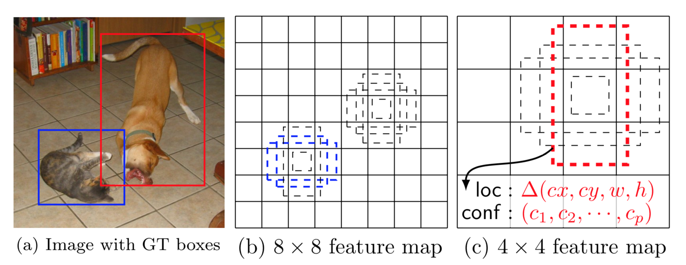

# SSD

## 思想

- 不选择 Region Proposal，直接回归目标的 BBox 变换量和对应分类

- 引入 Faster R-CNN 的 Anchor 思想，在特征图的每个位置上设置 Default Box，每个 Default Box 对应输入图像的一块区域，每块区域有对应的 BBox 变换量、分类结果

- 在多个尺度的特征图上设置 Default Box，以检测不同尺度的目标

- 省略了 Region Proposal 过程，SSD300 速度可以达到 59FPS

## 网络结构

- pool5 层之前使用预训练的 VGG 网络

- fc6，fc7 层使用卷积层代替

- 在 fc7 层之后添加 4 种尺度的卷积层

- 从 fc7 开始，下采样通过 \\(stride = 2\\) 的 \\(3 \times 3\\) 卷积实现

- pool5 层用 \\(stride = 1\\) 的 \\(3 \times 3\\) pooling 代替 VGG 中 \\(stride = 2\\) 的 \\(2 \times 2\\) pooling

	- 大部分设置 Default Box 的特征图在 pool5 之后，特征图太小会影响检测效果；采用 \\(stride = 1\\) 的 pooling 不改变特征图尺度

	- pool5 层特征图维度变大后，感受野相应减小；为了扩大感受野，同时不改变参数量，在 fc6 层使用了带孔卷积（dilation）

- 由于 conv4\_3 具有不同的特征尺度（其他论文指出），通过正则化将特征图的 \\(L2\\) 范数缩放至 20，并在反向传播时学习缩放因子

- 对于尺度为 \\(p \times h \times w\\) 的一组特征图，通过 \\(3 \times 3 \times p\\) 卷积后变为 \\(1 \times h \times w\\)

	- 分别计算 conv4\_3_norm、fc7、conv8\_2、conv9\_2、conv10\_2、conv11\_2 上每个 Default Box 的 Softmax 得分和 BBox 变换量

### Default Box

- 在特征图的每个点上设置多个 Default Box，每个点对应 6 个 Default Box：

	- 假设 Default Box 对应的最小区域为 \\(min\\)，最大区域为 \\(max\\)

	- 每个 Default Box 在原图上的对应区域如下：

		- \\(ratio = 1:1, \quad height = min, \quad width = min\\)

		- \\(ratio = 1:1, \quad height = \sqrt{min \cdot max}, \quad width = \sqrt{min \cdot max}\\)

		- \\(ratio = 1:2, \quad height = \frac{min}{\sqrt{2}}, \quad width = \sqrt{2} min\\)

		- \\(ratio = 2:1, \quad height = \sqrt{2} min, \quad width = \frac{min}{\sqrt{2}}\\)

		- \\(ratio = 1:3, \quad height = \frac{min}{\sqrt{3}}, \quad width = \sqrt{3} min\\)

		- \\(ratio = 3:1, \quad height = \sqrt{3} min, \quad width = \frac{min}{\sqrt{3}}\\)

	- 对于 conv4\_3\_norm 特征图，\\(min = 30\\)，相对原图的 \\(scale = 0.1\\)

	- 对于其他特征图，\\(scale\\) 依次增大：

		$$ s\_{k} = s\_{min} + (k - 1) \frac{s\_{max} - s\_{min}}{m - 1} $$

		- \\(s\_{min} = 0.2\\) 表示 conv8\_2 的 \\(scale\\)

		- \\(s\_{max} = 0.9\\) 表示 conv11\_2 的 \\(scale\\)

		- \\(m = 5\\) 表示从 fc7 开始有 5 种尺度的特征图

- 总共产生 8732 个 Default Box：

	- 对于 conv4\_3\_norm、conv10\_2、conv11\_2，只使用前 4 种 Default Box

		$$ 4 \cdot (38 \cdot 38 + 3 \cdot 3 + 1 \cdot 1) = 5816 $$

	- 对于 fc7、conv8\_2、conv9\_2，使用 6 种 Default Box

		$$ 6 \cdot (19 \cdot 19 + 10 \cdot 10 + 5 \cdot 5) = 2916 $$

## 训练过程

- 正负样本定义如下：

	- 正样本：与 Ground Truth \\(IoU\\) 最大的 Default Box

		- 同时也把任何与 Ground Truth \\(IoU \geq 0.5\\) 的 Default Box 标记为正样本

	- 负样本：其他 Default Box

- 首先图像缩放到 \\(300 \times 300\\) 的分辨率

- 总的 Loss 计算如下：

	$$ L = \frac{1}{N} \left( L\_{softmax} + \alpha \cdot L\_{smooth} \right) $$

	- 其中，\\(N\\) 表示正样本数量；\\(\alpha\\) 是权重系数，进行交叉验证后选择 \\(\alpha = 1\\)

	- 只计算正样本的 BBox Loss

	- 由于正、负样本不平衡，选择得分最高的负样本，使正、负样本大约为 \\(1:3\\)

## 测试过程

- 根据 Default Box 和 BBox 变换量，得到原图上的目标位置

- 按置信度降序排序，进行 NMS 后输出

## 缺点

- 需要手动设置 Default Box 的 min\_size、max\_size 和 aspect\_ratio；不同 feature 使用的 Default Box 大小、形状不一样，调试过程复杂

- 对小目标检测的效果不好

	- 使用 conv4\_3 的特征进行小目标检测，浅层网络可能存在特征提取不充分的情况

	- 深层网络特征提取充分，但特征图维度太小，容易检测不到小目标