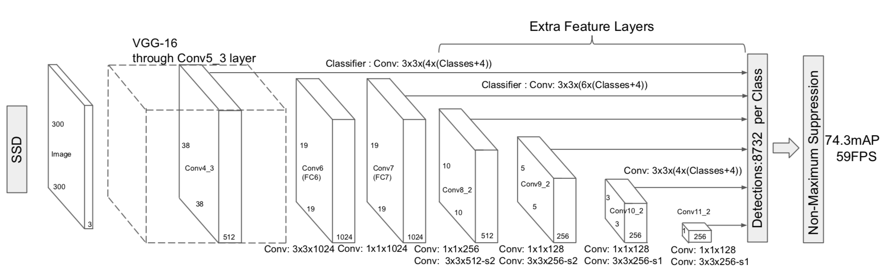

# $\mathrm{SSD}$

## 思想

- 不选择 $\mathrm{Region \ Proposal}$，直接回归目标的 $\mathrm{BBox}$ 变换量和对应分类

- 引入 $\mathrm{Faster \ R-CNN}$ 的 $\mathrm{Anchor}$ 思想，在特征图的每个位置上设置 $\mathrm{Default \ Box}$，每个 $\mathrm{Default \ Box}$ 对应输入图像的一块区域，每块区域有对应的 $\mathrm{BBox}$ 变换量、分类结果

- 在多个尺度的特征图上设置 $\mathrm{Default \ Box}$，以检测不同尺度的目标

- 省略了 $\mathrm{Region \ Proposal}$ 过程，$\mathrm{SSD-300}$ 速度可以达到 $\mathrm{59 \ FPS}$

## 网络结构

- $\mathrm{pool5}$ 层之前使用预训练的 $\mathrm{VGG}$ 网络

- $\mathrm{fc6}$，$\mathrm{fc7}$ 层使用卷积层代替

- 在 $\mathrm{fc7}$ 层之后添加 $4$ 种尺度的卷积层

- 从 $\mathrm{fc7}$ 开始，下采样通过 $\mathrm{stride} = 2$ 的 $3 \times 3$ 卷积实现

- $\mathrm{pool5}$ 层用 $\mathrm{stride} = 1$ 的 $3 \times 3 \ \mathrm{pooling}$ 代替 $\mathrm{VGG}$ 中 $\mathrm{stride} = 2$ 的 $2 \times 2 \ \mathrm{pooling}$

  - 大部分设置 $\mathrm{Default \ Box}$ 的特征图在 $\mathrm{pool5}$ 之后，特征图太小会影响检测效果；采用 $\mathrm{stride} = 1$ 的 $\mathrm{pooling}$ 不改变特征图尺度

  - $\mathrm{pool5}$ 层特征图维度变大后，感受野相应减小；为了扩大感受野，同时不改变参数量，在 $\mathrm{fc6}$ 层使用了带孔卷积（$\mathrm{dilation}$）

- 由于 $\mathrm{conv4\_3}$ 具有不同的特征尺度（其他论文指出），通过正则化将特征图的 $L_{1}$ 范数缩放至 $20$，并在反向传播时学习缩放因子

- 对于尺度为 $p \times h \times w$ 的一组特征图，通过 $3 \times 3 \times p$ 卷积后变为 $1 \times h \times w$

  - 分别计算 $\mathrm{conv4\_3\_norm}$、$\mathrm{fc7}$、$\mathrm{conv8\_2}$、$\mathrm{conv9\_2}$、$\mathrm{conv10\_2}$、$\mathrm{conv11\_2}$ 上每个 $\mathrm{Default \ Box}$ 的 $\mathrm{Softmax}$ 得分和 $\mathrm{BBox}$ 变换量

### $\mathrm{Default \ Box}$

- 在特征图的每个点上设置多个 $\mathrm{Default \ Box}$，每个点对应 $6$ 个 $\mathrm{Default \ Box}$：

  - 假设 $\mathrm{Default \ Box}$ 对应的最小区域为 $\mathrm{min}$，最大区域为 $\mathrm{max}$

  - 每个 $\mathrm{Default \ Box}$ 在原图上的对应区域如下：

    - $\mathrm{ratio} = 1:1, \quad \mathrm{height = min}, \quad \mathrm{width = min}$

    - $\mathrm{ratio} = 1:1, \quad \mathrm{height = \sqrt{min \cdot max}}, \quad \mathrm{width = \sqrt{min \cdot max}}$

    - $\mathrm{ratio} = 1:2, \quad \mathrm{height = \frac{min}{\sqrt{2}}}, \quad \mathrm{width = \sqrt{2} min}$

    - $\mathrm{ratio} = 2:1, \quad \mathrm{height = \sqrt{2} min}, \quad \mathrm{width = \frac{min}{\sqrt{2}}}$

    - $\mathrm{ratio} = 1:3, \quad \mathrm{height = \frac{min}{\sqrt{3}}}, \quad \mathrm{width = \sqrt{3} min}$

    - $\mathrm{ratio} = 3:1, \quad \mathrm{height = \sqrt{3} min}, \quad \mathrm{width = \frac{min}{\sqrt{3}}}$

  - 对于 $\mathrm{conv4\_3\_norm}$ 特征图，$\mathrm{min} = 30$，相对原图的 $\mathrm{scale} = 0.1$

  - 对于其他特征图，$\mathrm{scale}$ 依次增大：

    $$
    s_{k} = s_{\mathrm{min}} + \left( k - 1 \right) \frac{s_{\mathrm{max}} - s_{\mathrm{min}}}{m - 1}
    $$

    - $s_{\mathrm{min}} = 0.2$ 表示 $\mathrm{conv8\_2}$ 的 $\mathrm{scale}$

    - $s_{\mathrm{max}} = 0.9$ 表示 $\mathrm{conv11\_2}$ 的 $\mathrm{scale}$

    - $m = 5$ 表示从 $\mathrm{fc7}$ 开始有 $5$ 种尺度的特征图

- 总共产生 $8732$ 个 $\mathrm{Default \ Box}$：

  - 对于 $\mathrm{conv4\_3\_norm}$、$\mathrm{conv10\_2}$、$\mathrm{conv11\_2}$，只使用前 $4$ 种 $\mathrm{Default \ Box}$

    $$
    4 \cdot \left( 38 \cdot 38 + 3 \cdot 3 + 1 \cdot 1 \right) = 5816
    $$

  - 对于 $\mathrm{fc7}$、$\mathrm{conv8\_2}$、$\mathrm{conv9\_2}$，使用 $6$ 种 $\mathrm{Default \ Box}$

    $$
    6 \cdot \left( 19 \cdot 19 + 10 \cdot 10 + 5 \cdot 5 \right) = 2916
    $$

## 训练过程

- 正负样本定义如下：

  - 正样本：与 $\mathrm{Ground \ Truth \ IoU}$ 最大的 $\mathrm{Default \ Box}$

    - 同时也把任何与 $\mathrm{Ground \ Truth \ IoU \geq 0.5}$ 的 $\mathrm{Default \ Box}$ 标记为正样本

  - 负样本：其他 $\mathrm{Default \ Box}$

- 首先图像缩放到 $300 \times 300$ 的分辨率

- 总的 $\mathrm{Loss}$ 计算如下：

  $$
  L = \frac{1}{N} \left( L_{\mathrm{softmax}} + \alpha \cdot L_{\mathrm{smooth}} \right)
  $$

  - 其中，$N$ 表示正样本数量；$\alpha$ 是权重系数，进行交叉验证后选择 $\alpha = 1$

  - 只计算正样本的 $\mathrm{BBox \ Loss}$

  - 由于正、负样本不平衡，选择得分最高的负样本，使正、负样本大约为 $1:3$

## 测试过程

- 根据 $\mathrm{Default \ Box}$ 和 $\mathrm{BBox}$ 变换量，得到原图上的目标位置

- 按置信度降序排序，进行 $\mathrm{NMS}$ 后输出

## 缺点

- 需要手动设置 $\mathrm{Default \ Box}$ 的 $\mathrm{min\_size}$、$\mathrm{max\_size}$ 和 $\mathrm{aspect\_ratio}$；不同 $\mathrm{feature}$ 使用的 $\mathrm{Default \ Box}$ 大小、形状不一样，调试过程复杂

- 对小目标检测的效果不好

  - 使用 $\mathrm{conv4\_3}$ 的特征进行小目标检测，浅层网络可能存在特征提取不充分的情况

  - 深层网络特征提取充分，但特征图维度太小，容易检测不到小目标