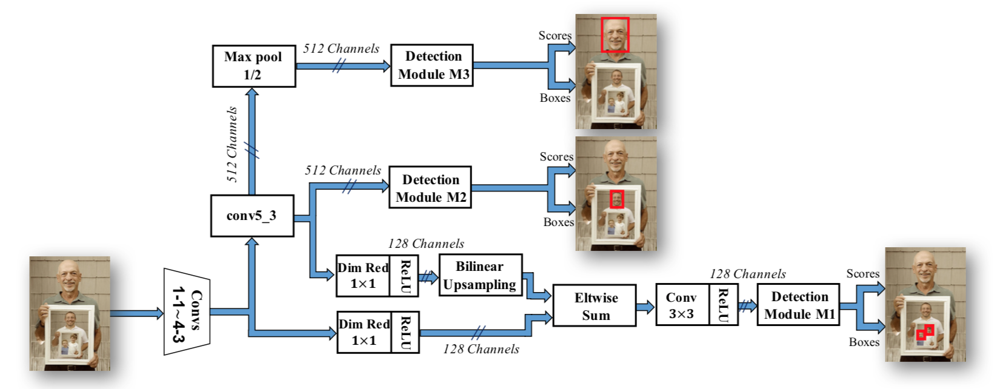
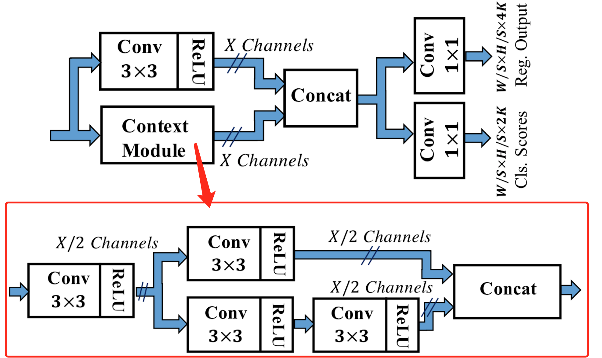

# $\mathrm{SSH}$

## 思想

- 不选择 $\mathrm{Region \ Proposal}$，直接回归目标的 $\mathrm{BBox}$ 变换量和对应分类

- 类似 [$\mathrm{SSD}$](SSD.md)

  - 基于 $\mathrm{VGG16}$，但不使用参数量较大的全连接层

  - 在多个尺度的特征图上设置 $\mathrm{Anchor}$，以检测不同尺度的目标

## 网络结构

- 在 $\mathrm{M1}$ 中使用简单的特征融合

### $\mathrm{SSH \ Module}$

- 同时使用 $3 \times 3, \ 5 \times 5, 7 \times 7$ 卷积，以增大感受野范围

  - 其中，$5 \times 5, \ 7 \times 7$ 卷积通过多层 $3 \times 3$ 卷积叠加实现，以节省计算量

## 训练过程

### $\mathrm{anchor}$ 分配

- 不同尺寸的 $\mathrm{anchor}$ 分配给不同的检测模块

### $\mathrm{OHEM}$

- 对每个检测模块单独使用 $\mathrm{OHEM}$

- 较高得分负样本和较低得分正样本组成 $\mathrm{mini-batch}$，再次送进网络训练，同时保持正负样本比例为 $1:3$