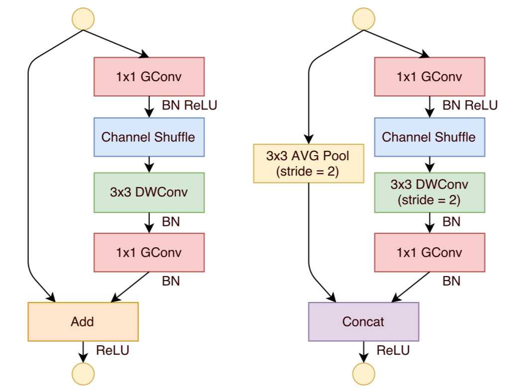
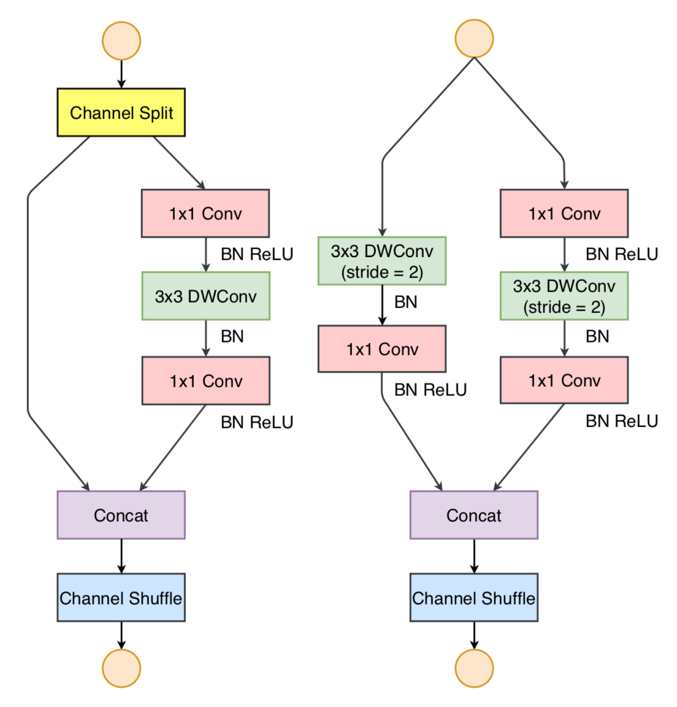

# ShuffleNet

## ShuffleNet v1

- 实际运行速度比 AlexNet 快 13 倍，精度与 VGG 持平

### 设计思想

- 通过分组 pointwise 卷积减少普通 pointwise 卷积的计算量

- 通过 channel shuffle，加强不同组之间的信息交流，提升模型的表示能力

### ShuffleNet 单元

- 采用 ResNet 的 bottleneck 思想

	- 将输入通道分为 \\(g\\) 组，每组 \\(n\\) 个通道

	- 在每一组内进行 pointwise 卷积，减少特征图通道数

	- 通过 channel shuffle 加强组间信息交流：

		- 将特征图通道 reshape 成新维度 \\((g, n)\\)

		- 对上述通道进行转置，得到 \\((n, g)\\)

		- 将通道展开，得到 \\(n \times g\\) 个特征图

		- 把相邻 \\(n\\) 个通道划分为一组

	- 进行 depthwise 卷积

	- 在每一组内进行 pointwise 卷积

- 当 depthwise 卷积步长为 \\(1, 2\\) 时，shufflenet 单元的结构分别如下：

	- 步长为 \\(1\\) 时，卷积分支与 shortcut 分支直接相加，第二个 pointwise 卷积是为了匹配 shortcut 特征图的通道数

	- 步长为 \\(2\\) 时，卷积分支与 shortcut 分支按通道拼接，shortcut 分支通过步长为 \\(2\\)、核为 \\(3\\) 的 average-pooling 进行下采样

	- 去掉 depthwise 卷积和第二个 pointwise 卷积后的 ReLU 激活函数

	

### 网络结构

- 第一层是步长为 \\(2\\) 的 \\(3 \times 3\\) 卷积

- 第二层是步长为 \\(2\\) 的 \\(3 \times 3\\)  max-pooling

- 最后一层通过 global average pooling 后进行 softmax 分类

- 其余层分为 3 组，每组包含若干个 ShuffleNet 单元

### 缩放因子 \\(t\\)

- 将每一层的通道数缩放为标准 ShuffleNet 的 \\(t\\) 倍，可以得到不同的模型

### 性能分析

- 假设 bottleneck 的输入为 \\(c \times h \times w\\)，中间层通道数为 \\(m\\)，输入特征图分为 \\(g\\) 组

- ResNet 残差块的计算量如下：

	$$ h \cdot w \cdot \left( 2 \cdot c \cdot m + 9 \cdot m^{2} \right) $$

	- 第一个 \\(1 \times 1\\) 卷积计算量：

		$$ h \cdot w \cdot c \cdot m $$

	- \\(3 \times 3\\) 卷积计算量：

		$$ h \cdot w \cdot m \cdot m \cdot 3 \cdot 3 $$

	- 第二个 \\(1 \times 1\\) 卷积计算量：

		$$ h \cdot w \cdot m \cdot c $$

- ShuffleNet 单元的计算量如下：

	$$ h \cdot w \cdot \left( \frac{2 \cdot c \cdot m}{g} + 9 \cdot m \right) $$

	- 第一个 pointwise 分组卷积计算量：

		$$ h \cdot w \cdot g \cdot \left( \frac{c}{g} \cdot \frac{m}{g} \right) $$

	- depthwise 卷积计算量：

		$$ h \cdot w \cdot g \cdot \left( \frac{m}{g} \cdot 3 \cdot 3 \right) $$

	- 第二个 pointwise 分组卷积计算量：

		$$ h \cdot w \cdot g \cdot \left( \frac{m}{g} \cdot \frac{c}{g} \right) $$

- 同等的计算量下，ShuffleNet 比 ResNet 更宽；对于小网络而言，提取的特征更充分

	- 在一定程度上，使用较大的 \\(g\\) 可以抵消 \\(m\\) 增加带来的计算量

- 同等的计算量下，在一定的范围内，分组越多，模型准确率越高

- 实验结果表明，\\(g = 3\\) 时能较好的平衡速度和准确率之间的关系

## ShuffleNet v2

- FLOPS 并不是衡量模型性能的直接指标，应该直接使用速度作为指标

	- 内存访问、并行资源等限制，都会影响实际速度

	- 平台不同时，实际速度也不同

### 设计思想

#### 输入输出通道相同，内存访问次数最少

- 对于 pointwise 卷积，特征图维度为 \\(h \times w\\)，输入输出通道数分别为 \\(c\_{1}, c\_{2}\\)，总计算量 \\( B = hwc\_{1}c\_{2} \\)

- 假设 cache 可以存储所有特征图和参数，内存访问总次数计算如下：

	$$ MAC = hw(c\_{1} + c\_{2}) + c\_{1} c\_{2} $$
	
	- 第一项是读写特征图的 IO 次数

	- 第二项是读卷积核的 IO 次数（\\(c\_{1}c\_{2}\\) 个卷积核）

- 根据均值不等式 \\(a + b \ge 2 \sqrt{ab}\\)：

	$$ MAC \ge 2hw \sqrt{c\_{1}c\_{2}} + c\_{1}c\_{2} = 2 \sqrt{hwB} + \frac{B}{hw} $$

	- 当 \\(c\_{1} = c\_{2}\\)，即输入、输出通道数相同时，内存访问次数最少

#### 卷积分组增加，内存访问次数也增加

- 对于 \\(g\\) 组的 pointwise 分组卷积，总的计算量如下：

	$$ B = \frac{hwc\_{1}c\_{2}}{g} $$

- 内存访问总次数计算如下：

	$$ MAC = hw(c\_{1} + c\_{2}) + \frac{c\_{1}c\_{2}}{g} $$

- 运算量不变时，增加卷积分组数意味着增加输入输出通道数，导致内存访问次数增加

#### 网络分支增多，实际速度会变慢

- 网络分支增多时，在一定程度上可以提高模型的准确率

- 串行分支（堆叠层数）过多，每层通道数较少，无法充分利用 GPU 并行能力

- 并行分支过多，内核启动和内核同步所需时间较长，

#### Element-wise 操作的时间不可忽视

- 此处的 element-wise 操作泛指 \\(\frac{MAC}{FLOPs}\\) 较高的操作，除了 ReLU、Add、Bias 等操作外，还包括 depthwise 卷积

- 对于 ResNet 的 bottleneck 结构，移除 ReLU 和 shortcut 后，速度上有 \\(20\%\\) 的提升

### ShuffleNet 单元

- 当 depthwise 卷积步长为 \\(1, 2\\) 时，shufflenet 单元的结构分别如下：

	- 步长为 \\(1\\) 时，输入通道分为两组，输出通道数不变

		- 卷积分支依次通过 pointwise、depthwise、pointwise 卷积提取特征，3 层通道数始终相同

		- 恒等映射分支与卷积分支级联后，经过 channel shuffle 操作，进入下一个 shufflenet 单元

	- 步长为 \\(2\\) 时，不对输入进行拆分，输出通道数加倍

		- 一个卷积分支使用与步长为 \\(1\\) 时相同的结构

		- 另一个分支也采用类似结构，但不使用第一个 pointwise 卷积

	- 去掉 depthwise 卷积后的 ReLU 激活函数

	

- 工程上，还可以把 concat、channel shuffle 以及下一个单元的 channel split 操作合并到一起，减少 elment-wise 操作带来的时间消耗

- 整体的网络结构与 ShuffleNet v1 基本相同，区别在于 global average pooling 前增加了一层 pointwise 卷积

### 网络性能

- 同等运算量下，ShuffleNet v2 比 MobileNet 速度更快，精度更高

	- ShuffleNet v2 设计出发点就是提升同等运算量下的实际速度

	- channel split 的特征复用基本不增加运算量，ShuffleNet v2 可以使用更多特征图