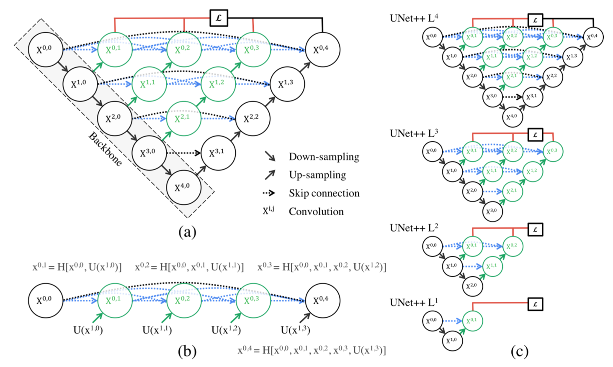

# $\mathrm{U-Net}$

- 用于语义分割

## $\mathrm{U-Net}$

### 网络结构

- 基于 $\mathrm{encoder-decoder}$ 思想，先通过下采样提取目标特征，再通过上采样恢复输入尺寸，最后进行逐像素分类

  - $\mathrm{encoder}$ 与 $\mathrm{decoder}$ 部分的网络结构基本对称

- 在 $\mathrm{decoder}$ 部分，通过 $\mathrm{concat}$ 方式融合浅层特征与深层特征

  - 相比于按通道相加，使用 $\mathrm{concat}$ 虽然会导致计算量增加，但可以保留更多的空间信息，更灵活地学习浅层特征与深层特征的融合方式与融合关系

## $\mathrm{UNet++}$

### 网络结构

### 设计思想

- $\mathrm{UNet}$ 的上采样、下采样次数，设置多少最合适？

  - 实验表明，并不是网络越深，效果就越好

  - 一次训练不同深度的 $\mathrm{UNet}$，自适应学习不同深度特征的重要性

- $\mathrm{U-Net}$ 的 $\mathrm{skip \ connection}$ 直接融合 $\mathrm{encoder}$ 特征与 $\mathrm{decoder}$ 特征，二者可能存在语义差距

- $\mathrm{UNet++}$ 重新设计了 $\mathrm{skip \ connection}$ 结构，以弥补上述语义差距

  - 对于 $\mathrm{encoder}$ 中每个 $\mathrm{stage}$，进行连续的上采样，一直恢复到输入尺寸（图中绿色部分）

  - 在上采样过程中，（类似 $\mathrm{DenseNet}$）通过 $\mathrm{concat}$ 方式，充分利用同一 $\mathrm{stage}$ 内的语义特征（图中蓝色部分）

  - 同时保留 $\mathrm{UNet}$ 中的长程 $\mathrm{skip \ connection}$ （黑色部分）

### 深度监督

- 对于第一个 $\mathrm{stage}$ 的每个特征图（与输入尺寸相同），都计算损失函数

- 由于深度监督的作用，在训练时，每个子网络的输出都是图像分割结果

- 在预测时，如果对精度要求比较高，可以对所有分支的分割结果进行平均

- 在预测时，如果子网络的输出满足要求，则多余部分可以直接剪掉，从而提高推理速度、精简模型体积

## $\mathrm{UNet3+}$

### 网络结构

### 设计思想

- 充分利用$\mathrm{encoder}$ 的全尺寸（所有尺寸）特征信息

  - $\mathrm{decoder}$ 的每个输出节点在计算时，通过池化或者上采样对 $\mathrm{encoder}$ 所有尺寸的特征进行整合

- 使用额外的分类分支，解决浅层背景噪声导致的过分割现象

  - 对于医学图像分割而言，该分支用于预测输入图像中是否有器官

  - 从 $\mathrm{encoder}$ 的最深层 $\mathrm{S5}$ 提取特征进行分类，以充分利用语义信息；根据分类结果，保留或置零 $\mathrm{decoder}$ 输出

- 使用深度监督，即对 $\mathrm{decoder}$ 的每个输出节点都计算损失函数

  - 具体是先上采样至输入尺寸，再计算损失函数